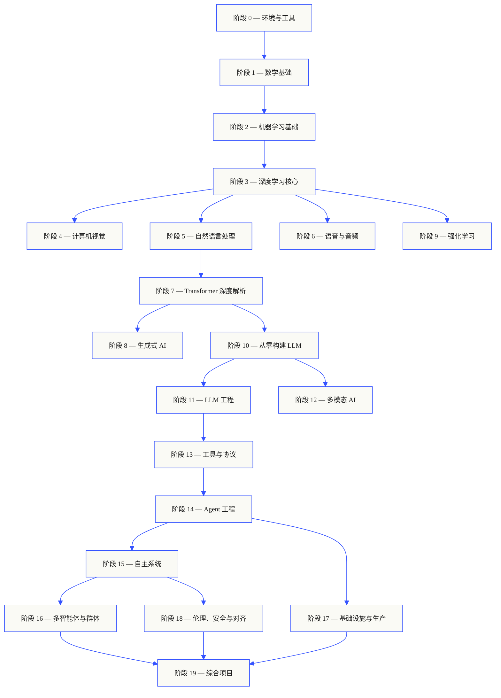
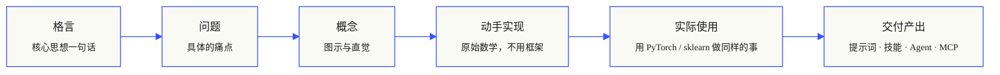

<p align="center">
  
</p>

<p align="center">
  <a href="LICENSE"></a>
  <a href="ROADMAP.md"></a>
  <a href="#contents"></a>
  <a href="https://github.com/rohitg00/ai-engineering-from-scratch/stargazers"></a>
  <a href="https://aiengineeringfromscratch.com"></a>
</p>

---

> **本仓库是 [rohitg00/ai-engineering-from-scratch](https://github.com/rohitg00/ai-engineering-from-scratch) 的中文翻译版本。**
>
> 原课程由 [Rohit Ghumare](https://github.com/rohitg00) 创作，内容涵盖 435 节课、20 个阶段，从数学基础到自主智能体全面覆盖 AI 工程实践。感谢 Rohit 构建了如此系统、完整且开源的学习资源，使更多中文学习者能够从中受益。
>
> 翻译内容包括：每节课的中文文档（`docs/zh.md`）、课程测验（`quiz.json`）以及所有可交付的提示词与技能文件（`outputs/*.md`）。英文原文（`docs/en.md`）保持不变。

---

```
░░░▒▒▒░░░▒▒▒░░░▒▒▒░░░▒▒▒░░░▒▒▒░░░▒▒▒░░░▒▒▒░░░▒▒▒░░░▒▒▒░░░▒▒▒░░░▒▒▒░░░▒▒▒░░░▒▒▒░░░▒▒▒░░░▒▒▒
```

> **84% 的学生已经在使用 AI 工具，但只有 18% 的人感到做好了在职场中专业运用 AI 的准备。**
> 本课程填补这一差距。
>
> 435 节课。20 个阶段。约 320 小时。Python、TypeScript、Rust、Julia。每节课产出一个可复用的工件：提示词、技能、智能体或 MCP 服务器。免费、开源、MIT 许可。
>
> 你不只是在学 AI，你是在亲手构建它。端到端，从零开始。

## 这门课如何运作

大多数 AI 学习材料是碎片化的。这里一篇论文，那里一篇微调博客，某个地方又是一个炫酷的 Agent 演示。这些碎片很难拼凑成完整的认知体系。你能部署一个聊天机器人，却说不清它的损失曲线；你能给 Agent 挂一个函数工具，却不知道调用它的模型内部注意力机制在做什么。

本课程是那根脊柱。20 个阶段，435 节课，四种语言：Python、TypeScript、Rust、Julia。一端是线性代数，另一端是自主智能体群。每个算法都从原始数学开始手写。反向传播、分词器、注意力机制、Agent 循环——等 PyTorch 出现的时候，你已经清楚它在底层做什么了。

每节课运行同一个循环：读懂问题，推导数学，写代码，跑测试，保留工件。没有五分钟速成视频，没有复制粘贴部署，没有手把手喂饭。免费、开源，可在你自己的笔记本上运行。

```
░░░▒▒▒░░░▒▒▒░░░▒▒▒░░░▒▒▒░░░▒▒▒░░░▒▒▒░░░▒▒▒░░░▒▒▒░░░▒▒▒░░░▒▒▒░░░▒▒▒░░░▒▒▒░░░▒▒▒░░░▒▒▒░░░▒▒▒
```

## 课程的整体结构

二十个阶段层层叠加。数学是地基，Agent 与生产是屋顶。如果你已经掌握了底层，可以跳级，但跳了之后再为顶层的问题困惑，那就是自找的。



```
░░░▒▒▒░░░▒▒▒░░░▒▒▒░░░▒▒▒░░░▒▒▒░░░▒▒▒░░░▒▒▒░░░▒▒▒░░░▒▒▒░░░▒▒▒░░░▒▒▒░░░▒▒▒░░░▒▒▒░░░▒▒▒░░░▒▒▒
```

## 每节课的结构

每节课独立存放在一个文件夹中，整个课程保持统一的目录结构：

```
phases/<NN>-<phase-name>/<NN>-<lesson-name>/
├── code/      可运行的实现代码（Python、TypeScript、Rust、Julia）
├── docs/
│   └── en.md  课程正文
└── outputs/   本节课产出的提示词、技能、Agent 或 MCP 服务器
```

每节课遵循六个环节。*动手实现 / 实际使用* 的分割是核心——你先从零手写算法，再用同样的逻辑跑生产级库。因为你自己写过精简版，所以你清楚框架在做什么。



## 如何开始

三种入口，选一种。

**选项 A — 直接阅读。** 在 [aiengineeringfromscratch.com](https://aiengineeringfromscratch.com) 上打开任意已完成的课程，或展开下方[目录](#contents)中的某个阶段。无需安装，无需克隆。

**选项 B — 克隆并运行。**

```bash
git clone https://github.com/rohitg00/ai-engineering-from-scratch.git
cd ai-engineering-from-scratch
python phases/01-math-foundations/01-linear-algebra-intuition/code/vectors.py
```

**选项 C — 找到你的起点（推荐）。** 智能跳级。在 Claude、Cursor、Codex、OpenClaw、Hermes 或任何安装了课程技能的 Agent 中：

```bash
/find-your-level
```

十道题。自动映射你的知识到对应阶段，生成带时间估算的个性化学习路径。每个阶段结束后：

```bash
/check-understanding 3        # 对第 3 阶段进行自测
ls phases/03-deep-learning-core/05-loss-functions/outputs/
# ├── prompt-loss-function-selector.md
# └── prompt-loss-debugger.md
```

### 前置要求

- 你会写代码（任何语言都行，Python 尤佳）。
- 你想真正理解 AI **是如何运作的**，而不只是调用 API。

### 内置 Agent 技能（Claude、Cursor、Codex、OpenClaw、Hermes）

| 技能 | 功能说明 |
|---|---|
| [`/find-your-level`](.claude/skills/find-your-level/SKILL.md) | 十题定级测验。将你的知识映射到起始阶段，生成带时间估算的个性化学习路径。|
| [`/check-understanding <phase>`](.claude/skills/check-understanding/SKILL.md) | 按阶段测验，八道题，附反馈和具体复习课程推荐。|

```
░░░▒▒▒░░░▒▒▒░░░▒▒▒░░░▒▒▒░░░▒▒▒░░░▒▒▒░░░▒▒▒░░░▒▒▒░░░▒▒▒░░░▒▒▒░░░▒▒▒░░░▒▒▒░░░▒▒▒░░░▒▒▒░░░▒▒▒
```

## 每节课都有可交付产出

其他课程以"恭喜你，你学会了 X"结尾。而这里的每节课以一个**可复用的工具**结尾，你可以直接安装或粘贴进日常工作流。

<table>
<tr>
<th align="left" width="25%"><br/><sub>FIG_001 · A</sub><br/><b>提示词</b></th>
<th align="left" width="25%"><br/><sub>FIG_001 · B</sub><br/><b>技能</b></th>
<th align="left" width="25%"><br/><sub>FIG_001 · C</sub><br/><b>智能体</b></th>
<th align="left" width="25%"><br/><sub>FIG_001 · D</sub><br/><b>MCP 服务器</b></th>
</tr>
<tr>
<td valign="top">粘贴进任何 AI 助手，获得针对特定任务的专家级帮助。</td>
<td valign="top">拖进 Claude、Cursor、Codex、OpenClaw、Hermes 或任何能读取 <code>SKILL.md</code> 的 Agent。</td>
<td valign="top">作为自主工作者部署——你在第 14 阶段自己写过这个循环。</td>
<td valign="top">接入任何兼容 MCP 的客户端。在第 13 阶段端到端构建。</td>
</tr>
</table>

> 用 `python3 scripts/install_skills.py` 一键安装全部。真实工具，不是课后作业。
> 课程结束时，你将拥有一个包含 435 个工件的作品集，每一个你都理解，因为每一个都是你亲手构建的。

### FIG_002 · 一个实际示例

第 14 阶段第 1 课：Agent 循环。约 120 行纯 Python，零依赖。

<table>
<tr>
<td valign="top" width="50%">

**`code/agent_loop.py`** &nbsp; <sub><i>动手实现</i></sub>

```python
def run(query, tools):
    history = [user(query)]
    for step in range(MAX_STEPS):
        msg = llm(history)
        if msg.tool_calls:
            for call in msg.tool_calls:
                result = tools[call.name](**call.args)
                history.append(tool_result(call.id, result))
            continue
        return msg.content
    raise StepLimitExceeded
```

</td>
<td valign="top" width="50%">

**`outputs/skill-agent-loop.md`** &nbsp; <sub><i>交付产出</i></sub>

```markdown
---
name: agent-loop
description: ReAct-style loop for any tool list
phase: 14
lesson: 01
---

Implement a minimal agent loop that...
```

**`outputs/prompt-debug-agent.md`**

```markdown
You are an agent debugger. Given the trace
of an agent run, identify the step where
the agent went wrong and explain why...
```

</td>
</tr>
</table>

```
░░░▒▒▒░░░▒▒▒░░░▒▒▒░░░▒▒▒░░░▒▒▒░░░▒▒▒░░░▒▒▒░░░▒▒▒░░░▒▒▒░░░▒▒▒░░░▒▒▒░░░▒▒▒░░░▒▒▒░░░▒▒▒░░░▒▒▒
```

<a id="contents"></a>

## 目录

二十个阶段。点击任意阶段展开课程列表。

<a id="phase-0"></a>
### 阶段 0：环境与工具 `12 节课`
> 为后续一切内容做好环境准备。

| # | 课程 | 类型 | 语言 |
|:---:|--------|:----:|------|
| 01 | [开发环境](phases/00-setup-and-tooling/01-dev-environment/) | 实践 | Python, TypeScript, Rust |
| 02 | [Git 与协作](phases/00-setup-and-tooling/02-git-and-collaboration/) | 学习 | — |
| 03 | [GPU 配置与云端](phases/00-setup-and-tooling/03-gpu-setup-and-cloud/) | 实践 | Python |
| 04 | [API 与密钥管理](phases/00-setup-and-tooling/04-apis-and-keys/) | 实践 | Python, TypeScript |
| 05 | [Jupyter Notebook](phases/00-setup-and-tooling/05-jupyter-notebooks/) | 实践 | Python |
| 06 | [Python 环境管理](phases/00-setup-and-tooling/06-python-environments/) | 实践 | Python |
| 07 | [AI 的 Docker 实践](phases/00-setup-and-tooling/07-docker-for-ai/) | 实践 | Python |
| 08 | [编辑器配置](phases/00-setup-and-tooling/08-editor-setup/) | 实践 | — |
| 09 | [数据管理](phases/00-setup-and-tooling/09-data-management/) | 实践 | Python |
| 10 | [终端与 Shell](phases/00-setup-and-tooling/10-terminal-and-shell/) | 学习 | — |
| 11 | [AI 的 Linux 基础](phases/00-setup-and-tooling/11-linux-for-ai/) | 学习 | — |
| 12 | [调试与性能分析](phases/00-setup-and-tooling/12-debugging-and-profiling/) | 实践 | Python |

<details id="phase-1">
<summary><b>阶段 1 — 数学基础</b> &nbsp;<code>22 节课</code>&nbsp; <em>通过代码理解每个 AI 算法背后的直觉。</em></summary>
<br/>

| # | 课程 | 类型 | 语言 |
|:---:|--------|:----:|------|
| 01 | [线性代数直觉](phases/01-math-foundations/01-linear-algebra-intuition/) | 学习 | Python, Julia |
| 02 | [向量、矩阵与运算](phases/01-math-foundations/02-vectors-matrices-operations/) | 实践 | Python, Julia |
| 03 | [矩阵变换与特征值](phases/01-math-foundations/03-matrix-transformations/) | 实践 | Python, Julia |
| 04 | [机器学习中的微积分：导数与梯度](phases/01-math-foundations/04-calculus-for-ml/) | 学习 | Python |
| 05 | [链式法则与自动微分](phases/01-math-foundations/05-chain-rule-and-autodiff/) | 实践 | Python |
| 06 | [概率与分布](phases/01-math-foundations/06-probability-and-distributions/) | 学习 | Python |
| 07 | [贝叶斯定理与统计思维](phases/01-math-foundations/07-bayes-theorem/) | 实践 | Python |
| 08 | [优化：梯度下降家族](phases/01-math-foundations/08-optimization/) | 实践 | Python |
| 09 | [信息论：熵与 KL 散度](phases/01-math-foundations/09-information-theory/) | 学习 | Python |
| 10 | [降维：PCA、t-SNE、UMAP](phases/01-math-foundations/10-dimensionality-reduction/) | 实践 | Python |
| 11 | [奇异值分解（SVD）](phases/01-math-foundations/11-singular-value-decomposition/) | 实践 | Python, Julia |
| 12 | [张量运算](phases/01-math-foundations/12-tensor-operations/) | 实践 | Python |
| 13 | [数值稳定性](phases/01-math-foundations/13-numerical-stability/) | 实践 | Python |
| 14 | [范数与距离](phases/01-math-foundations/14-norms-and-distances/) | 实践 | Python |
| 15 | [机器学习中的统计学](phases/01-math-foundations/15-statistics-for-ml/) | 实践 | Python |
| 16 | [采样方法](phases/01-math-foundations/16-sampling-methods/) | 实践 | Python |
| 17 | [线性方程组](phases/01-math-foundations/17-linear-systems/) | 实践 | Python |
| 18 | [凸优化](phases/01-math-foundations/18-convex-optimization/) | 实践 | Python |
| 19 | [AI 中的复数](phases/01-math-foundations/19-complex-numbers/) | 学习 | Python |
| 20 | [傅里叶变换](phases/01-math-foundations/20-fourier-transform/) | 实践 | Python |
| 21 | [机器学习中的图论](phases/01-math-foundations/21-graph-theory/) | 实践 | Python |
| 22 | [随机过程](phases/01-math-foundations/22-stochastic-processes/) | 学习 | Python |

</details>

<details id="phase-2">
<summary><b>阶段 2 — 机器学习基础</b> &nbsp;<code>18 节课</code>&nbsp; <em>经典机器学习——至今仍是大多数生产 AI 的骨干。</em></summary>
<br/>

| # | 课程 | 类型 | 语言 |
|:---:|--------|:----:|------|
| 01 | [什么是机器学习](phases/02-ml-fundamentals/01-what-is-machine-learning/) | 学习 | Python |
| 02 | [从零实现线性回归](phases/02-ml-fundamentals/02-linear-regression/) | 实践 | Python |
| 03 | [逻辑回归与分类](phases/02-ml-fundamentals/03-logistic-regression/) | 实践 | Python |
| 04 | [决策树与随机森林](phases/02-ml-fundamentals/04-decision-trees/) | 实践 | Python |
| 05 | [支持向量机（SVM）](phases/02-ml-fundamentals/05-support-vector-machines/) | 实践 | Python |
| 06 | [KNN 与距离度量](phases/02-ml-fundamentals/06-knn-and-distances/) | 实践 | Python |
| 07 | [无监督学习：K-Means、DBSCAN](phases/02-ml-fundamentals/07-unsupervised-learning/) | 实践 | Python |
| 08 | [特征工程与特征选择](phases/02-ml-fundamentals/08-feature-engineering/) | 实践 | Python |
| 09 | [模型评估：指标与交叉验证](phases/02-ml-fundamentals/09-model-evaluation/) | 实践 | Python |
| 10 | [偏差、方差与学习曲线](phases/02-ml-fundamentals/10-bias-variance/) | 学习 | Python |
| 11 | [集成方法：Boosting、Bagging、Stacking](phases/02-ml-fundamentals/11-ensemble-methods/) | 实践 | Python |
| 12 | [超参数调优](phases/02-ml-fundamentals/12-hyperparameter-tuning/) | 实践 | Python |
| 13 | [机器学习流水线与实验追踪](phases/02-ml-fundamentals/13-ml-pipelines/) | 实践 | Python |
| 14 | [朴素贝叶斯](phases/02-ml-fundamentals/14-naive-bayes/) | 实践 | Python |
| 15 | [时间序列基础](phases/02-ml-fundamentals/15-time-series/) | 实践 | Python |
| 16 | [异常检测](phases/02-ml-fundamentals/16-anomaly-detection/) | 实践 | Python |
| 17 | [处理不平衡数据](phases/02-ml-fundamentals/17-imbalanced-data/) | 实践 | Python |
| 18 | [特征选择](phases/02-ml-fundamentals/18-feature-selection/) | 实践 | Python |

</details>

<details id="phase-3">
<summary><b>阶段 3 — 深度学习核心</b> &nbsp;<code>13 节课</code>&nbsp; <em>从第一性原理出发的神经网络。构建自己的框架之前，不使用任何现成框架。</em></summary>
<br/>

| # | 课程 | 类型 | 语言 |
|:---:|--------|:----:|------|
| 01 | [感知机：一切的起点](phases/03-deep-learning-core/01-the-perceptron/) | 实践 | Python |
| 02 | [多层网络与前向传播](phases/03-deep-learning-core/02-multi-layer-networks/) | 实践 | Python |
| 03 | [从零实现反向传播](phases/03-deep-learning-core/03-backpropagation/) | 实践 | Python |
| 04 | [激活函数：ReLU、Sigmoid、GELU 及其原理](phases/03-deep-learning-core/04-activation-functions/) | 实践 | Python |
| 05 | [损失函数：MSE、交叉熵、对比损失](phases/03-deep-learning-core/05-loss-functions/) | 实践 | Python |
| 06 | [优化器：SGD、动量、Adam、AdamW](phases/03-deep-learning-core/06-optimizers/) | 实践 | Python |
| 07 | [正则化：Dropout、权重衰减、BatchNorm](phases/03-deep-learning-core/07-regularization/) | 实践 | Python |
| 08 | [权重初始化与训练稳定性](phases/03-deep-learning-core/08-weight-initialization/) | 实践 | Python |
| 09 | [学习率调度与 Warmup](phases/03-deep-learning-core/09-learning-rate-schedules/) | 实践 | Python |
| 10 | [构建你自己的迷你框架](phases/03-deep-learning-core/10-mini-framework/) | 实践 | Python |
| 11 | [PyTorch 入门](phases/03-deep-learning-core/11-intro-to-pytorch/) | 实践 | Python |
| 12 | [JAX 入门](phases/03-deep-learning-core/12-intro-to-jax/) | 实践 | Python |
| 13 | [神经网络调试](phases/03-deep-learning-core/13-debugging-neural-networks/) | 实践 | Python |

</details>

<details id="phase-4">
<summary><b>阶段 4 — 计算机视觉</b> &nbsp;<code>28 节课</code>&nbsp; <em>从像素到理解——图像、视频、3D、视觉语言模型与世界模型。</em></summary>
<br/>

| # | 课程 | 类型 | 语言 |
|:---:|--------|:----:|------|
| 01 | [图像基础：像素、通道、色彩空间](phases/04-computer-vision/01-image-fundamentals/) | 学习 | Python |
| 02 | [从零实现卷积](phases/04-computer-vision/02-convolutions-from-scratch/) | 实践 | Python |
| 03 | [卷积神经网络：从 LeNet 到 ResNet](phases/04-computer-vision/03-cnns-lenet-to-resnet/) | 实践 | Python |
| 04 | [图像分类](phases/04-computer-vision/04-image-classification/) | 实践 | Python |
| 05 | [迁移学习与微调](phases/04-computer-vision/05-transfer-learning/) | 实践 | Python |
| 06 | [目标检测——从零实现 YOLO](phases/04-computer-vision/06-object-detection-yolo/) | 实践 | Python |
| 07 | [语义分割——U-Net](phases/04-computer-vision/07-semantic-segmentation-unet/) | 实践 | Python |
| 08 | [实例分割——Mask R-CNN](phases/04-computer-vision/08-instance-segmentation-mask-rcnn/) | 实践 | Python |
| 09 | [图像生成——GAN](phases/04-computer-vision/09-image-generation-gans/) | 实践 | Python |
| 10 | [图像生成——扩散模型](phases/04-computer-vision/10-image-generation-diffusion/) | 实践 | Python |
| 11 | [Stable Diffusion——架构与微调](phases/04-computer-vision/11-stable-diffusion/) | 实践 | Python |
| 12 | [视频理解——时序建模](phases/04-computer-vision/12-video-understanding/) | 实践 | Python |
| 13 | [三维视觉：点云、NeRF](phases/04-computer-vision/13-3d-vision-nerf/) | 实践 | Python |
| 14 | [视觉 Transformer（ViT）](phases/04-computer-vision/14-vision-transformers/) | 实践 | Python |
| 15 | [实时视觉：边缘部署](phases/04-computer-vision/15-real-time-edge/) | 实践 | Python, Rust |
| 16 | [构建完整视觉流水线](phases/04-computer-vision/16-vision-pipeline-capstone/) | 实践 | Python |
| 17 | [自监督视觉——SimCLR、DINO、MAE](phases/04-computer-vision/17-self-supervised-vision/) | 实践 | Python |
| 18 | [开放词汇视觉——CLIP](phases/04-computer-vision/18-open-vocab-clip/) | 实践 | Python |
| 19 | [OCR 与文档理解](phases/04-computer-vision/19-ocr-document-understanding/) | 实践 | Python |
| 20 | [图像检索与度量学习](phases/04-computer-vision/20-image-retrieval-metric/) | 实践 | Python |
| 21 | [关键点检测与姿态估计](phases/04-computer-vision/21-keypoint-pose/) | 实践 | Python |
| 22 | [从零实现 3D 高斯溅射](phases/04-computer-vision/22-3d-gaussian-splatting/) | 实践 | Python |
| 23 | [扩散 Transformer 与整流流](phases/04-computer-vision/23-diffusion-transformers-rectified-flow/) | 实践 | Python |
| 24 | [SAM 3 与开放词汇分割](phases/04-computer-vision/24-sam3-open-vocab-segmentation/) | 实践 | Python |
| 25 | [视觉语言模型（ViT-MLP-LLM）](phases/04-computer-vision/25-vision-language-models/) | 实践 | Python |
| 26 | [单目深度与几何估计](phases/04-computer-vision/26-monocular-depth/) | 实践 | Python |
| 27 | [多目标跟踪与视频记忆](phases/04-computer-vision/27-multi-object-tracking/) | 实践 | Python |
| 28 | [世界模型与视频扩散](phases/04-computer-vision/28-world-models-video-diffusion/) | 实践 | Python |

</details>

<details id="phase-5">
<summary><b>阶段 5 — 自然语言处理：从基础到进阶</b> &nbsp;<code>29 节课</code>&nbsp; <em>语言是通向智能的接口。</em></summary>
<br/>

| # | 课程 | 类型 | 语言 |
|:---:|--------|:----:|------|
| 01 | [文本处理：分词、词干提取、词形还原](phases/05-nlp-foundations-to-advanced/01-text-processing/) | 实践 | Python |
| 02 | [词袋模型、TF-IDF 与文本表示](phases/05-nlp-foundations-to-advanced/02-bag-of-words-tfidf/) | 实践 | Python |
| 03 | [词嵌入：从零实现 Word2Vec](phases/05-nlp-foundations-to-advanced/03-word-embeddings-word2vec/) | 实践 | Python |
| 04 | [GloVe、FastText 与子词嵌入](phases/05-nlp-foundations-to-advanced/04-glove-fasttext-subword/) | 实践 | Python |
| 05 | [情感分析](phases/05-nlp-foundations-to-advanced/05-sentiment-analysis/) | 实践 | Python |
| 06 | [命名实体识别（NER）](phases/05-nlp-foundations-to-advanced/06-named-entity-recognition/) | 实践 | Python |
| 07 | [词性标注与句法分析](phases/05-nlp-foundations-to-advanced/07-pos-tagging-parsing/) | 实践 | Python |
| 08 | [文本分类——CNN 与 RNN](phases/05-nlp-foundations-to-advanced/08-cnns-rnns-for-text/) | 实践 | Python |
| 09 | [序列到序列模型](phases/05-nlp-foundations-to-advanced/09-sequence-to-sequence/) | 实践 | Python |
| 10 | [注意力机制——突破性进展](phases/05-nlp-foundations-to-advanced/10-attention-mechanism/) | 实践 | Python |
| 11 | [机器翻译](phases/05-nlp-foundations-to-advanced/11-machine-translation/) | 实践 | Python |
| 12 | [文本摘要](phases/05-nlp-foundations-to-advanced/12-text-summarization/) | 实践 | Python |
| 13 | [问答系统](phases/05-nlp-foundations-to-advanced/13-question-answering/) | 实践 | Python |
| 14 | [信息检索与搜索](phases/05-nlp-foundations-to-advanced/14-information-retrieval-search/) | 实践 | Python |
| 15 | [主题建模：LDA、BERTopic](phases/05-nlp-foundations-to-advanced/15-topic-modeling/) | 实践 | Python |
| 16 | [文本生成](phases/05-nlp-foundations-to-advanced/16-text-generation-pre-transformer/) | 实践 | Python |
| 17 | [聊天机器人：从规则到神经网络](phases/05-nlp-foundations-to-advanced/17-chatbots-rule-to-neural/) | 实践 | Python |
| 18 | [多语言 NLP](phases/05-nlp-foundations-to-advanced/18-multilingual-nlp/) | 实践 | Python |
| 19 | [子词分词：BPE、WordPiece、Unigram、SentencePiece](phases/05-nlp-foundations-to-advanced/19-subword-tokenization/) | 学习 | Python |
| 20 | [结构化输出与约束解码](phases/05-nlp-foundations-to-advanced/20-structured-outputs-constrained-decoding/) | 实践 | Python |
| 21 | [自然语言推理与文本蕴含](phases/05-nlp-foundations-to-advanced/21-nli-textual-entailment/) | 学习 | Python |
| 22 | [嵌入模型深度解析](phases/05-nlp-foundations-to-advanced/22-embedding-models-deep-dive/) | 学习 | Python |
| 23 | [RAG 的分块策略](phases/05-nlp-foundations-to-advanced/23-chunking-strategies-rag/) | 实践 | Python |
| 24 | [指代消解](phases/05-nlp-foundations-to-advanced/24-coreference-resolution/) | 学习 | Python |
| 25 | [实体链接与消歧](phases/05-nlp-foundations-to-advanced/25-entity-linking/) | 实践 | Python |
| 26 | [关系抽取与知识图谱构建](phases/05-nlp-foundations-to-advanced/26-relation-extraction-kg/) | 实践 | Python |
| 27 | [LLM 评估：RAGAS、DeepEval、G-Eval](phases/05-nlp-foundations-to-advanced/27-llm-evaluation-frameworks/) | 实践 | Python |
| 28 | [长上下文评估：NIAH、RULER、LongBench、MRCR](phases/05-nlp-foundations-to-advanced/28-long-context-evaluation/) | 学习 | Python |
| 29 | [对话状态追踪](phases/05-nlp-foundations-to-advanced/29-dialogue-state-tracking/) | 实践 | Python |

</details>

<details id="phase-6">
<summary><b>阶段 6 — 语音与音频</b> &nbsp;<code>17 节课</code>&nbsp; <em>听懂、理解、开口说话。</em></summary>
<br/>

| # | 课程 | 类型 | 语言 |
|:---:|--------|:----:|------|
| 01 | [音频基础：波形、采样、FFT](phases/06-speech-and-audio/01-audio-fundamentals) | 学习 | Python |
| 02 | [频谱图、Mel 尺度与音频特征](phases/06-speech-and-audio/02-spectrograms-mel-features) | 实践 | Python |
| 03 | [音频分类](phases/06-speech-and-audio/03-audio-classification) | 实践 | Python |
| 04 | [语音识别（ASR）](phases/06-speech-and-audio/04-speech-recognition-asr) | 实践 | Python |
| 05 | [Whisper：架构与微调](phases/06-speech-and-audio/05-whisper-architecture-finetuning) | 实践 | Python |
| 06 | [说话人识别与验证](phases/06-speech-and-audio/06-speaker-recognition-verification) | 实践 | Python |
| 07 | [文本转语音（TTS）](phases/06-speech-and-audio/07-text-to-speech) | 实践 | Python |
| 08 | [声音克隆与语音转换](phases/06-speech-and-audio/08-voice-cloning-conversion) | 实践 | Python |
| 09 | [音乐生成](phases/06-speech-and-audio/09-music-generation) | 实践 | Python |
| 10 | [音频语言模型](phases/06-speech-and-audio/10-audio-language-models) | 实践 | Python |
| 11 | [实时音频处理](phases/06-speech-and-audio/11-real-time-audio-processing) | 实践 | Python, Rust |
| 12 | [构建语音助手流水线](phases/06-speech-and-audio/12-voice-assistant-pipeline) | 实践 | Python |
| 13 | [神经音频编解码器——EnCodec、SNAC、Mimi、DAC](phases/06-speech-and-audio/13-neural-audio-codecs) | 学习 | Python |
| 14 | [语音活动检测与对话轮换](phases/06-speech-and-audio/14-voice-activity-detection-turn-taking) | 实践 | Python |
| 15 | [流式语音对话——Moshi、Hibiki](phases/06-speech-and-audio/15-streaming-speech-to-speech-moshi-hibiki) | 学习 | Python |
| 16 | [语音反欺骗与音频水印](phases/06-speech-and-audio/16-anti-spoofing-audio-watermarking) | 实践 | Python |
| 17 | [音频评估——WER、MOS、MMAU、排行榜](phases/06-speech-and-audio/17-audio-evaluation-metrics) | 学习 | Python |

</details>

<details id="phase-7">
<summary><b>阶段 7 — Transformer 深度解析</b> &nbsp;<code>14 节课</code>&nbsp; <em>改变一切的架构。</em></summary>
<br/>

| # | 课程 | 类型 | 语言 |
|:---:|--------|:----:|------|
| 01 | [为什么需要 Transformer：RNN 的问题](phases/07-transformers-deep-dive/01-why-transformers/) | 学习 | Python |
| 02 | [从零实现自注意力](phases/07-transformers-deep-dive/02-self-attention-from-scratch/) | 实践 | Python |
| 03 | [多头注意力](phases/07-transformers-deep-dive/03-multi-head-attention/) | 实践 | Python |
| 04 | [位置编码：正弦、RoPE、ALiBi](phases/07-transformers-deep-dive/04-positional-encoding/) | 实践 | Python |
| 05 | [完整 Transformer：编码器 + 解码器](phases/07-transformers-deep-dive/05-full-transformer/) | 实践 | Python |
| 06 | [BERT——掩码语言建模](phases/07-transformers-deep-dive/06-bert-masked-language-modeling/) | 实践 | Python |
| 07 | [GPT——因果语言建模](phases/07-transformers-deep-dive/07-gpt-causal-language-modeling/) | 实践 | Python |
| 08 | [T5、BART——编码器-解码器模型](phases/07-transformers-deep-dive/08-t5-bart-encoder-decoder/) | 学习 | Python |
| 09 | [视觉 Transformer（ViT）](phases/07-transformers-deep-dive/09-vision-transformers/) | 实践 | Python |
| 10 | [音频 Transformer——Whisper 架构](phases/07-transformers-deep-dive/10-audio-transformers-whisper/) | 学习 | Python |
| 11 | [混合专家模型（MoE）](phases/07-transformers-deep-dive/11-mixture-of-experts/) | 实践 | Python |
| 12 | [KV 缓存、Flash Attention 与推理优化](phases/07-transformers-deep-dive/12-kv-cache-flash-attention/) | 实践 | Python |
| 13 | [Scaling Law（规模法则）](phases/07-transformers-deep-dive/13-scaling-laws/) | 学习 | Python |
| 14 | [从零构建 Transformer](phases/07-transformers-deep-dive/14-build-a-transformer-capstone/) | 实践 | Python |

</details>

<details id="phase-8">
<summary><b>阶段 8 — 生成式 AI</b> &nbsp;<code>14 节课</code>&nbsp; <em>生成图像、视频、音频、3D 及更多。</em></summary>
<br/>

| # | 课程 | 类型 | 语言 |
|:---:|--------|:----:|------|
| 01 | [生成模型：分类与历史](phases/08-generative-ai/01-generative-models-taxonomy-history/) | 学习 | Python |
| 02 | [自编码器与 VAE](phases/08-generative-ai/02-autoencoders-vae/) | 实践 | Python |
| 03 | [GAN：生成器 vs 判别器](phases/08-generative-ai/03-gans-generator-discriminator/) | 实践 | Python |
| 04 | [条件 GAN 与 Pix2Pix](phases/08-generative-ai/04-conditional-gans-pix2pix/) | 实践 | Python |
| 05 | [StyleGAN](phases/08-generative-ai/05-stylegan/) | 实践 | Python |
| 06 | [扩散模型——从零实现 DDPM](phases/08-generative-ai/06-diffusion-ddpm-from-scratch/) | 实践 | Python |
| 07 | [潜在扩散与 Stable Diffusion](phases/08-generative-ai/07-latent-diffusion-stable-diffusion/) | 实践 | Python |
| 08 | [ControlNet、LoRA 与条件控制](phases/08-generative-ai/08-controlnet-lora-conditioning/) | 实践 | Python |
| 09 | [图像补全、外扩与编辑](phases/08-generative-ai/09-inpainting-outpainting-editing/) | 实践 | Python |
| 10 | [视频生成](phases/08-generative-ai/10-video-generation/) | 实践 | Python |
| 11 | [音频生成](phases/08-generative-ai/11-audio-generation/) | 实践 | Python |
| 12 | [三维生成](phases/08-generative-ai/12-3d-generation/) | 实践 | Python |
| 13 | [流匹配与整流流](phases/08-generative-ai/13-flow-matching-rectified-flows/) | 实践 | Python |
| 14 | [评估：FID、CLIP Score](phases/08-generative-ai/14-evaluation-fid-clip-score/) | 实践 | Python |

</details>

<details id="phase-9">
<summary><b>阶段 9 — 强化学习</b> &nbsp;<code>12 节课</code>&nbsp; <em>RLHF 与博弈 AI 的基础。</em></summary>
<br/>

| # | 课程 | 类型 | 语言 |
|:---:|--------|:----:|------|
| 01 | [MDP：状态、动作与奖励](phases/09-reinforcement-learning/01-mdps-states-actions-rewards/) | 学习 | Python |
| 02 | [动态规划](phases/09-reinforcement-learning/02-dynamic-programming/) | 实践 | Python |
| 03 | [蒙特卡洛方法](phases/09-reinforcement-learning/03-monte-carlo-methods/) | 实践 | Python |
| 04 | [Q-Learning、SARSA](phases/09-reinforcement-learning/04-q-learning-sarsa/) | 实践 | Python |
| 05 | [深度 Q 网络（DQN）](phases/09-reinforcement-learning/05-dqn/) | 实践 | Python |
| 06 | [策略梯度——REINFORCE](phases/09-reinforcement-learning/06-policy-gradients-reinforce/) | 实践 | Python |
| 07 | [Actor-Critic——A2C、A3C](phases/09-reinforcement-learning/07-actor-critic-a2c-a3c/) | 实践 | Python |
| 08 | [PPO（近端策略优化）](phases/09-reinforcement-learning/08-ppo/) | 实践 | Python |
| 09 | [奖励建模与 RLHF](phases/09-reinforcement-learning/09-reward-modeling-rlhf/) | 实践 | Python |
| 10 | [多智能体强化学习](phases/09-reinforcement-learning/10-multi-agent-rl/) | 实践 | Python |
| 11 | [仿真到真实的迁移](phases/09-reinforcement-learning/11-sim-to-real-transfer/) | 实践 | Python |
| 12 | [游戏中的强化学习](phases/09-reinforcement-learning/12-rl-for-games/) | 实践 | Python |

</details>

<details id="phase-10">
<summary><b>阶段 10 — 从零构建 LLM</b> &nbsp;<code>22 节课</code>&nbsp; <em>构建、训练并深入理解大语言模型。</em></summary>
<br/>

| # | 课程 | 类型 | 语言 |
|:---:|--------|:----:|------|
| 01 | [分词器：BPE、WordPiece、SentencePiece](phases/10-llms-from-scratch/01-tokenizers/) | 实践 | Python |
| 02 | [从零构建分词器](phases/10-llms-from-scratch/02-building-a-tokenizer/) | 实践 | Python |
| 03 | [预训练数据流水线](phases/10-llms-from-scratch/03-data-pipelines/) | 实践 | Python |
| 04 | [预训练迷你 GPT（124M）](phases/10-llms-from-scratch/04-pre-training-mini-gpt/) | 实践 | Python |
| 05 | [分布式训练、FSDP、DeepSpeed](phases/10-llms-from-scratch/05-scaling-distributed/) | 实践 | Python |
| 06 | [指令微调——SFT](phases/10-llms-from-scratch/06-instruction-tuning-sft/) | 实践 | Python |
| 07 | [RLHF——奖励模型 + PPO](phases/10-llms-from-scratch/07-rlhf/) | 实践 | Python |
| 08 | [DPO——直接偏好优化](phases/10-llms-from-scratch/08-dpo/) | 实践 | Python |
| 09 | [宪法 AI 与自我改进](phases/10-llms-from-scratch/09-constitutional-ai-self-improvement/) | 实践 | Python |
| 10 | [评估——基准测试与 Eval](phases/10-llms-from-scratch/10-evaluation/) | 实践 | Python |
| 11 | [量化：INT8、GPTQ、AWQ、GGUF](phases/10-llms-from-scratch/11-quantization/) | 实践 | Python, Rust |
| 12 | [推理优化](phases/10-llms-from-scratch/12-inference-optimization/) | 实践 | Python |
| 13 | [构建完整的 LLM 流水线](phases/10-llms-from-scratch/13-building-complete-llm-pipeline/) | 实践 | Python |
| 14 | [开源模型：架构代码走读](phases/10-llms-from-scratch/14-open-models-architecture-walkthroughs/) | 学习 | Python |
| 15 | [推测解码与 EAGLE-3](phases/10-llms-from-scratch/15-speculative-decoding-eagle3/) | 实践 | Python |
| 16 | [差分注意力（V2）](phases/10-llms-from-scratch/16-differential-attention-v2/) | 实践 | Python |
| 17 | [原生稀疏注意力（DeepSeek NSA）](phases/10-llms-from-scratch/17-native-sparse-attention/) | 实践 | Python |
| 18 | [多 Token 预测（MTP）](phases/10-llms-from-scratch/18-multi-token-prediction/) | 实践 | Python |
| 19 | [DualPipe 并行](phases/10-llms-from-scratch/19-dualpipe-parallelism/) | 学习 | Python |
| 20 | [DeepSeek-V3 架构走读](phases/10-llms-from-scratch/20-deepseek-v3-walkthrough/) | 学习 | Python |
| 21 | [Jamba——混合 SSM-Transformer](phases/10-llms-from-scratch/21-jamba-hybrid-ssm-transformer/) | 学习 | Python |
| 22 | [异步与 Hogwild! 推理](phases/10-llms-from-scratch/22-async-hogwild-inference/) | 实践 | Python |

</details>

<details id="phase-11">
<summary><b>阶段 11 — LLM 工程</b> &nbsp;<code>17 节课</code>&nbsp; <em>让 LLM 在生产中真正工作。</em></summary>
<br/>

| # | 课程 | 类型 | 语言 |
|:---:|--------|:----:|------|
| 01 | [提示词工程：技术与模式](phases/11-llm-engineering/01-prompt-engineering/) | 实践 | Python |
| 02 | [少样本、思维链、思维树](phases/11-llm-engineering/02-few-shot-cot/) | 实践 | Python |
| 03 | [结构化输出](phases/11-llm-engineering/03-structured-outputs/) | 实践 | Python, TypeScript |
| 04 | [嵌入与向量表示](phases/11-llm-engineering/04-embeddings/) | 实践 | Python |
| 05 | [上下文工程](phases/11-llm-engineering/05-context-engineering/) | 实践 | Python, TypeScript |
| 06 | [RAG：检索增强生成](phases/11-llm-engineering/06-rag/) | 实践 | Python, TypeScript |
| 07 | [高级 RAG：分块、重排序](phases/11-llm-engineering/07-advanced-rag/) | 实践 | Python |
| 08 | [LoRA 与 QLoRA 微调](phases/11-llm-engineering/08-fine-tuning-lora/) | 实践 | Python |
| 09 | [函数调用与工具使用](phases/11-llm-engineering/09-function-calling/) | 实践 | Python |
| 10 | [评估与测试](phases/11-llm-engineering/10-evaluation/) | 实践 | Python |
| 11 | [缓存、限流与成本控制](phases/11-llm-engineering/11-caching-cost/) | 实践 | Python |
| 12 | [护栏与安全](phases/11-llm-engineering/12-guardrails/) | 实践 | Python |
| 13 | [构建生产级 LLM 应用](phases/11-llm-engineering/13-production-app/) | 实践 | Python |
| 14 | [模型上下文协议（MCP）](phases/11-llm-engineering/14-model-context-protocol/) | 实践 | Python |
| 15 | [提示词缓存与上下文缓存](phases/11-llm-engineering/15-prompt-caching/) | 实践 | Python |
| 16 | [LangGraph：Agent 的状态机](phases/11-llm-engineering/16-langgraph-state-machines/) | 实践 | Python |
| 17 | [Agent 框架的取舍](phases/11-llm-engineering/17-agent-framework-tradeoffs/) | 学习 | Python |

</details>

<details id="phase-12">
<summary><b>阶段 12 — 多模态 AI</b> &nbsp;<code>25 节课</code>&nbsp; <em>看、听、读、跨模态推理——从 ViT 图像块到计算机使用智能体。</em></summary>
<br/>

| # | 课程 | 类型 | 语言 |
|:---:|--------|:----:|------|
| 01 | [视觉 Transformer 与图像块-Token 原语](phases/12-multimodal-ai/01-vision-transformer-patch-tokens/) | 学习 | Python |
| 02 | [CLIP 与对比视觉-语言预训练](phases/12-multimodal-ai/02-clip-contrastive-pretraining/) | 实践 | Python |
| 03 | [BLIP-2 Q-Former 作为模态桥接器](phases/12-multimodal-ai/03-blip2-qformer-bridge/) | 实践 | Python |
| 04 | [Flamingo 与门控交叉注意力](phases/12-multimodal-ai/04-flamingo-gated-cross-attention/) | 学习 | Python |
| 05 | [LLaVA 与视觉指令微调](phases/12-multimodal-ai/05-llava-visual-instruction-tuning/) | 实践 | Python |
| 06 | [任意分辨率视觉——Patch-n'-Pack 与 NaFlex](phases/12-multimodal-ai/06-any-resolution-patch-n-pack/) | 实践 | Python |
| 07 | [开源 VLM 训练秘诀：真正重要的是什么](phases/12-multimodal-ai/07-open-weight-vlm-recipes/) | 学习 | Python |
| 08 | [LLaVA-OneVision：单图、多图、视频](phases/12-multimodal-ai/08-llava-onevision-single-multi-video/) | 实践 | Python |
| 09 | [Qwen-VL 系列与动态帧率视频](phases/12-multimodal-ai/09-qwen-vl-family-dynamic-fps/) | 学习 | Python |
| 10 | [InternVL3 原生多模态预训练](phases/12-multimodal-ai/10-internvl3-native-multimodal/) | 学习 | Python |
| 11 | [Chameleon 早期融合纯 Token 架构](phases/12-multimodal-ai/11-chameleon-early-fusion-tokens/) | 实践 | Python |
| 12 | [Emu3 下一个 Token 预测统一生成](phases/12-multimodal-ai/12-emu3-next-token-for-generation/) | 学习 | Python |
| 13 | [Transfusion 自回归 + 扩散](phases/12-multimodal-ai/13-transfusion-autoregressive-diffusion/) | 实践 | Python |
| 14 | [Show-o 离散扩散统一模型](phases/12-multimodal-ai/14-show-o-discrete-diffusion-unified/) | 学习 | Python |
| 15 | [Janus-Pro 解耦编码器](phases/12-multimodal-ai/15-janus-pro-decoupled-encoders/) | 实践 | Python |
| 16 | [MIO 任意到任意流式处理](phases/12-multimodal-ai/16-mio-any-to-any-streaming/) | 学习 | Python |
| 17 | [视频-语言时序定位](phases/12-multimodal-ai/17-video-language-temporal-grounding/) | 实践 | Python |
| 18 | [百万 Token 上下文的长视频理解](phases/12-multimodal-ai/18-long-video-million-token/) | 实践 | Python |
| 19 | [音频语言模型：从 Whisper 到 AF3](phases/12-multimodal-ai/19-audio-language-whisper-to-af3/) | 实践 | Python |
| 20 | [全模态模型：思考者-说话者流式架构](phases/12-multimodal-ai/20-omni-models-thinker-talker/) | 实践 | Python |
| 21 | [具身 VLA：RT-2、OpenVLA、π0、GR00T](phases/12-multimodal-ai/21-embodied-vlas-openvla-pi0-groot/) | 学习 | Python |
| 22 | [文档与图表理解](phases/12-multimodal-ai/22-document-diagram-understanding/) | 实践 | Python |
| 23 | [ColPali 视觉原生文档 RAG](phases/12-multimodal-ai/23-colpali-vision-native-rag/) | 实践 | Python |
| 24 | [多模态 RAG 与跨模态检索](phases/12-multimodal-ai/24-multimodal-rag-cross-modal/) | 实践 | Python |
| 25 | [多模态 Agent 与计算机使用（综合）](phases/12-multimodal-ai/25-multimodal-agents-computer-use/) | 实践 | Python |

</details>

<details id="phase-13">
<summary><b>阶段 13 — 工具与协议</b> &nbsp;<code>23 节课</code>&nbsp; <em>AI 与现实世界之间的接口。</em></summary>
<br/>

| # | 课程 | 类型 | 语言 |
|:---:|--------|:----:|------|
| 01 | [工具接口](phases/13-tools-and-protocols/01-the-tool-interface/) | 学习 | Python |
| 02 | [函数调用深度解析](phases/13-tools-and-protocols/02-function-calling-deep-dive/) | 实践 | Python |
| 03 | [并行与流式工具调用](phases/13-tools-and-protocols/03-parallel-and-streaming-tool-calls/) | 实践 | Python |
| 04 | [结构化输出](phases/13-tools-and-protocols/04-structured-output/) | 实践 | Python |
| 05 | [工具 Schema 设计](phases/13-tools-and-protocols/05-tool-schema-design/) | 学习 | Python |
| 06 | [MCP 基础](phases/13-tools-and-protocols/06-mcp-fundamentals/) | 学习 | Python |
| 07 | [构建 MCP 服务器](phases/13-tools-and-protocols/07-building-an-mcp-server/) | 实践 | Python |
| 08 | [构建 MCP 客户端](phases/13-tools-and-protocols/08-building-an-mcp-client/) | 实践 | Python |
| 09 | [MCP 传输层](phases/13-tools-and-protocols/09-mcp-transports/) | 学习 | Python |
| 10 | [MCP 资源与提示词](phases/13-tools-and-protocols/10-mcp-resources-and-prompts/) | 实践 | Python |
| 11 | [MCP 采样](phases/13-tools-and-protocols/11-mcp-sampling/) | 实践 | Python |
| 12 | [MCP Roots 与 Elicitation](phases/13-tools-and-protocols/12-mcp-roots-and-elicitation/) | 实践 | Python |
| 13 | [MCP 异步任务](phases/13-tools-and-protocols/13-mcp-async-tasks/) | 实践 | Python |
| 14 | [MCP 应用](phases/13-tools-and-protocols/14-mcp-apps/) | 实践 | Python |
| 15 | [MCP 安全 I——工具投毒](phases/13-tools-and-protocols/15-mcp-security-tool-poisoning/) | 学习 | Python |
| 16 | [MCP 安全 II——OAuth 2.1](phases/13-tools-and-protocols/16-mcp-security-oauth-2-1/) | 实践 | Python |
| 17 | [MCP 网关与注册表](phases/13-tools-and-protocols/17-mcp-gateways-and-registries/) | 学习 | Python |
| 18 | [生产级 MCP 鉴权——DCR + JWKS](phases/13-tools-and-protocols/18-mcp-auth-production/) | 实践 | Python |
| 19 | [A2A 协议](phases/13-tools-and-protocols/19-a2a-protocol/) | 实践 | Python |
| 20 | [OpenTelemetry GenAI](phases/13-tools-and-protocols/20-opentelemetry-genai/) | 实践 | Python |
| 21 | [LLM 路由层](phases/13-tools-and-protocols/21-llm-routing-layer/) | 学习 | Python |
| 22 | [技能与 Agent SDK](phases/13-tools-and-protocols/22-skills-and-agent-sdks/) | 学习 | Python |
| 23 | [综合——工具生态系统](phases/13-tools-and-protocols/23-capstone-tool-ecosystem/) | 实践 | Python |

</details>

<details id="phase-14">
<summary><b>阶段 14 — Agent 工程</b> &nbsp;<code>42 节课</code>&nbsp; <em>从第一性原理构建 Agent——循环、记忆、规划、框架、基准测试、生产、工作台。</em></summary>
<br/>

| # | 课程 | 类型 | 语言 |
|:---:|--------|:----:|------|
| 01 | [Agent 循环](phases/14-agent-engineering/01-the-agent-loop/) | 实践 | Python |
| 02 | [ReWOO 与规划-执行模式](phases/14-agent-engineering/02-rewoo-plan-and-execute/) | 实践 | Python |
| 03 | [Reflexion 与语言强化学习](phases/14-agent-engineering/03-reflexion-verbal-rl/) | 实践 | Python |
| 04 | [思维树与 LATS](phases/14-agent-engineering/04-tree-of-thoughts-lats/) | 实践 | Python |
| 05 | [自我精炼与 CRITIC](phases/14-agent-engineering/05-self-refine-and-critic/) | 实践 | Python |
| 06 | [工具使用与函数调用](phases/14-agent-engineering/06-tool-use-and-function-calling/) | 实践 | Python |
| 07 | [记忆——虚拟上下文与 MemGPT](phases/14-agent-engineering/07-memory-virtual-context-memgpt/) | 实践 | Python |
| 08 | [记忆块与睡眠时计算](phases/14-agent-engineering/08-memory-blocks-sleep-time-compute/) | 实践 | Python |
| 09 | [混合记忆——Mem0 向量 + 图 + KV](phases/14-agent-engineering/09-hybrid-memory-mem0/) | 实践 | Python |
| 10 | [技能库与终身学习——Voyager](phases/14-agent-engineering/10-skill-libraries-voyager/) | 实践 | Python |
| 11 | [HTN 与进化搜索规划](phases/14-agent-engineering/11-planning-htn-and-evolutionary/) | 实践 | Python |
| 12 | [Anthropic 的工作流模式](phases/14-agent-engineering/12-anthropic-workflow-patterns/) | 实践 | Python |
| 13 | [LangGraph——有状态图与持久执行](phases/14-agent-engineering/13-langgraph-stateful-graphs/) | 实践 | Python |
| 14 | [AutoGen v0.4——Actor 模型](phases/14-agent-engineering/14-autogen-actor-model/) | 实践 | Python |
| 15 | [CrewAI——基于角色的团队与流程](phases/14-agent-engineering/15-crewai-role-based-crews/) | 实践 | Python |
| 16 | [OpenAI Agents SDK——切换、护栏、追踪](phases/14-agent-engineering/16-openai-agents-sdk/) | 实践 | Python |
| 17 | [Claude Agent SDK——子 Agent 与会话存储](phases/14-agent-engineering/17-claude-agent-sdk/) | 实践 | Python |
| 18 | [Agno 与 Mastra——生产级运行时](phases/14-agent-engineering/18-agno-and-mastra-runtimes/) | 学习 | Python, TypeScript |
| 19 | [基准测试——SWE-bench、GAIA、AgentBench](phases/14-agent-engineering/19-benchmarks-swebench-gaia/) | 学习 | Python |
| 20 | [基准测试——WebArena 与 OSWorld](phases/14-agent-engineering/20-benchmarks-webarena-osworld/) | 学习 | Python |
| 21 | [计算机使用——Claude、OpenAI CUA、Gemini](phases/14-agent-engineering/21-computer-use-agents/) | 实践 | Python |
| 22 | [语音 Agent——Pipecat 与 LiveKit](phases/14-agent-engineering/22-voice-agents-pipecat-livekit/) | 实践 | Python |
| 23 | [OpenTelemetry GenAI 语义约定](phases/14-agent-engineering/23-otel-genai-conventions/) | 实践 | Python |
| 24 | [Agent 可观测性——Langfuse、Phoenix、Opik](phases/14-agent-engineering/24-agent-observability-platforms/) | 学习 | Python |
| 25 | [多 Agent 辩论与协作](phases/14-agent-engineering/25-multi-agent-debate/) | 实践 | Python |
| 26 | [失效模式——Agent 为什么会崩溃](phases/14-agent-engineering/26-failure-modes-agentic/) | 实践 | Python |
| 27 | [提示词注入与 PVE 防御](phases/14-agent-engineering/27-prompt-injection-defense/) | 实践 | Python |
| 28 | [编排模式——监督者、群体、层级](phases/14-agent-engineering/28-orchestration-patterns/) | 实践 | Python |
| 29 | [生产运行时——队列、事件、定时任务](phases/14-agent-engineering/29-production-runtimes/) | 学习 | Python |
| 30 | [评估驱动的 Agent 开发](phases/14-agent-engineering/30-eval-driven-agent-development/) | 实践 | Python |
| 31 | [Agent 工作台：有能力的模型为什么仍然失败](phases/14-agent-engineering/31-agent-workbench-why-models-fail/) | 学习 | Python |
| 32 | [最小化 Agent 工作台](phases/14-agent-engineering/32-minimal-agent-workbench/) | 实践 | Python |
| 33 | [Agent 指令作为可执行约束](phases/14-agent-engineering/33-instructions-as-executable-constraints/) | 实践 | Python |
| 34 | [仓库记忆与持久状态](phases/14-agent-engineering/34-repo-memory-and-state/) | 实践 | Python |
| 35 | [Agent 初始化脚本](phases/14-agent-engineering/35-initialization-scripts/) | 实践 | Python |
| 36 | [范围契约与任务边界](phases/14-agent-engineering/36-scope-contracts/) | 实践 | Python |
| 37 | [运行时反馈循环](phases/14-agent-engineering/37-runtime-feedback-loops/) | 实践 | Python |
| 38 | [验证门控](phases/14-agent-engineering/38-verification-gates/) | 实践 | Python |
| 39 | [审查 Agent：将构建者与评分者分离](phases/14-agent-engineering/39-reviewer-agent/) | 实践 | Python |
| 40 | [多会话交接](phases/14-agent-engineering/40-multi-session-handoff/) | 实践 | Python |
| 41 | [在真实代码库上运行工作台](phases/14-agent-engineering/41-workbench-for-real-repos/) | 实践 | Python |
| 42 | [综合：交付可复用的 Agent 工作台包](phases/14-agent-engineering/42-agent-workbench-capstone/) | 实践 | Python |

第 14 阶段的每个工作台课程（31-42）都附带一份 `mission.md`，在 Agent 打开完整课程文档之前为其做简要说明。

</details>

<details id="phase-15">
<summary><b>阶段 15 — 自主系统</b> &nbsp;<code>22 节课</code>&nbsp; <em>长视野 Agent、自我改进与 2026 年安全技术栈。</em></summary>
<br/>

| # | 课程 | 类型 | 语言 |
|:---:|--------|:----:|------|
| 01 | [从聊天机器人到长视野 Agent（METR）](phases/15-autonomous-systems/01-long-horizon-agents/) | 学习 | Python |
| 02 | [STaR、V-STaR、Quiet-STaR：自学推理](phases/15-autonomous-systems/02-star-family-reasoning/) | 学习 | Python |
| 03 | [AlphaEvolve：进化式编码 Agent](phases/15-autonomous-systems/03-alphaevolve-evolutionary-coding/) | 学习 | Python |
| 04 | [Darwin Gödel Machine：自修改 Agent](phases/15-autonomous-systems/04-darwin-godel-machine/) | 学习 | Python |
| 05 | [AI Scientist v2：研讨会级别的科学研究](phases/15-autonomous-systems/05-ai-scientist-v2/) | 学习 | Python |
| 06 | [自动化对齐研究（Anthropic AAR）](phases/15-autonomous-systems/06-automated-alignment-research/) | 学习 | Python |
| 07 | [递归自我改进：能力 vs 对齐](phases/15-autonomous-systems/07-recursive-self-improvement/) | 学习 | Python |
| 08 | [有界自我改进设计](phases/15-autonomous-systems/08-bounded-self-improvement/) | 学习 | Python |
| 09 | [自主编码 Agent 全景（SWE-bench、CodeAct）](phases/15-autonomous-systems/09-coding-agent-landscape/) | 学习 | Python |
| 10 | [Claude Code 权限模式与自动模式](phases/15-autonomous-systems/10-claude-code-permission-modes/) | 学习 | Python |
| 11 | [浏览器 Agent 与间接提示词注入](phases/15-autonomous-systems/11-browser-agents/) | 学习 | Python |
| 12 | [长运行 Agent 的持久执行](phases/15-autonomous-systems/12-durable-execution/) | 学习 | Python |
| 13 | [动作预算、迭代上限与成本调控器](phases/15-autonomous-systems/13-cost-governors/) | 学习 | Python |
| 14 | [熔断开关、断路器与金丝雀令牌](phases/15-autonomous-systems/14-kill-switches-canaries/) | 学习 | Python |
| 15 | [人机协同：提议后提交](phases/15-autonomous-systems/15-propose-then-commit/) | 学习 | Python |
| 16 | [检查点与回滚](phases/15-autonomous-systems/16-checkpoints-rollback/) | 学习 | Python |
| 17 | [宪法 AI 与规则覆盖](phases/15-autonomous-systems/17-constitutional-ai/) | 学习 | Python |
| 18 | [Llama Guard 与输入/输出分类](phases/15-autonomous-systems/18-llama-guard/) | 学习 | Python |
| 19 | [Anthropic 负责任扩展政策 v3.0](phases/15-autonomous-systems/19-anthropic-rsp/) | 学习 | Python |
| 20 | [OpenAI 准备度框架与 DeepMind FSF](phases/15-autonomous-systems/20-openai-preparedness-deepmind-fsf/) | 学习 | Python |
| 21 | [METR 时间视野与外部评估](phases/15-autonomous-systems/21-metr-external-evaluation/) | 学习 | Python |
| 22 | [CAIS、CAISI 与社会级风险](phases/15-autonomous-systems/22-cais-caisi-societal-risk/) | 学习 | Python |

</details>

<details id="phase-16">
<summary><b>阶段 16 — 多智能体与群体</b> &nbsp;<code>25 节课</code>&nbsp; <em>协调、涌现与集体智能。</em></summary>
<br/>

| # | 课程 | 类型 | 语言 |
|:---:|--------|:----:|------|
| 01 | [为什么需要多智能体](phases/16-multi-agent-and-swarms/01-why-multi-agent/) | 学习 | TypeScript |
| 02 | [FIPA-ACL 遗产与言语行为](phases/16-multi-agent-and-swarms/02-fipa-acl-heritage/) | 学习 | Python |
| 03 | [通信协议](phases/16-multi-agent-and-swarms/03-communication-protocols/) | 实践 | TypeScript |
| 04 | [多智能体原语模型](phases/16-multi-agent-and-swarms/04-primitive-model/) | 学习 | Python |
| 05 | [监督者/编排者-工作者模式](phases/16-multi-agent-and-swarms/05-supervisor-orchestrator-pattern/) | 实践 | Python |
| 06 | [层级架构与分解漂移](phases/16-multi-agent-and-swarms/06-hierarchical-architecture/) | 学习 | Python |
| 07 | [思维社会与多智能体辩论](phases/16-multi-agent-and-swarms/07-society-of-mind-debate/) | 实践 | Python |
| 08 | [角色专化——规划者/批评者/执行者/验证者](phases/16-multi-agent-and-swarms/08-role-specialization/) | 实践 | Python |
| 09 | [并行群体与网络化架构](phases/16-multi-agent-and-swarms/09-parallel-swarm-networks/) | 实践 | Python |
| 10 | [群聊与发言者选择](phases/16-multi-agent-and-swarms/10-group-chat-speaker-selection/) | 实践 | Python |
| 11 | [切换与例程（无状态编排）](phases/16-multi-agent-and-swarms/11-handoffs-and-routines/) | 实践 | Python |
| 12 | [A2A——智能体间协议](phases/16-multi-agent-and-swarms/12-a2a-protocol/) | 实践 | Python |
| 13 | [共享记忆与黑板模式](phases/16-multi-agent-and-swarms/13-shared-memory-blackboard/) | 实践 | Python |
| 14 | [共识与拜占庭容错](phases/16-multi-agent-and-swarms/14-consensus-and-bft/) | 实践 | Python |
| 15 | [投票、自洽性与辩论拓扑](phases/16-multi-agent-and-swarms/15-voting-debate-topology/) | 实践 | Python |
| 16 | [谈判与讨价还价](phases/16-multi-agent-and-swarms/16-negotiation-bargaining/) | 实践 | Python |
| 17 | [生成式 Agent 与涌现模拟](phases/16-multi-agent-and-swarms/17-generative-agents-simulation/) | 实践 | Python |
| 18 | [心智理论与涌现协调](phases/16-multi-agent-and-swarms/18-theory-of-mind-coordination/) | 实践 | Python |
| 19 | [群体优化（PSO、ACO）](phases/16-multi-agent-and-swarms/19-swarm-optimization-pso-aco/) | 实践 | Python |
| 20 | [多智能体强化学习——MADDPG、QMIX、MAPPO](phases/16-multi-agent-and-swarms/20-marl-maddpg-qmix-mappo/) | 学习 | Python |
| 21 | [Agent 经济体、Token 激励与声誉](phases/16-multi-agent-and-swarms/21-agent-economies/) | 学习 | Python |
| 22 | [生产扩展——队列、检查点、持久性](phases/16-multi-agent-and-swarms/22-production-scaling-queues-checkpoints/) | 实践 | Python |
| 23 | [失效模式——MAST、群体思维、单一文化](phases/16-multi-agent-and-swarms/23-failure-modes-mast-groupthink/) | 学习 | Python |
| 24 | [评估与协调基准测试](phases/16-multi-agent-and-swarms/24-evaluation-coordination-benchmarks/) | 学习 | Python |
| 25 | [案例研究与 2026 年前沿进展](phases/16-multi-agent-and-swarms/25-case-studies-2026-sota/) | 学习 | Python |

</details>

<details id="phase-17">
<summary><b>阶段 17 — 基础设施与生产</b> &nbsp;<code>28 节课</code>&nbsp; <em>将 AI 部署到真实世界。</em></summary>
<br/>

| # | 课程 | 类型 | 语言 |
|:---:|--------|:----:|------|
| 01 | 托管 LLM 平台——Bedrock、Azure OpenAI、Vertex AI | 学习 | Python |
| 02 | 推理平台经济学——Fireworks、Together、Baseten、Modal | 学习 | Python |
| 03 | Kubernetes GPU 自动扩缩——Karpenter、KAI Scheduler | 学习 | Python |
| 04 | vLLM 服务内核——PagedAttention、连续批处理、分块预填充 | 学习 | Python |
| 05 | 生产环境中的 EAGLE-3 推测解码 | 学习 | Python |
| 06 | SGLang 与 RadixAttention：前缀密集型负载 | 学习 | Python |
| 07 | TensorRT-LLM on Blackwell：FP8 与 NVFP4 | 学习 | Python |
| 08 | 推理指标——TTFT、TPOT、ITL、Goodput、P99 | 学习 | Python |
| 09 | 生产量化——AWQ、GPTQ、GGUF、FP8、NVFP4 | 学习 | Python |
| 10 | Serverless LLM 冷启动缓解 | 学习 | Python |
| 11 | 多区域 LLM 服务与 KV 缓存局部性 | 学习 | Python |
| 12 | 边缘推理——ANE、Hexagon、WebGPU、Jetson | 学习 | Python |
| 13 | LLM 可观测性技术栈选型 | 学习 | Python |
| 14 | 提示词缓存与语义缓存经济学 | 学习 | Python |
| 15 | 批处理 API——50% 折扣已成行业标准 | 学习 | Python |
| 16 | 模型路由作为降本原语 | 学习 | Python |
| 17 | 预填充/解码分离——NVIDIA Dynamo 与 llm-d | 学习 | Python |
| 18 | vLLM 生产技术栈与 LMCache KV 卸载 | 学习 | Python |
| 19 | AI 网关——LiteLLM、Portkey、Kong、Bifrost | 学习 | Python |
| 20 | 影子、金丝雀与渐进式部署 | 学习 | Python |
| 21 | LLM 功能 A/B 测试——GrowthBook 与 Statsig | 学习 | Python |
| 22 | LLM API 负载测试——k6、LLMPerf、GenAI-Perf | 实践 | Python |
| 23 | AI 的 SRE——多 Agent 事件响应 | 学习 | Python |
| 24 | LLM 生产的混沌工程 | 学习 | Python |
| 25 | 安全——密钥、PII 脱敏、审计日志 | 学习 | Python |
| 26 | 合规——SOC 2、HIPAA、GDPR、EU AI Act、ISO 42001 | 学习 | Python |
| 27 | LLM 的 FinOps——单位经济学与多租户归因 | 学习 | Python |
| 28 | 自托管服务选型——llama.cpp、Ollama、TGI、vLLM、SGLang | 学习 | Python |

</details>

<details id="phase-18">
<summary><b>阶段 18 — 伦理、安全与对齐</b> &nbsp;<code>30 节课</code>&nbsp; <em>构建有益于人类的 AI。这不是可选项。</em></summary>
<br/>

| # | 课程 | 类型 | 语言 |
|:---:|--------|:----:|------|
| 01 | [指令遵循作为对齐信号](phases/18-ethics-safety-alignment/01-instruction-following-alignment-signal/) | 学习 | Python |
| 02 | [奖励黑客与古德哈特定律](phases/18-ethics-safety-alignment/02-reward-hacking-goodhart/) | 学习 | Python |
| 03 | [直接偏好优化家族](phases/18-ethics-safety-alignment/03-direct-preference-optimization-family/) | 学习 | Python |
| 04 | [谄媚行为作为 RLHF 的放大](phases/18-ethics-safety-alignment/04-sycophancy-rlhf-amplification/) | 学习 | Python |
| 05 | [宪法 AI 与 RLAIF](phases/18-ethics-safety-alignment/05-constitutional-ai-rlaif/) | 学习 | Python |
| 06 | [元优化与欺骗性对齐](phases/18-ethics-safety-alignment/06-mesa-optimization-deceptive-alignment/) | 学习 | Python |
| 07 | [沉睡 Agent——持续性欺骗](phases/18-ethics-safety-alignment/07-sleeper-agents-persistent-deception/) | 学习 | Python |
| 08 | [前沿模型中的上下文阴谋](phases/18-ethics-safety-alignment/08-in-context-scheming-frontier-models/) | 学习 | Python |
| 09 | [对齐伪装](phases/18-ethics-safety-alignment/09-alignment-faking/) | 学习 | Python |
| 10 | [AI 控制——即使面对颠覆也能保持安全](phases/18-ethics-safety-alignment/10-ai-control-subversion/) | 学习 | Python |
| 11 | [可扩展监督与弱到强泛化](phases/18-ethics-safety-alignment/11-scalable-oversight-weak-to-strong/) | 学习 | Python |
| 12 | [红队测试：PAIR 与自动化攻击](phases/18-ethics-safety-alignment/12-red-teaming-pair-automated-attacks/) | 实践 | Python |
| 13 | [多样本越狱](phases/18-ethics-safety-alignment/13-many-shot-jailbreaking/) | 学习 | Python |
| 14 | [ASCII 艺术与视觉越狱](phases/18-ethics-safety-alignment/14-ascii-art-visual-jailbreaks/) | 实践 | Python |
| 15 | [间接提示词注入](phases/18-ethics-safety-alignment/15-indirect-prompt-injection/) | 实践 | Python |
| 16 | [红队工具：Garak、Llama Guard、PyRIT](phases/18-ethics-safety-alignment/16-red-team-tooling-garak-llamaguard-pyrit/) | 实践 | Python |
| 17 | [WMDP 与双用途能力评估](phases/18-ethics-safety-alignment/17-wmdp-dual-use-evaluation/) | 学习 | Python |
| 18 | [前沿安全框架——RSP、PF、FSF](phases/18-ethics-safety-alignment/18-frontier-safety-frameworks-rsp-pf-fsf/) | 学习 | — |
| 19 | [模型福祉研究](phases/18-ethics-safety-alignment/19-model-welfare-research/) | 学习 | Python |
| 20 | [偏见与表征伤害](phases/18-ethics-safety-alignment/20-bias-representational-harm/) | 实践 | Python |
| 21 | [公平性标准：群体、个体、反事实](phases/18-ethics-safety-alignment/21-fairness-criteria-group-individual-counterfactual/) | 学习 | Python |
| 22 | [LLM 的差分隐私](phases/18-ethics-safety-alignment/22-differential-privacy-for-llms/) | 实践 | Python |
| 23 | [水印：SynthID、Stable Signature、C2PA](phases/18-ethics-safety-alignment/23-watermarking-synthid-stable-signature-c2pa/) | 实践 | Python |
| 24 | [监管框架：欧盟、美国、英国、韩国](phases/18-ethics-safety-alignment/24-regulatory-frameworks-eu-us-uk-korea/) | 学习 | — |
| 25 | [EchoLeak 与 AI 的 CVE](phases/18-ethics-safety-alignment/25-echoleak-cves-for-ai/) | 学习 | Python |
| 26 | [模型、系统与数据集卡片](phases/18-ethics-safety-alignment/26-model-system-dataset-cards/) | 实践 | Python |
| 27 | [数据溯源与训练数据治理](phases/18-ethics-safety-alignment/27-data-provenance-training-governance/) | 学习 | Python |
| 28 | [对齐研究生态——MATS、Redwood、Apollo、METR](phases/18-ethics-safety-alignment/28-alignment-research-ecosystem/) | 学习 | — |
| 29 | [内容审核系统：OpenAI、Perspective、Llama Guard](phases/18-ethics-safety-alignment/29-moderation-systems-openai-perspective-llamaguard/) | 实践 | Python |
| 30 | [双用途风险：网络、生物、化学、核](phases/18-ethics-safety-alignment/30-dual-use-risk-cyber-bio-chem-nuclear/) | 学习 | — |

</details>

<details id="phase-19">
<summary><b>阶段 19 — 综合项目</b> &nbsp;<code>17 个项目</code>&nbsp; <em>2026 年可交付的端到端产品，每个约 20-40 小时。</em></summary>
<br/>

| # | 项目 | 综合阶段 | 语言 |
|:---:|---------|----------|------|
| 01 | [终端原生编码 Agent](phases/19-capstone-projects/01-terminal-native-coding-agent/) | P0 P5 P7 P10 P11 P13 P14 P15 P17 P18 | TypeScript, Python |
| 02 | [代码库 RAG（跨仓库语义搜索）](phases/19-capstone-projects/02-rag-over-codebase/) | P5 P7 P11 P13 P17 | Python, TypeScript |
| 03 | [实时语音助手（ASR → LLM → TTS）](phases/19-capstone-projects/03-realtime-voice-assistant/) | P6 P7 P11 P13 P14 P17 | Python, TypeScript |
| 04 | [多模态文档问答（视觉优先）](phases/19-capstone-projects/04-multimodal-document-qa/) | P4 P5 P7 P11 P12 P17 | Python, TypeScript |
| 05 | [自主研究 Agent（AI Scientist 级别）](phases/19-capstone-projects/05-autonomous-research-agent/) | P0 P2 P3 P7 P10 P14 P15 P16 P18 | Python |
| 06 | [Kubernetes DevOps 故障排查 Agent](phases/19-capstone-projects/06-devops-troubleshooting-agent/) | P11 P13 P14 P15 P17 P18 | Python, TypeScript |
| 07 | [端到端微调流水线](phases/19-capstone-projects/07-end-to-end-fine-tuning-pipeline/) | P2 P3 P7 P10 P11 P17 P18 | Python |
| 08 | [生产级 RAG 聊天机器人（监管行业）](phases/19-capstone-projects/08-production-rag-chatbot/) | P5 P7 P11 P12 P17 P18 | Python, TypeScript |
| 09 | [代码迁移 Agent（仓库级升级）](phases/19-capstone-projects/09-code-migration-agent/) | P5 P7 P11 P13 P14 P15 P17 | Python, TypeScript |
| 10 | [多 Agent 软件工程团队](phases/19-capstone-projects/10-multi-agent-software-team/) | P11 P13 P14 P15 P16 P17 | Python, TypeScript |
| 11 | [LLM 可观测性与评估仪表板](phases/19-capstone-projects/11-llm-observability-dashboard/) | P11 P13 P17 P18 | TypeScript, Python |
| 12 | [视频理解流水线（场景 → 问答）](phases/19-capstone-projects/12-video-understanding-pipeline/) | P4 P6 P7 P11 P12 P17 | Python, TypeScript |
| 13 | [带注册表与治理的 MCP 服务器](phases/19-capstone-projects/13-mcp-server-with-registry/) | P11 P13 P14 P17 P18 | Python, TypeScript |
| 14 | [推测解码推理服务器](phases/19-capstone-projects/14-speculative-decoding-server/) | P3 P7 P10 P17 | Python |
| 15 | [宪法安全防护 + 红队靶场](phases/19-capstone-projects/15-constitutional-safety-harness/) | P10 P11 P13 P14 P18 | Python |
| 16 | [GitHub Issue 到 PR 的自主 Agent](phases/19-capstone-projects/16-github-issue-to-pr-agent/) | P11 P13 P14 P15 P17 | Python, TypeScript |
| 17 | [个人 AI 辅导员（自适应、多模态）](phases/19-capstone-projects/17-personal-ai-tutor/) | P5 P6 P11 P12 P14 P17 P18 | Python, TypeScript |

</details>

```
░░░▒▒▒░░░▒▒▒░░░▒▒▒░░░▒▒▒░░░▒▒▒░░░▒▒▒░░░▒▒▒░░░▒▒▒░░░▒▒▒░░░▒▒▒░░░▒▒▒░░░▒▒▒░░░▒▒▒░░░▒▒▒░░░▒▒▒
```

## 工具包

每节课都产出一个可复用的工件。课程结束时，你将拥有：

```
outputs/
├── prompts/      每个 AI 任务的提示词模板
└── skills/       AI 编程 Agent 的 SKILL.md 文件
```

用 `python3 scripts/install_skills.py` 安装。插入 Claude、Cursor、Codex、OpenClaw、Hermes 或任何兼容 MCP 的 Agent。真实工具，不是课后作业。

### 将所有课程技能安装到你的 Agent

本仓库在 `phases/**/outputs/` 下附带 378 个技能和 99 个提示词。
`scripts/install_skills.py` 遍历每个工件，解析 YAML frontmatter，并将匹配文件复制到目标目录，按照你的 Agent 期望的布局组织。

```bash
python3 scripts/install_skills.py ~/.claude/skills                 # 全部技能，嵌套布局
python3 scripts/install_skills.py ./out --type all                 # 技能 + 提示词 + Agent
python3 scripts/install_skills.py ./out --phase 14                 # 仅一个阶段
python3 scripts/install_skills.py ./out --tag rag                  # 按标签过滤
python3 scripts/install_skills.py ./out --layout flat              # 平铺文件
python3 scripts/install_skills.py ./out --dry-run                  # 预览，不写入
python3 scripts/install_skills.py ./out --force                    # 覆盖已有文件
```

默认情况下，脚本拒绝覆盖已有目标文件，并列出所有冲突路径后以代码 1 退出。使用 `--dry-run` 预览冲突，或使用 `--force` 强制覆盖。每次非 dry-run 运行都会在目标目录写入一个 `manifest.json`，包含按类型和阶段分组的完整清单。按需选择布局：

| `--layout`  | 写入路径 |
|---|---|
| `skills`    | `<target>/<name>/SKILL.md`（Claude / Cursor 约定）|
| `by-phase`  | `<target>/phase-NN/<name>.md` |
| `flat`      | `<target>/<name>.md` |

### 将 Agent 工作台放入你自己的仓库

第 14 阶段综合课程附带一个可复用的 Agent 工作台包（AGENTS.md、Schema、初始化/验证/交接脚本）。用以下命令将其脚手架到任意仓库：

```bash
python3 scripts/scaffold_workbench.py path/to/your-repo            # 完整包 + 种子文件
python3 scripts/scaffold_workbench.py path/to/your-repo --minimal  # 跳过 docs/
python3 scripts/scaffold_workbench.py path/to/your-repo --dry-run  # 仅预览
python3 scripts/scaffold_workbench.py path/to/your-repo --force    # 覆盖
```

你将获得七个工作台接口的完整连接、一个初始 `task_board.json` 和一个 `schema_version: 1` 的全新 `agent_state.json`。接下来：编辑任务，修改 `AGENTS.md`，运行 `scripts/init_agent.py`，将契约交给你的 Agent。包源位于 `phases/14-agent-engineering/42-agent-workbench-capstone/outputs/agent-workbench-pack/`。

### 以 JSON 格式浏览整个课程

`scripts/build_catalog.py` 遍历每个阶段、每节课、磁盘上的每个工件，并在仓库根目录生成 `catalog.json`。一个文件，包含课程的所有真实信息。

```bash
python3 scripts/build_catalog.py               # 写入 <repo>/catalog.json
python3 scripts/build_catalog.py --stdout      # 输出到 stdout，不修改仓库
python3 scripts/build_catalog.py --out path/to/file.json
```

catalog 来源于文件系统，而非 README，因此计数始终与磁盘实际内容一致。可用于站点构建、下游工具，或验证 README 的数字是否已过时。Schema 记录在脚本顶部。

GitHub Action（`.github/workflows/curriculum.yml`）在每次 PR 时重建 `catalog.json`，若提交的文件已过时则构建失败。编辑任何课程后，运行 `python3 scripts/build_catalog.py` 并提交结果，否则 CI 会拒绝该 PR。同一工作流以仅告警模式运行 `audit_lessons.py`（防止已有差异阻塞贡献者）。

### 对每节课的 Python 代码进行冒烟测试

`scripts/lesson_run.py` 对每节课 `code/` 目录下的每个 `.py` 文件进行字节编译。默认模式仅做语法检查——无需执行，无需 API 密钥，无需重型 ML 依赖。捕获贡献者最常引入的回归（缩进错误、f-string 语法错误、误操作编辑）。

```bash
python3 scripts/lesson_run.py                  # 对整个课程做语法检查
python3 scripts/lesson_run.py --phase 14       # 仅一个阶段
python3 scripts/lesson_run.py --json           # 在 stdout 输出 JSON 报告
python3 scripts/lesson_run.py --strict         # 若有任何课程失败则退出码为 1
python3 scripts/lesson_run.py --execute        # 实际运行，每节课超时 10 秒
```

`--execute` 以 10 秒超时运行每节课的 `code/main.py`（或第一个 `.py` 文件）。入口文件开头带有 `# requires: pkg1, pkg2` 注释的课程将被跳过，原因记为 `needs <deps>`。该脚本为可选项，未接入 CI。

仅依赖标准库，Python 3.10+。设置 `LINK_CHECK_SKIP=domain1,domain2` 可覆盖默认跳过列表（`twitter.com`、`x.com`、`linkedin.com`、`instagram.com`、`medium.com`——这些域名会主动屏蔽自动化 HEAD/GET 请求）。

## 从哪里开始

| 背景 | 起点 | 预计时间 |
|---|---|---|
| 编程和 AI 的新手 | 阶段 0 — 环境配置 | 约 306 小时 |
| 会 Python，不懂机器学习 | 阶段 1 — 数学基础 | 约 270 小时 |
| 懂机器学习，不懂深度学习 | 阶段 3 — 深度学习核心 | 约 200 小时 |
| 懂深度学习，想学 LLM 和 Agent | 阶段 10 — 从零构建 LLM | 约 100 小时 |
| 资深工程师，只想学 Agent 工程 | 阶段 14 — Agent 工程 | 约 60 小时 |

```
░░░▒▒▒░░░▒▒▒░░░▒▒▒░░░▒▒▒░░░▒▒▒░░░▒▒▒░░░▒▒▒░░░▒▒▒░░░▒▒▒░░░▒▒▒░░░▒▒▒░░░▒▒▒░░░▒▒▒░░░▒▒▒░░░▒▒▒
```

## 为什么现在很重要

<table>
<tr>
<th align="left" width="50%"><sub>FIG_003 · A</sub><br/><b>行业信号</b></th>
<th align="left" width="50%"><sub>FIG_003 · B</sub><br/><b>涵盖的基础论文</b></th>
</tr>
<tr>
<td valign="top">

> *"最热门的新编程语言是英语。"*<br/>
> — **Andrej Karpathy** ([推文](https://x.com/karpathy/status/1617979122625712128))

> *"软件工程正在我们眼前被重新定义。"*<br/>
> — **Boris Cherny**，Claude Code 的创造者

> *"模型会持续变强。真正能复利增长的技能是**知道该构建什么**。"*<br/>
> — 行业共识，2026

</td>
<td valign="top">

- *Attention Is All You Need* — Vaswani 等，2017 → [阶段 7](#phase-7)
- *Language Models are Few-Shot Learners*（GPT-3）→ [阶段 10](#phase-10)
- *Denoising Diffusion Probabilistic Models* → [阶段 8](#phase-8)
- *InstructGPT / RLHF* → [阶段 10](#phase-10)
- *Direct Preference Optimization* → [阶段 10](#phase-10)
- *Chain-of-Thought Prompting* → [阶段 11](#phase-11)
- *ReAct: Reasoning + Acting in LLMs* → [阶段 14](#phase-14)
- *Model Context Protocol* — Anthropic → [阶段 13](#phase-13)

</td>
</tr>
</table>

```
░░░▒▒▒░░░▒▒▒░░░▒▒▒░░░▒▒▒░░░▒▒▒░░░▒▒▒░░░▒▒▒░░░▒▒▒░░░▒▒▒░░░▒▒▒░░░▒▒▒░░░▒▒▒░░░▒▒▒░░░▒▒▒░░░▒▒▒
```

## 参与贡献

| 目标 | 阅读 |
|---|---|
| 贡献课程或修复 Bug | [CONTRIBUTING.md](CONTRIBUTING.md) |
| 为团队或学校 Fork | [FORKING.md](FORKING.md) |
| 课程模板 | [LESSON_TEMPLATE.md](LESSON_TEMPLATE.md) |
| 追踪进度 | [ROADMAP.md](ROADMAP.md) |
| 术语表 | [glossary/terms.md](glossary/terms.md) |
| 行为准则 | [CODE_OF_CONDUCT.md](CODE_OF_CONDUCT.md) |

提交课程前，请运行不变量检查：

```bash
python3 scripts/audit_lessons.py           # 完整课程
python3 scripts/audit_lessons.py --phase 14  # 单个阶段
python3 scripts/audit_lessons.py --json    # CI 友好输出
```

任意规则失败时退出码非零。规则（L001–L010）验证目录结构、`docs/en.md` 存在性及 H1 标题、`code/` 非空、`quiz.json` Schema（拒绝引发 issue #102 的旧版 `q/choices/answer` 键），以及课程文档中的相对链接。

```
░░░▒▒▒░░░▒▒▒░░░▒▒▒░░░▒▒▒░░░▒▒▒░░░▒▒▒░░░▒▒▒░░░▒▒▒░░░▒▒▒░░░▒▒▒░░░▒▒▒░░░▒▒▒░░░▒▒▒░░░▒▒▒░░░▒▒▒
```

## 赞助

免费、MIT 许可、435 节课。课程依靠赞助维持运营。仅接受现金赞助。

**覆盖范围（2026-05-14 核实）：** 月独立访客 55,593 · 页面浏览量 90,709 · 7,500 星标 · Twitter/X 是第一大流量来源。

| 级别 | 美元/月 | 权益 |
|------|------|---|
| 支持者 | $25 | 姓名列入 BACKERS.md |
| 铜牌 | $250 | 纯文字行列入 README 赞助区 + 发布日推文 |
| 银牌 | $750 | 小 Logo 列入 README + 在 API 课程中列为支持供应商之一 |
| 金牌 | $2,000 | 中等 Logo 列入 README + 赞助页面 + 每季度 X/LinkedIn 联合推广 |
| 铂金 | $5,000 | 核心 Logo 置顶 + 独家集成课程（最多 1 个合作伙伴）|

完整价格表、硬性规则、定价参考与覆盖数据：[SPONSORS.md](SPONSORS.md)。
通过 [GitHub Sponsors](https://github.com/sponsors/rohitg00) 注册。

```
░░░▒▒▒░░░▒▒▒░░░▒▒▒░░░▒▒▒░░░▒▒▒░░░▒▒▒░░░▒▒▒░░░▒▒▒░░░▒▒▒░░░▒▒▒░░░▒▒▒░░░▒▒▒░░░▒▒▒░░░▒▒▒░░░▒▒▒
```

## 星标历史

<a href="https://star-history.com/#rohitg00/ai-engineering-from-scratch&Date">
  <picture>
    <source media="(prefers-color-scheme: dark)" srcset="https://api.star-history.com/svg?repos=rohitg00/ai-engineering-from-scratch&type=Date&theme=dark">
    
  </picture>
</a>

如果这本手册对你有帮助，请给仓库点个星标。这能让项目持续下去。

## 许可证

MIT。随意使用——Fork、教学、售卖、部署都可以。署名欢迎但不强制要求。

由 [Rohit Ghumare](https://github.com/rohitg00) 与社区共同维护。

<sub>
  <a href="https://x.com/ghumare64">@ghumare64</a> &nbsp;·&nbsp;
  <a href="https://aiengineeringfromscratch.com">aiengineeringfromscratch.com</a> &nbsp;·&nbsp;
  <a href="https://github.com/rohitg00/ai-engineering-from-scratch/issues/new/choose">报告 / 建议</a>
</sub>
