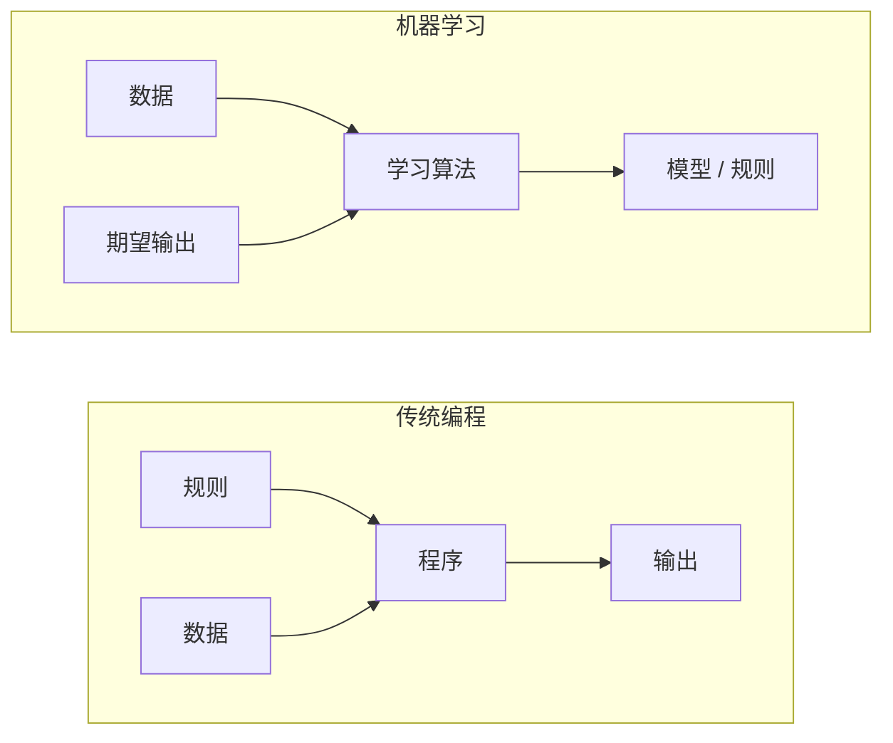
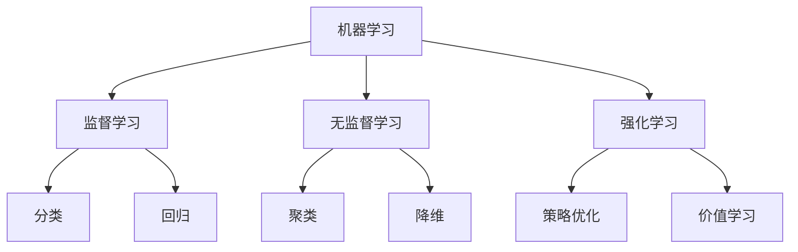
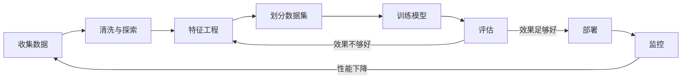
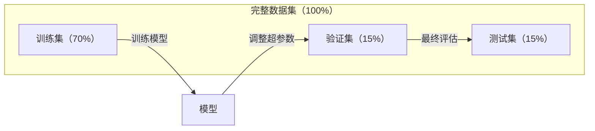
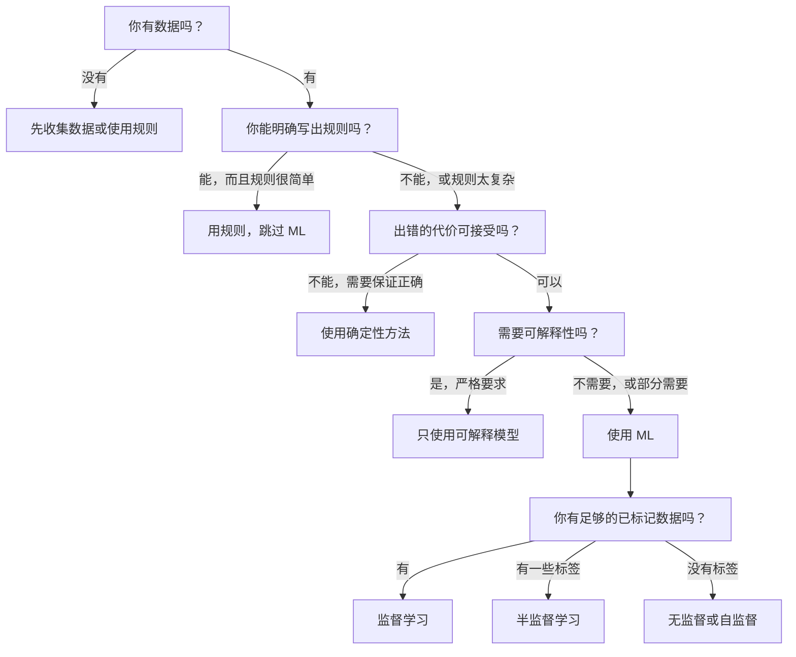

# 什么是机器学习

> 机器学习是让计算机从数据中发现规律，而不是手动编写规则。

**类型：** 学习
**语言：** Python
**前置知识：** 第一阶段（数学基础）
**时长：** ~45 分钟

## 学习目标

- 解释监督学习、无监督学习和强化学习的区别，并判断给定问题属于哪种类型
- 从零实现最近质心分类器，并与随机基线对比评估
- 区分分类任务和回归任务，为各自选择合适的损失函数
- 判断给定业务问题是否适合用机器学习解决，还是更适合用确定性规则

## 问题

你想构建一个垃圾邮件过滤器。传统方法：坐下来写数百条规则。"如果邮件包含'免费赚钱'，标记为垃圾邮件。如果有超过 3 个感叹号，标记为垃圾邮件。" 你花了几周写规则，然后垃圾邮件发送者改变了措辞，你的规则失效了。你再写更多规则。这个循环永无止境。

机器学习颠覆了这一切。与其编写规则，不如给计算机数千封已标记的邮件（"垃圾邮件"或"正常邮件"），让它自己找出规律。计算机会发现你从未想到的模式。当垃圾邮件发送者改变策略时，你重新训练新数据，而不是重写代码。

从"编写规则"到"从数据中学习"的转变，正是机器学习的核心。每一个推荐引擎、语音助手、自动驾驶汽车和语言模型都是这样工作的。

## 概念

### 从数据中学习，而非从规则

传统编程和机器学习以相反的方向解决问题。



传统编程：你编写规则，程序将其应用于数据以产生输出。

机器学习：你提供数据和期望输出，算法自己发现规则。

训练产出的"模型"就是规则，以数字（权重、参数）的形式编码。它从见过的样本中泛化，对从未见过的数据进行预测。

### 机器学习的三种类型



**监督学习**：有输入-输出对，模型学习从输入映射到输出。
- "这里有 1 万张标记为猫或狗的照片，学习区分它们。"
- "这里有房屋特征和价格，学习预测价格。"

**无监督学习**：只有输入，没有标签，模型自行发现结构。
- "这里有 1 万条客户购买历史，找出自然分组。"
- "这里有 1000 维数据点，在保留结构的同时降到 2 维。"

**强化学习**：智能体在环境中采取行动，获得奖励或惩罚，学习一种策略（policy）来最大化总奖励。
- "玩这个游戏，赢了 +1，输了 -1，自己找出策略。"
- "控制这个机械臂，拾起物体 +1，每浪费一秒 -0.01。"

实践中大多数工作使用监督学习。无监督学习常用于预处理和探索。强化学习驱动游戏 AI、机器人控制和语言模型的 RLHF。

### 三种类型之外

上述三种分类很清晰，但现实中的机器学习往往界限模糊。

**半监督学习**使用少量已标记数据和大量未标记数据。你可能有 100 张标记医学图像和 10 万张未标记图像。常见技术包括：

- **标签传播：** 建立连接相似数据点的图，标签通过图从有标记节点传播到未标记邻居。
- **伪标签：** 在已标记数据上训练模型，用它预测未标记数据的标签，然后在所有数据上重新训练。模型自举自己的训练集。
- **一致性正则化：** 模型对输入及其轻微扰动版本应给出相同预测，即使没有标签也有效。

**自监督学习**从数据本身创建监督信号，完全不需要人工标注。模型从数据结构中创建自己的预测任务。

- **掩码语言建模（BERT）：** 隐藏句子中 15% 的词，训练模型预测缺失的词，"标签"来自原始文本。
- **对比学习（SimCLR）：** 对图像创建两个增强版本，训练模型识别它们来自同一图像，同时将其与其他图像的增强版本区分开。
- **下一词预测（GPT）：** 根据所有前文预测下一个词，每个文本文档都成为一个训练样本。

这些不是独立于三种类型之外的别的分类，而是结合监督和无监督思想的策略。自监督学习在技术上属于监督学习（模型在预测某些东西），但标签是自动生成的，而非人工标注。

### 分类与回归

这是监督学习的两种主要任务。

| 方面 | 分类 | 回归 |
|------|------|------|
| 输出 | 离散类别 | 连续数值 |
| 示例 | "这封邮件是垃圾邮件吗？" | "这栋房子的价格会是多少？" |
| 输出空间 | {猫、狗、鸟} | 任意实数 |
| 损失函数 | 交叉熵、准确率 | 均方误差、MAE |
| 决策 | 类别之间的边界 | 拟合数据的曲线 |

分类回答"哪个类别"，回归回答"多少"。

有些问题可以用两种方式建模：预测股票是涨还是跌是分类，预测确切价格是回归。

### ML 工作流程

无论使用什么算法，每个机器学习项目都遵循相同的流程。



**收集数据**：汇集原始数据。数据量多几乎总是更好，但质量比数量更重要。

**清洗与探索**：处理缺失值、删除重复项、可视化分布、发现异常。这一步通常占据项目总时间的 60-80%。

**特征工程**：将原始数据转换为模型可以使用的特征。将日期转换为星期几，对数值列归一化，对类别变量编码。好的特征比高级算法更重要。

**划分数据集**：分成训练集、验证集和测试集。模型在训练集上训练，在验证集上调整超参数，在测试集上报告最终性能。

**训练模型**：将训练数据输入算法，算法调整内部参数以最小化损失函数。

**评估**：在验证集/测试集上衡量性能。如果性能不可接受，回头尝试不同的特征、算法或超参数。

**部署**：将模型投入生产，对新数据进行预测。

**监控**：随时间追踪性能。数据分布会变化（数据漂移），模型会退化。性能下降时，重新训练。

### 训练集、验证集与测试集划分

这是初学者最容易出错的概念。必须在训练期间从未见过的数据上评估模型，否则你衡量的是记忆，而非学习。



| 数据集 | 用途 | 使用时机 | 典型大小 |
|--------|------|----------|----------|
| 训练集 | 模型从中学习 | 训练期间 | 60-80% |
| 验证集 | 调整超参数、比较模型 | 每次训练后 | 10-20% |
| 测试集 | 最终无偏性能估计 | 最后仅使用一次 | 10-20% |

测试集是神圣的，只看一次。如果你根据测试性能不断调整模型，实际上是在测试集上训练，报告的数字毫无意义。

对于小数据集，使用 k 折交叉验证：将数据分为 k 份，在 k-1 份上训练，在剩余一份上验证，轮换，取平均结果。

### 过拟合与欠拟合


**欠拟合**：模型太简单，无法捕捉数据中的模式。用直线拟合曲线关系。训练误差高，测试误差高。

**过拟合**：模型太复杂，记住了训练数据包括其噪声。穿过每个训练点的弯曲曲线，但在新数据上表现糟糕。训练误差低，测试误差高。

**良好拟合**：模型捕捉真实模式而不记住噪声。训练误差和测试误差都相对较低。

过拟合的迹象：
- 训练精度远高于验证精度
- 模型在训练数据上表现良好，但在新数据上表现差
- 添加更多训练数据可以提高性能（模型在记忆而非学习）

过拟合的解决方法：
- 获取更多训练数据
- 降低模型复杂度（更少的参数，更简单的架构）
- 正则化（对大权重添加惩罚）
- Dropout（训练时随机将神经元置零）
- 早停（当验证误差开始增加时停止训练）

欠拟合的解决方法：
- 使用更复杂的模型
- 添加更多特征
- 减少正则化
- 训练更长时间

### 偏差-方差权衡

这是过拟合和欠拟合背后的数学框架。

**偏差**：来自模型中错误假设的误差。当真实关系是非线性时，线性模型具有高偏差。高偏差导致欠拟合。

**方差**：来自对训练数据中微小波动的敏感性的误差。高方差的模型在不同子集的训练数据上给出截然不同的预测。高方差导致过拟合。

| 模型复杂度 | 偏差 | 方差 | 结果 |
|-----------|------|------|------|
| 太低（弯曲数据用线性模型）| 高 | 低 | 欠拟合 |
| 适中 | 中 | 中 | 良好泛化 |
| 太高（10 个点用 20 次多项式）| 低 | 高 | 过拟合 |

总误差 = 偏差² + 方差 + 不可消除的噪声

你无法减少不可消除的噪声（它是数据本身的随机性）。你的目标是找到偏差² + 方差最小化的甜蜜点。

### 没有免费午餐定理

没有哪种算法对所有问题都是最优的。在一类问题上表现好的算法，在另一类问题上会表现差。这就是为什么数据科学家要尝试多种算法并比较结果。

在实践中，选择取决于：
- 数据量
- 特征数量
- 关系是线性还是非线性
- 是否需要可解释性
- 可以承受多少计算量

### 何时不使用机器学习

ML 功能强大，但并不总是正确的工具。在使用模型之前，先问一下你是否真的需要它。

**以下情况不要使用 ML：**

- **规则简单且定义明确。** 税务计算、排序算法、单位换算。如果逻辑可以用几个 if 语句来写，模型只增加复杂性而没有好处。
- **没有数据或数据极少。** ML 需要从样本中学习。只有 10 个数据点，无法训练任何有意义的东西。先收集数据。
- **出错的代价是灾难性的，你需要保证正确性。** 药物剂量计算、核反应堆控制、加密验证。ML 模型是概率性的，有时会出错。如果"有时出错"是不可接受的，使用确定性方法。
- **查找表或启发式方法能解决问题。** 如果简单的阈值或表格涵盖 99% 的情况，增加 ML 只会增加维护成本而没有实质改进。
- **你无法解释决策，但需要可解释性。** 监管行业（贷款、保险、刑事司法）有时要求每个决策都能完全解释。有些 ML 模型是可解释的（线性回归、小型决策树），大多数不是。
- **问题变化速度超过重新训练的速度。** 如果规则每天都在变化，而重新训练需要一周，模型总是过时的。

使用这个决策流程图：



## 动手实现

`code/ml_intro.py` 中的代码从零实现了最近质心分类器（最简单的 ML 算法），演示了核心思想：从数据中学习，然后对新数据进行预测。

### 第一步：从零实现最近质心分类器

最近质心分类器计算训练数据中每个类别的中心（均值）。预测时，将每个新点分配给中心最近的类别。

```python
class NearestCentroid:
    def fit(self, X, y):
        self.classes = np.unique(y)
        self.centroids = np.array([
            X[y == c].mean(axis=0) for c in self.classes
        ])

    def predict(self, X):
        distances = np.array([
            np.sqrt(((X - c) ** 2).sum(axis=1))
            for c in self.centroids
        ])
        return self.classes[distances.argmin(axis=0)]
```

这就是完整的算法。fit 计算两个均值，predict 计算距离。没有梯度下降，没有迭代，没有超参数。

### 第二步：在合成数据上训练

我们生成一个有两类（轻微重叠）的二维分类数据集。质心分类器在类别中心之间画一条线性决策边界。

```python
rng = np.random.RandomState(42)
X_class0 = rng.randn(100, 2) + np.array([1.0, 1.0])
X_class1 = rng.randn(100, 2) + np.array([-1.0, -1.0])
X = np.vstack([X_class0, X_class1])
y = np.array([0] * 100 + [1] * 100)
```

### 第三步：与基线对比

每个 ML 模型都应该与一个简单基线进行比较。这里，基线随机预测类别。如果你的 ML 模型没有超过随机猜测，说明有问题。

```python
baseline_preds = rng.choice([0, 1], size=len(y_test))
baseline_acc = np.mean(baseline_preds == y_test)
```

在这个干净的数据集上，质心分类器应该达到约 90%+ 的准确率，随机基线约 50%。

### 为什么这很重要

最近质心分类器极其简单：没有超参数，没有迭代，没有梯度下降。但它捕捉了基本的 ML 模式：

1. 从训练数据中**学习**一个表示（质心）
2. 用该表示对新数据进行**预测**（最近距离）
3. 与基线进行**评估**（随机猜测）

每种 ML 算法，从逻辑回归到 Transformer，都遵循相同的三步模式。表示变得更复杂，但工作流程保持不变。

### 第四步：质心分类器的局限性

最近质心分类器假设每个类别形成一个单一的 blob，它画出线性决策边界。在以下情况下失败：

- 类别有多个簇（例如，数字"1"有多种写法）
- 决策边界是非线性的（例如，一个类别包裹在另一个周围）
- 特征尺度差异很大（距离被最大尺度特征主导）

这些局限性推动了你将学习的每一种其他算法：K 近邻处理多簇问题，决策树处理非线性边界，特征缩放解决尺度问题。每节课都建立在前一节的局限性之上。

## 实际使用

sklearn 提供了 `NearestCentroid` 和合成数据生成器：

```python
from sklearn.neighbors import NearestCentroid
from sklearn.datasets import make_classification
from sklearn.model_selection import train_test_split

X, y = make_classification(
    n_samples=500, n_features=2, n_redundant=0,
    n_clusters_per_class=1, random_state=42
)
X_train, X_test, y_train, y_test = train_test_split(X, y, test_size=0.3)

clf = NearestCentroid()
clf.fit(X_train, y_train)
print(f"Accuracy: {clf.score(X_test, y_test):.3f}")
```

## 交付

本课生成 `outputs/prompt-ml-problem-framer.md`——一个将模糊业务问题转化为具体 ML 任务的提示词。输入问题描述（"我们想减少流失"或"预测下季度需求"），它会识别学习类型、定义预测目标、列出候选特征、选择成功指标、建立基线，并标记数据泄漏或类别不平衡等陷阱。在任何 ML 项目开始时使用它，避免构建错误的东西。

## 关键术语

| 术语 | 通俗说法 | 实际含义 |
|------|----------|----------|
| 模型 | "AI" | 一个具有可学习参数的数学函数，将输入映射到输出 |
| 训练 | "教 AI" | 运行优化算法，调整模型参数使预测与已知输出匹配 |
| 特征 | "输入列" | 数据的可测量属性，模型用于做出预测 |
| 标签 | "答案" | 训练样本的已知输出，用于计算误差信号 |
| 超参数 | "你调整的设置" | 训练前设置的参数，控制学习过程（学习率、层数）|
| 损失函数 | "模型有多错" | 测量预测与实际输出之间差距的函数，训练试图最小化它 |
| 过拟合 | "记住了测试集" | 模型学了训练特有的噪声而非通用规律，因此在新数据上失败 |
| 欠拟合 | "什么都没学到" | 模型太简单，无法捕捉数据中的真实规律 |
| 泛化 | "能处理新数据" | 模型对未经训练的数据做出准确预测的能力 |
| 交叉验证 | "在不同数据块上测试" | 反复将数据分为训练/测试折叠并取平均结果，给出更可靠的性能估计 |
| 正则化 | "保持权重小" | 在损失函数中增加惩罚项，阻止过于复杂的模型 |
| 数据漂移 | "世界变了" | 随时间推移，输入数据的统计分布发生偏移，导致模型性能下降 |

## 练习

1. 取任意数据集（如 Iris、Titanic），按 70/15/15 分为训练/验证/测试集。解释为什么不应在测试集上调整超参数。
2. 列举三个现实世界的问题，分别判断是分类、回归还是聚类，以及是监督学习还是无监督学习。
3. 一个模型在训练数据上达到 99% 的准确率，但在测试数据上只有 60%。诊断问题并列出三件你会尝试修复它的事情。

## 延伸阅读

- [统计学习导论](https://www.statlearning.com/) — 免费教材，涵盖所有经典 ML 方法，附有实际示例
- [Google 机器学习速成课程](https://developers.google.com/machine-learning/crash-course) — 简洁的 ML 概念可视化介绍
- [Scikit-learn 用户指南](https://scikit-learn.org/stable/user_guide.html) — 在 Python 中实现 ML 的实用参考
