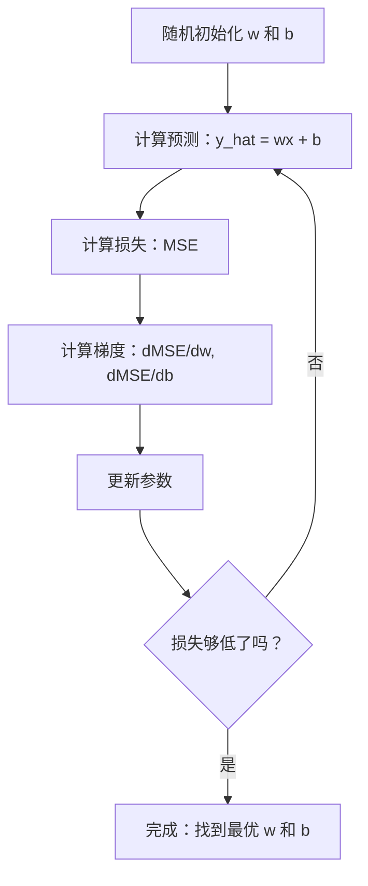

# 线性回归

> 线性回归通过你的数据画出最佳直线。它是机器学习的"Hello World"。

**类型：** 构建
**语言：** Python
**前置知识：** 第一阶段（线性代数、微积分、优化），第二阶段第 1 课
**时长：** ~90 分钟

## 学习目标

- 推导均方误差的梯度下降更新规则，从零实现线性回归
- 从计算复杂度角度比较梯度下降和正规方程，了解各自的适用场景
- 构建带特征标准化的多元线性回归模型，并解读学到的权重
- 解释岭回归（L2 正则化）如何通过惩罚大权重来防止过拟合

## 问题

你有数据：房屋面积和销售价格。你想根据房屋面积预测新房子的价格。你可以在散点图上目测，但你需要一个公式——一条最能拟合数据的直线，使你可以输入任意面积得到价格预测。

线性回归给你这条直线。更重要的是，它引入了完整的 ML 训练循环：定义模型、定义损失函数、优化参数。每种 ML 算法都遵循相同的模式。在这里用最简单的情况掌握它，你会在任何地方都认得出来。

线性回归不只用于简单问题，它在生产系统中用于需求预测、A/B 测试分析、金融建模，以及作为每个回归任务的基线。

## 概念

### 模型

线性回归假设输入 (x) 和输出 (y) 之间存在线性关系：

```
y = wx + b
```

- `w`（权重/斜率）：x 增加 1 时 y 的变化量
- `b`（偏置/截距）：x = 0 时 y 的值

对于多个输入（特征），这扩展为：

```
y = w1*x1 + w2*x2 + ... + wn*xn + b
```

或向量形式：`y = w^T * x + b`

目标：在所有训练样本中，找到使预测 y 尽可能接近实际 y 的 w 和 b 值。

### 损失函数（均方误差）

如何衡量"尽可能接近"？你需要一个数字来反映预测有多错。最常见的选择是均方误差（MSE）：

```
MSE = (1/n) * sum((y_predicted - y_actual)^2)
```

为什么要平方？两个原因。第一，它对大误差的惩罚远大于小误差（误差 10 比误差 1 差 100 倍，不是 10 倍）。第二，平方函数处处光滑可微，使优化变得直接。

损失函数创建了一个曲面。对于单个权重 w 和偏置 b，MSE 曲面看起来像一个碗（凸抛物面）。碗的底部是 MSE 最小化的地方。训练意味着找到那个底部。

### 梯度下降

梯度下降通过一步步向下走来找到碗的底部。



梯度告诉你两件事：每个参数应该向哪个方向移动，以及移动多少。

对于 y_hat = wx + b 时的 MSE：

```
dMSE/dw = (2/n) * sum((y_hat - y) * x)
dMSE/db = (2/n) * sum(y_hat - y)
```

更新规则：

```
w = w - learning_rate * dMSE/dw
b = b - learning_rate * dMSE/db
```

学习率控制步长。太大：越过最小值并发散。太小：训练需要很长时间。典型的起始值：0.01、0.001 或 0.0001。

### 正规方程（闭式解）

对于线性回归，有一个直接的公式，不需要任何迭代就能给出最优权重：

```
w = (X^T * X)^(-1) * X^T * y
```

这通过矩阵求逆一步求解 w。对于小数据集效果完美。对于大数据集（数百万行或数千特征），梯度下降更好，因为矩阵求逆在特征数量上是 O(n^3)。

### 多元线性回归

有多个特征时，模型变为：

```
y = w1*x1 + w2*x2 + ... + wn*xn + b
```

一切相同：MSE 是损失函数，梯度下降同时更新所有权重。唯一的区别是你在拟合超平面而不是直线。

特征缩放在这里很重要。如果一个特征范围是 0 到 1，另一个是 0 到 1,000,000，梯度下降会遇到困难，因为损失曲面变得细长。训练前对特征标准化（减去均值，除以标准差）。

### 多项式回归

如果关系不是线性的怎么办？你仍然可以通过创建多项式特征来使用线性回归：

```
y = w1*x + w2*x^2 + w3*x^3 + b
```

这仍然是"线性"回归，因为模型在权重（w1, w2, w3）上是线性的，只是使用了 x 的非线性特征。

高次多项式可以拟合更复杂的曲线，但有过拟合的风险。一个 10 次多项式会通过 10 个训练点中的每一个，但在新数据上预测很差。

### R 平方分数

MSE 告诉你有多错，但数字取决于 y 的尺度。R² 给出了一个与尺度无关的度量：

```
R² = 1 - (残差平方和) / (与均值偏差的平方和)
   = 1 - SS_res / SS_tot
```

- R² = 1.0：完美预测
- R² = 0.0：模型与每次预测均值一样好（等于没有）
- R² < 0.0：模型比预测均值还差

### 正则化预览（岭回归）

当你有很多特征时，模型可能通过分配大权重来过拟合。岭回归（L2 正则化）添加一个惩罚项：

```
损失 = MSE + lambda * sum(w_i^2)
```

惩罚项抑制大权重。超参数 lambda 控制权衡：lambda 越大，权重越小，正则化越强。这将在后续课程中深入介绍。现在，只需知道它的存在和原因。

## 动手实现

### 第一步：生成样本数据

```python
import random
import math

random.seed(42)

TRUE_W = 3.0
TRUE_B = 7.0
N_SAMPLES = 100

X = [random.uniform(0, 10) for _ in range(N_SAMPLES)]
y = [TRUE_W * x + TRUE_B + random.gauss(0, 2.0) for x in X]

print(f"生成了 {N_SAMPLES} 个样本")
print(f"真实关系：y = {TRUE_W}x + {TRUE_B}（+ 噪声）")
print(f"前 5 个点：{[(round(X[i], 2), round(y[i], 2)) for i in range(5)]}")
```

### 第二步：用梯度下降从零实现线性回归

```python
class LinearRegression:
    def __init__(self, learning_rate=0.01):
        self.w = 0.0
        self.b = 0.0
        self.lr = learning_rate
        self.cost_history = []

    def predict(self, X):
        return [self.w * x + self.b for x in X]

    def compute_cost(self, X, y):
        predictions = self.predict(X)
        n = len(y)
        cost = sum((pred - actual) ** 2 for pred, actual in zip(predictions, y)) / n
        return cost

    def compute_gradients(self, X, y):
        predictions = self.predict(X)
        n = len(y)
        dw = (2 / n) * sum((pred - actual) * x for pred, actual, x in zip(predictions, y, X))
        db = (2 / n) * sum(pred - actual for pred, actual in zip(predictions, y))
        return dw, db

    def fit(self, X, y, epochs=1000, print_every=200):
        for epoch in range(epochs):
            dw, db = self.compute_gradients(X, y)
            self.w -= self.lr * dw
            self.b -= self.lr * db
            cost = self.compute_cost(X, y)
            self.cost_history.append(cost)
            if epoch % print_every == 0:
                print(f"  Epoch {epoch:4d} | 损失: {cost:.4f} | w: {self.w:.4f} | b: {self.b:.4f}")
        return self

    def r_squared(self, X, y):
        predictions = self.predict(X)
        y_mean = sum(y) / len(y)
        ss_res = sum((actual - pred) ** 2 for actual, pred in zip(y, predictions))
        ss_tot = sum((actual - y_mean) ** 2 for actual in y)
        return 1 - (ss_res / ss_tot)
```

### 第三步：正规方程（闭式解）

```python
class LinearRegressionNormal:
    def __init__(self):
        self.w = 0.0
        self.b = 0.0

    def fit(self, X, y):
        n = len(X)
        x_mean = sum(X) / n
        y_mean = sum(y) / n
        numerator = sum((X[i] - x_mean) * (y[i] - y_mean) for i in range(n))
        denominator = sum((X[i] - x_mean) ** 2 for i in range(n))
        self.w = numerator / denominator
        self.b = y_mean - self.w * x_mean
        return self

    def predict(self, X):
        return [self.w * x + self.b for x in X]

    def r_squared(self, X, y):
        predictions = self.predict(X)
        y_mean = sum(y) / len(y)
        ss_res = sum((actual - pred) ** 2 for actual, pred in zip(y, predictions))
        ss_tot = sum((actual - y_mean) ** 2 for actual in y)
        return 1 - (ss_res / ss_tot)
```

### 第四步：多元线性回归

```python
class MultipleLinearRegression:
    def __init__(self, n_features, learning_rate=0.01):
        self.weights = [0.0] * n_features
        self.bias = 0.0
        self.lr = learning_rate

    def predict_single(self, x):
        return sum(w * xi for w, xi in zip(self.weights, x)) + self.bias

    def predict(self, X):
        return [self.predict_single(x) for x in X]

    def fit(self, X, y, epochs=1000, print_every=200):
        n = len(y)
        n_features = len(X[0])
        for epoch in range(epochs):
            predictions = self.predict(X)
            errors = [pred - actual for pred, actual in zip(predictions, y)]
            for j in range(n_features):
                grad = (2 / n) * sum(errors[i] * X[i][j] for i in range(n))
                self.weights[j] -= self.lr * grad
            grad_b = (2 / n) * sum(errors)
            self.bias -= self.lr * grad_b
            if epoch % print_every == 0:
                cost = sum(e**2 for e in errors) / n
                print(f"  Epoch {epoch:4d} | 损失: {cost:.4f}")
        return self
```

### 第五步：多项式回归

```python
class PolynomialRegression:
    def __init__(self, degree, learning_rate=0.01):
        self.degree = degree
        self.weights = [0.0] * degree
        self.bias = 0.0
        self.lr = learning_rate

    def make_features(self, X):
        return [[x ** (d + 1) for d in range(self.degree)] for x in X]

    def predict(self, X):
        features = self.make_features(X)
        return [sum(w * f for w, f in zip(self.weights, row)) + self.bias for row in features]
```

### 第六步：岭回归（L2 正则化）

```python
class RidgeRegression:
    def __init__(self, n_features, learning_rate=0.01, alpha=1.0):
        self.weights = [0.0] * n_features
        self.bias = 0.0
        self.lr = learning_rate
        self.alpha = alpha

    def fit(self, X, y, epochs=1000, print_every=200):
        n = len(y)
        n_features = len(X[0])
        for epoch in range(epochs):
            predictions = [sum(w * xi for w, xi in zip(self.weights, x)) + self.bias for x in X]
            errors = [pred - actual for pred, actual in zip(predictions, y)]
            mse = sum(e ** 2 for e in errors) / n
            reg_term = self.alpha * sum(w ** 2 for w in self.weights)
            cost = mse + reg_term
            for j in range(n_features):
                grad = (2 / n) * sum(errors[i] * X[i][j] for i in range(n))
                grad += 2 * self.alpha * self.weights[j]
                self.weights[j] -= self.lr * grad
            grad_b = (2 / n) * sum(errors)
            self.bias -= self.lr * grad_b
            if epoch % print_every == 0:
                print(f"  Epoch {epoch:4d} | 损失: {cost:.4f} | L2 惩罚: {reg_term:.4f}")
        return self
```

## 实际使用

用 scikit-learn 实现相同功能：

```python
from sklearn.linear_model import LinearRegression as SklearnLR
from sklearn.linear_model import Ridge
from sklearn.preprocessing import PolynomialFeatures, StandardScaler
from sklearn.model_selection import train_test_split
from sklearn.metrics import mean_squared_error, r2_score
import numpy as np

np.random.seed(42)
X_sk = np.random.uniform(0, 10, (100, 1))
y_sk = 3.0 * X_sk.squeeze() + 7.0 + np.random.normal(0, 2.0, 100)

X_train, X_test, y_train, y_test = train_test_split(X_sk, y_sk, test_size=0.2, random_state=42)

lr = SklearnLR()
lr.fit(X_train, y_train)
y_pred = lr.predict(X_test)

print(f"系数 (w): {lr.coef_[0]:.4f}")
print(f"截距 (b): {lr.intercept_:.4f}")
print(f"R² (测试集): {r2_score(y_test, y_pred):.4f}")
print(f"MSE (测试集): {mean_squared_error(y_test, y_pred):.4f}")
```

你的从零实现和 scikit-learn 产生相同的结果。区别：scikit-learn 处理边界情况、数值稳定性和性能优化。生产中用库，用从零实现来理解原理。

## 交付

本课生成：
- `outputs/skill-regression.md` — 根据问题选择合适回归方法的技能

## 练习

1. 实现批量梯度下降、随机梯度下降（SGD）和小批量梯度下降，在同一数据集上比较收敛速度。哪个收敛最快？哪个损失曲线最平滑？
2. 从一个三次函数（y = ax³ + bx² + cx + d + 噪声）生成数据，拟合 1、3 和 10 次多项式，比较训练 R² 和测试 R²。在哪个次数时过拟合变得明显？
3. 实现 Lasso 回归（L1 正则化：惩罚 = alpha * sum(|w_i|)），在多特征房价数据上训练，比较哪些权重变为零（与岭回归相比）。为什么 L1 产生稀疏解而 L2 不会？

## 关键术语

| 术语 | 通俗说法 | 实际含义 |
|------|----------|----------|
| 线性回归 | "画一条穿过数据的直线" | 找到最小化 wx+b 与实际 y 值之间平方差之和的权重 w 和偏置 b |
| 损失函数 | "模型有多糟" | 将模型参数映射到单一数字（衡量预测误差）的函数，训练试图将其最小化 |
| 均方误差 | "误差的平均" | (1/n) * 各（预测 - 实际）² 之和，对大误差施以不成比例的惩罚 |
| 梯度下降 | "向下坡走" | 沿着减小损失函数的方向迭代调整参数，使用偏导数 |
| 学习率 | "步长" | 控制每次梯度下降参数变化量的标量 |
| 正规方程 | "直接求解" | 闭式解 w = (X^T X)^-1 X^T y，无需迭代直接给出最优权重 |
| R 平方 | "拟合有多好" | y 中被模型解释的方差比例，范围从负无穷到 1.0 |
| 特征缩放 | "使特征可比" | 将特征转换为相似范围（如零均值、单位方差），使梯度下降收敛更快 |
| 正则化 | "惩罚复杂性" | 在损失函数中加入收缩权重的项，防止过拟合 |
| 岭回归 | "L2 正则化" | 在 MSE 基础上加入 lambda * sum(w_i²) 惩罚的线性回归 |
| 多项式回归 | "用线性数学拟合曲线" | 对多项式特征（x, x², x³, ...）进行线性回归，在权重上仍是线性的 |
| 过拟合 | "记住训练数据" | 模型过于复杂，拟合了训练数据中的噪声，在新数据上失败 |

## 延伸阅读

- [统计学习导论（ISLR）](https://www.statlearning.com/) — 免费 PDF，第 3 章和第 6 章涵盖线性回归和正则化
- [统计学习精要（ESL）](https://hastie.su.domains/ElemStatLearn/) — 免费 PDF，ISLR 的数学深化版本
- [Stanford CS229 线性回归讲义](https://cs229.stanford.edu/main_notes.pdf) — Andrew Ng 的笔记，从第一原理推导正规方程和梯度下降
- [scikit-learn LinearRegression 文档](https://scikit-learn.org/stable/modules/linear_model.html) — 含代码示例的实用参考
