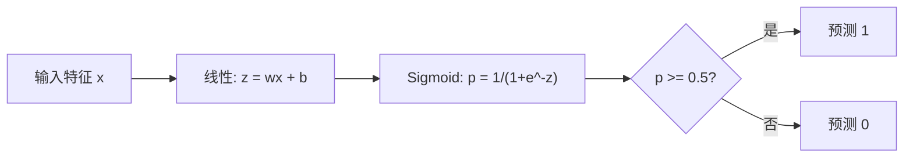

# 逻辑回归

> 逻辑回归将直线弯曲成 S 形曲线，用概率回答是或否的问题。

**类型：** 构建
**语言：** Python
**前置知识：** 第二阶段第 1-2 课（什么是 ML、线性回归）
**时长：** ~90 分钟

## 学习目标

- 使用 sigmoid 函数和二元交叉熵损失从零实现逻辑回归
- 计算并解读二元分类的精确率、召回率、F1 分数和混淆矩阵
- 解释为什么 MSE 对分类失败，以及为什么二元交叉熵产生凸损失曲面
- 构建用于多类分类的 Softmax 回归模型，评估阈值调整的权衡

## 问题

你想根据肿瘤大小预测它是恶性还是良性。你尝试了线性回归，它输出了 0.3、1.7 或 -0.5 这样的数字。这些数字意味着什么？1.7 是"非常恶性"吗？-0.5 是"非常良性"吗？线性回归的输出是无界的，而分类需要 0 到 1 之间的有界概率，以及明确的决策：是或否。

逻辑回归解决了这个问题。它取相同的线性组合（wx + b），然后通过 sigmoid 函数，将任意数字压缩到 (0, 1) 范围内。输出是概率。设置一个阈值（通常是 0.5）然后做出决定。

这是实践中使用最广泛的算法之一。尽管名字叫"回归"，逻辑回归是分类算法，名字来自它使用的 logistic（sigmoid）函数。

## 概念

### 为什么线性回归对分类失败

想象根据学习时间预测通过/失败（1/0）。线性回归拟合一条直线：

```
时间：   1    2    3    4    5    6    7    8    9    10
实际：   0    0    0    0    1    1    1    1    1     1
```

线性拟合可能产生第 1 小时 -0.2、第 10 小时 1.3 这样的预测。这些值不是概率，会低于 0 或高于 1。更糟的是，一个异常值（某人学习了 50 小时）会拖拽整条线，改变所有人的预测。

分类需要一个函数：
- 输出 0 到 1 之间的值（概率）
- 产生尖锐的过渡（决策边界）
- 不被边界远处的离群值扭曲

### Sigmoid 函数

Sigmoid 函数正是如此：

```
sigmoid(z) = 1 / (1 + e^(-z))
```

性质：
- z 很大且为正时，sigmoid(z) 接近 1
- z 很大且为负时，sigmoid(z) 接近 0
- z = 0 时，sigmoid(z) = 0.5
- 输出始终在 0 到 1 之间
- 函数处处光滑可微

导数有一个方便的形式：sigmoid'(z) = sigmoid(z) * (1 - sigmoid(z))，使梯度计算高效。

### 逻辑回归 = 线性模型 + Sigmoid

模型计算 z = wx + b（与线性回归相同），然后应用 sigmoid：



输出 p 被解释为 P(y=1 | x)，即输入属于类别 1 的概率。决策边界是 wx + b = 0 处，这使 sigmoid 输出恰好为 0.5。

### 二元交叉熵损失

不能对逻辑回归使用 MSE。带 sigmoid 的 MSE 会产生有很多局部最小值的非凸损失曲面。改用二元交叉熵（对数损失）：

```
损失 = -(1/n) * sum(y * log(p) + (1-y) * log(1-p))
```

为什么有效：
- y=1 且 p 接近 1 时：log(1) = 0，损失接近 0（正确，低代价）
- y=1 且 p 接近 0 时：log(0) 趋向负无穷，损失极大（错误，高代价）
- y=0 且 p 接近 0 时：log(1) = 0，损失接近 0（正确，低代价）
- y=0 且 p 接近 1 时：log(0) 趋向负无穷，损失极大（错误，高代价）

此损失函数对于逻辑回归是凸的，保证单一全局最小值。

### 逻辑回归的梯度下降

带 sigmoid 的二元交叉熵梯度有简洁的形式：

```
dL/dw = (1/n) * sum((p - y) * x)
dL/db = (1/n) * sum(p - y)
```

这与线性回归梯度完全相同。区别在于 p = sigmoid(wx + b) 而不是 p = wx + b。sigmoid 引入非线性，但梯度更新规则不变。

```mermaid
flowchart TD
    A[初始化 w=0, b=0] --> B[前向传播: z = wx+b, p = sigmoid(z)]
    B --> C[计算损失: 二元交叉熵]
    C --> D["计算梯度: dw = (1/n) * sum((p-y)*x)"]
    D --> E[更新: w = w - lr*dw, b = b - lr*db]
    E --> F{收敛了吗？}
    F -->|否| B
    F -->|是| G[模型训练完成]
```

### 决策边界

对于二维输入（两个特征），决策边界是满足以下条件的直线：

```
w1*x1 + w2*x2 + b = 0
```

一侧的点分类为 1，另一侧为 0。逻辑回归始终产生线性决策边界。如果需要曲线边界，要么添加多项式特征，要么使用非线性模型。

### 用 Softmax 进行多类分类

二元逻辑回归处理两个类别。对于 k 个类别，使用 Softmax 函数：

```
softmax(z_i) = e^(z_i) / sum(e^(z_j) 对所有 j)
```

每个类别都有自己的权重向量。模型为每个类别计算分数 z_i，然后 Softmax 将分数转换为总和为 1 的概率。预测类别是概率最高的那个。

损失函数变为分类交叉熵：

```
损失 = -(1/n) * sum(sum(y_k * log(p_k)))
```

其中 y_k 对于真实类别为 1，对其他所有类别为 0（one-hot 编码）。

### 评估指标

准确率单独使用是不够的。对于一个 95% 为负类、5% 为正类的数据集，总是预测负类的模型准确率达 95%，但毫无用处。

**混淆矩阵**：

| | 预测正类 | 预测负类 |
|---|---|---|
| 实际正类 | 真正例（TP）| 假负例（FN）|
| 实际负类 | 假正例（FP）| 真负例（TN）|

**精确率**：在所有预测为正类中，有多少实际是正类？
```
精确率 = TP / (TP + FP)
```

**召回率**（灵敏度）：在所有实际正类中，我们捕获了多少？
```
召回率 = TP / (TP + FN)
```

**F1 分数**：精确率和召回率的调和平均值，平衡两个指标。
```
F1 = 2 * (精确率 * 召回率) / (精确率 + 召回率)
```

优先考虑的场景：
- **精确率**：当假正例代价高昂时（垃圾邮件过滤器，不想屏蔽正常邮件）
- **召回率**：当假负例代价高昂时（癌症筛查，不想遗漏肿瘤）
- **F1**：当需要单一平衡指标时

## 动手实现

### 第一步：Sigmoid 函数和数据生成

```python
import random
import math

def sigmoid(z):
    z = max(-500, min(500, z))
    return 1.0 / (1.0 + math.exp(-z))


random.seed(42)
N = 200
X = []
y = []

for _ in range(N // 2):
    X.append([random.gauss(2, 1), random.gauss(2, 1)])
    y.append(0)

for _ in range(N // 2):
    X.append([random.gauss(5, 1), random.gauss(5, 1)])
    y.append(1)
```

### 第二步：从零实现逻辑回归

```python
class LogisticRegression:
    def __init__(self, n_features, learning_rate=0.01):
        self.weights = [0.0] * n_features
        self.bias = 0.0
        self.lr = learning_rate
        self.loss_history = []

    def predict_proba(self, x):
        z = sum(w * xi for w, xi in zip(self.weights, x)) + self.bias
        return sigmoid(z)

    def predict(self, x, threshold=0.5):
        return 1 if self.predict_proba(x) >= threshold else 0

    def compute_loss(self, X, y):
        n = len(y)
        total = 0.0
        for i in range(n):
            p = self.predict_proba(X[i])
            p = max(1e-15, min(1 - 1e-15, p))
            total += y[i] * math.log(p) + (1 - y[i]) * math.log(1 - p)
        return -total / n

    def fit(self, X, y, epochs=1000, print_every=200):
        n = len(y)
        n_features = len(X[0])
        for epoch in range(epochs):
            dw = [0.0] * n_features
            db = 0.0
            for i in range(n):
                p = self.predict_proba(X[i])
                error = p - y[i]
                for j in range(n_features):
                    dw[j] += error * X[i][j]
                db += error
            for j in range(n_features):
                self.weights[j] -= self.lr * (dw[j] / n)
            self.bias -= self.lr * (db / n)
            loss = self.compute_loss(X, y)
            self.loss_history.append(loss)
            if epoch % print_every == 0:
                print(f"  Epoch {epoch:4d} | 损失: {loss:.4f}")
        return self
```

### 第三步：从零实现混淆矩阵和指标

```python
class ClassificationMetrics:
    def __init__(self, y_true, y_pred):
        self.tp = sum(1 for t, p in zip(y_true, y_pred) if t == 1 and p == 1)
        self.tn = sum(1 for t, p in zip(y_true, y_pred) if t == 0 and p == 0)
        self.fp = sum(1 for t, p in zip(y_true, y_pred) if t == 0 and p == 1)
        self.fn = sum(1 for t, p in zip(y_true, y_pred) if t == 1 and p == 0)

    def accuracy(self):
        total = self.tp + self.tn + self.fp + self.fn
        return (self.tp + self.tn) / total if total > 0 else 0

    def precision(self):
        denom = self.tp + self.fp
        return self.tp / denom if denom > 0 else 0

    def recall(self):
        denom = self.tp + self.fn
        return self.tp / denom if denom > 0 else 0

    def f1(self):
        p = self.precision()
        r = self.recall()
        return 2 * p * r / (p + r) if (p + r) > 0 else 0
```

### 第四步：决策边界分析

```python
print("\n=== 决策边界 ===")
w1, w2 = model.weights
b = model.bias
print(f"决策边界: {w1:.4f}*x1 + {w2:.4f}*x2 + {b:.4f} = 0")
if abs(w2) > 1e-10:
    print(f"关于 x2 求解: x2 = {-w1/w2:.4f}*x1 + {-b/w2:.4f}")
```

### 第五步：Softmax 多分类

```python
class SoftmaxRegression:
    def __init__(self, n_features, n_classes, learning_rate=0.01):
        self.n_features = n_features
        self.n_classes = n_classes
        self.lr = learning_rate
        self.weights = [[0.0] * n_features for _ in range(n_classes)]
        self.biases = [0.0] * n_classes

    def softmax(self, scores):
        max_score = max(scores)
        exp_scores = [math.exp(s - max_score) for s in scores]
        total = sum(exp_scores)
        return [e / total for e in exp_scores]

    def predict_proba(self, x):
        scores = [
            sum(self.weights[k][j] * x[j] for j in range(self.n_features)) + self.biases[k]
            for k in range(self.n_classes)
        ]
        return self.softmax(scores)

    def predict(self, x):
        probs = self.predict_proba(x)
        return probs.index(max(probs))
```

### 第六步：阈值调整

```python
thresholds = [0.3, 0.4, 0.5, 0.6, 0.7]
print(f"{'阈值':>10} {'准确率':>10} {'精确率':>10} {'召回率':>10} {'F1':>10}")
print("-" * 52)

for t in thresholds:
    y_pred_t = [1 if model.predict_proba(x) >= t else 0 for x in X_test]
    m = ClassificationMetrics(y_test, y_pred_t)
    print(f"{t:>10.1f} {m.accuracy():>10.4f} {m.precision():>10.4f} {m.recall():>10.4f} {m.f1():>10.4f}")
```

## 实际使用

用 scikit-learn 实现：

```python
from sklearn.linear_model import LogisticRegression as SklearnLR
from sklearn.metrics import accuracy_score, precision_score, recall_score, f1_score
from sklearn.metrics import confusion_matrix, classification_report
from sklearn.model_selection import train_test_split
from sklearn.preprocessing import StandardScaler
import numpy as np

np.random.seed(42)
X_0 = np.random.randn(100, 2) + [2, 2]
X_1 = np.random.randn(100, 2) + [5, 5]
X_sk = np.vstack([X_0, X_1])
y_sk = np.array([0] * 100 + [1] * 100)

X_tr, X_te, y_tr, y_te = train_test_split(X_sk, y_sk, test_size=0.2, random_state=42)

scaler = StandardScaler()
X_tr_sc = scaler.fit_transform(X_tr)
X_te_sc = scaler.transform(X_te)

lr = SklearnLR()
lr.fit(X_tr_sc, y_tr)
y_pred = lr.predict(X_te_sc)

print(f"准确率: {accuracy_score(y_te, y_pred):.4f}")
print(f"精确率: {precision_score(y_te, y_pred):.4f}")
print(f"召回率: {recall_score(y_te, y_pred):.4f}")
print(f"F1: {f1_score(y_te, y_pred):.4f}")
print(f"\n混淆矩阵:\n{confusion_matrix(y_te, y_pred)}")
print(f"\n分类报告:\n{classification_report(y_te, y_pred)}")
```

## 交付

本课生成：
- `code/logistic_regression.py` — 带指标的从零实现逻辑回归

## 练习

1. 生成一个非线性可分的数据集（如两个同心圆）。训练逻辑回归并观察它的失败。然后添加多项式特征（x1²、x2²、x1*x2）并再次训练，展示准确率的提高。
2. 为三类 Softmax 模型实现多类混淆矩阵，计算每个类别的精确率和召回率。哪个类别最难分类？
3. 从零构建 ROC 曲线：对 100 个从 0 到 1 的阈值值，计算真正例率和假正例率，使用梯形规则计算 AUC（曲线下面积）。

## 关键术语

| 术语 | 通俗说法 | 实际含义 |
|------|----------|----------|
| 逻辑回归 | "用于分类的回归" | 线性模型后接 sigmoid 函数，输出类别概率 |
| Sigmoid 函数 | "S 形曲线" | 函数 1/(1+e^(-z))，将任意实数映射到 (0, 1) 范围 |
| 二元交叉熵 | "对数损失" | 损失函数 -[y*log(p) + (1-y)*log(1-p)]，对自信的错误预测施以严厉惩罚 |
| 决策边界 | "分界线" | 模型输出概率等于 0.5 的曲面，分隔预测类别 |
| Softmax | "多类 sigmoid" | 将分数向量转换为总和为 1 的概率的函数 |
| 精确率 | "选出的有多少是相关的" | TP / (TP + FP)，正类预测中实际为正类的比例 |
| 召回率 | "相关的有多少被选出来了" | TP / (TP + FN)，实际正类中模型正确识别的比例 |
| F1 分数 | "平衡准确率" | 精确率和召回率的调和平均值：2*P*R / (P+R) |
| 混淆矩阵 | "误差分解" | 显示每个类别对之间 TP、TN、FP、FN 计数的表格 |
| 阈值 | "截止值" | 超过该概率值则预测为类别 1 的概率（默认 0.5，可调） |
| One-hot 编码 | "类别的二进制列" | 将类别 k 表示为在位置 k 为 1 的零向量 |
| 分类交叉熵 | "多类对数损失" | 使用 one-hot 编码标签将二元交叉熵扩展到 k 个类别 |
