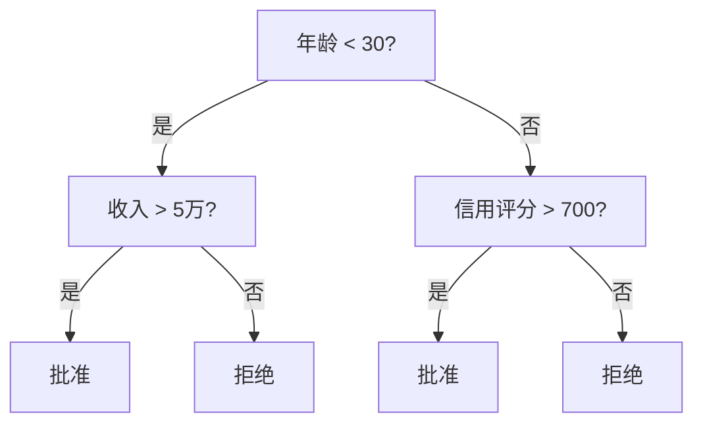
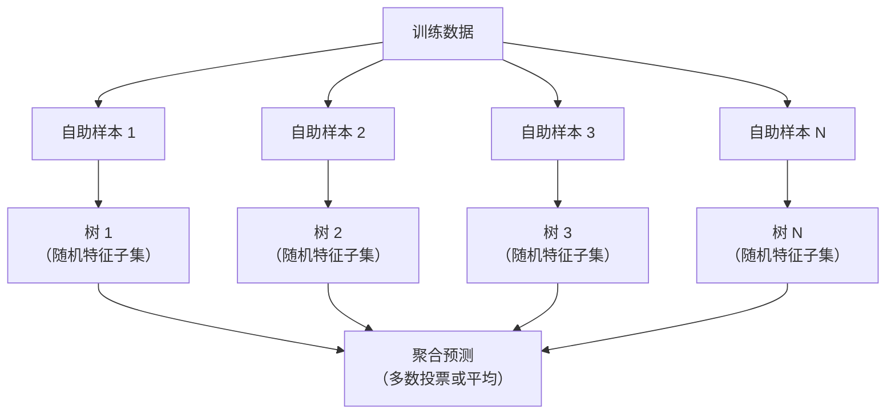

# 决策树与随机森林

> 决策树不过是一张流程图。但一片森林却是 ML 中最强大的工具之一。

**类型：** 构建
**语言：** Python
**前置知识：** 第一阶段（第09课信息论、第06课概率论）
**时间：** ~90 分钟

## 学习目标

- 实现基尼不纯度、熵和信息增益计算，以找到最优决策树分裂点
- 从零构建带预剪枝控制（最大深度、最小样本数）的决策树分类器
- 使用自助采样和特征随机化构建随机森林，并解释其为何能降低方差
- 比较 MDI 特征重要性与置换重要性，识别 MDI 存在偏差的情况

## 问题背景

你有表格数据。行是样本，列是特征，有一个目标列需要预测。你可以用神经网络来处理。但对于表格数据，基于树的模型（决策树、随机森林、梯度提升树）始终优于深度学习。结构化数据的 Kaggle 竞赛由 XGBoost 和 LightGBM 主导，而非 Transformer。

为什么？树能原生处理混合特征类型（数值型和类别型），无需预处理。它们能处理非线性关系，无需特征工程。它们可解释：你可以直接看树并了解为何做出某个预测。随机森林通过平均多棵树，对中等规模数据集具有极强的抗过拟合能力。

本课从零开始使用递归分裂构建决策树，然后在此基础上构建随机森林。你将实现分裂准则背后的数学（基尼不纯度、熵、信息增益），并理解为何弱学习器的集成能变得强大。

## 核心概念

### 决策树的工作原理

决策树通过一系列是/否问题将特征空间划分为矩形区域。



每个内部节点对特征与阈值进行测试。每个叶节点做出预测。对新数据点分类时，从根节点开始沿分支走到叶节点。

树从上而下构建，在每个节点选择能最好分离数据的特征和阈值。"最好"由分裂准则定义。

### 分裂准则：衡量不纯度

在每个节点，我们有一组样本，希望分裂后的子节点尽可能"纯"，即每个子节点主要包含一个类别。

**基尼不纯度（Gini impurity）**衡量在该节点按类别分布随机标记时，随机样本被错误分类的概率。

```
Gini(S) = 1 - sum(p_k^2)

其中 p_k 是集合 S 中第 k 类的比例。
```

对于纯节点（全为一类），Gini = 0。对于二元 50/50 分割，Gini = 0.5。越低越好。

```
示例：6只猫，4只狗

Gini = 1 - (0.6^2 + 0.4^2) = 1 - (0.36 + 0.16) = 0.48
```

**熵（Entropy）**衡量节点中的信息量（无序程度）。见第一阶段第09课。

```
Entropy(S) = -sum(p_k * log2(p_k))
```

纯节点的熵 = 0。二元 50/50 分割的熵 = 1.0。越低越好。

```
示例：6只猫，4只狗

Entropy = -(0.6 * log2(0.6) + 0.4 * log2(0.4))
        = -(0.6 * -0.737 + 0.4 * -1.322)
        = 0.442 + 0.529
        = 0.971 位
```

**信息增益（Information gain）**是分裂后不纯度（熵或基尼）的减少量。

```
IG(S, 特征, 阈值) = Impurity(S) - weighted_avg(Impurity(S_left), Impurity(S_right))

其中权重是每个子节点的样本比例。
```

每个节点的贪心算法：尝试每个特征和每个可能的阈值。选择使信息增益最大的（特征, 阈值）对。

### 分裂的工作原理

对于当前节点有 n 个特征、m 个样本的数据集：

1. 对每个特征 j（j = 1 到 n）：
   - 按特征 j 对样本排序
   - 尝试连续不同值之间的每个中点作为阈值
   - 计算每个阈值的信息增益
2. 选择信息增益最高的特征和阈值
3. 将数据分为左（特征 <= 阈值）和右（特征 > 阈值）
4. 对每个子节点递归

这种贪心方法不保证全局最优树。找到最优树是 NP 难问题。但贪心分裂在实践中效果很好。

### 停止条件

没有停止条件，树会一直生长直到每个叶节点都是纯的（每个叶一个样本）。这会完美记忆训练数据，泛化性极差。

**预剪枝（Pre-pruning）**在树完全生长前停止：
- 最大深度：树达到设定深度时停止分裂
- 每叶最小样本数：节点样本数少于 k 时停止
- 最小信息增益：最佳分裂的不纯度改善小于阈值时停止
- 最大叶节点数：限制叶节点总数

**后剪枝（Post-pruning）**先生长完整的树，再裁剪：
- 代价复杂度剪枝（scikit-learn 使用）：添加与叶节点数成比例的惩罚项。增大惩罚得到更小的树
- 降低错误率剪枝：若移除子树不增加验证误差则移除它

预剪枝更简单快速。后剪枝通常产生更好的树，因为它不会过早停止可能导致后续有用分裂的过程。

### 回归决策树

对于回归，叶节点的预测是该叶中目标值的均值。分裂准则也随之改变：

**方差减少（Variance reduction）**替代信息增益：

```
VR(S, 特征, 阈值) = Var(S) - weighted_avg(Var(S_left), Var(S_right))
```

选择方差减少最多的分裂。树将输入空间划分为区域，在每个区域预测常数（均值）。

### 随机森林：集成的力量

单棵决策树具有高方差。数据的微小变化可能产生完全不同的树。随机森林通过平均多棵树来解决这个问题。



两种随机性使树之间多样化：

**袋装法（Bagging，自助聚合）：** 每棵树在自助样本上训练，即从训练数据有放回地随机抽取的样本。约 63% 的原始样本出现在每个自助样本中（其余为袋外样本，可用于验证）。

**特征随机化：** 在每个分裂点，只考虑特征的随机子集。分类默认为 sqrt(n_features)，回归为 n_features/3。这防止所有树都在同一个主导特征上分裂。

核心洞察：平均多棵去相关的树在不增加偏差的情况下减少方差。每棵单独的树可能很平庸。集成则很强大。

### 特征重要性

随机森林自然提供特征重要性分数。最常见的方法：

**不纯度平均减少（MDI，Mean Decrease in Impurity）：** 对每个特征，汇总所有树和所有使用该特征的节点中的不纯度减少总量。在早期分裂中产生更大不纯度减少的特征更重要。

```
importance(feature_j) = 对所有使用 feature_j 的节点求和:
    (该节点样本数 / 总样本数) * 不纯度减少量
```

这很快（训练期间计算），但偏向高基数特征和有很多可能分裂点的特征。

**置换重要性（Permutation importance）**是替代方案：打乱一个特征的值，测量模型准确率下降多少。更可靠但更慢。

### 树何时胜过神经网络

在表格数据上，树和森林主导神经网络。原因如下：

| 因素 | 树 | 神经网络 |
|------|-----|---------|
| 混合类型（数值 + 类别） | 原生支持 | 需要编码 |
| 小数据集（< 1万行） | 效果好 | 过拟合 |
| 特征交互 | 通过分裂发现 | 需要架构设计 |
| 可解释性 | 完全透明 | 黑箱 |
| 训练时间 | 分钟级 | 小时级 |
| 超参数敏感度 | 低 | 高 |

当数据具有空间或序列结构（图像、文本、音频）时，神经网络胜出。对于特征的平面表格，树是默认选择。

## 构建实现

### 第一步：基尼不纯度和熵

从零构建两种分裂准则，验证它们对好分裂的判断一致。

```python
import math

def gini_impurity(labels):
    n = len(labels)
    if n == 0:
        return 0.0
    counts = {}
    for label in labels:
        counts[label] = counts.get(label, 0) + 1
    return 1.0 - sum((c / n) ** 2 for c in counts.values())

def entropy(labels):
    n = len(labels)
    if n == 0:
        return 0.0
    counts = {}
    for label in labels:
        counts[label] = counts.get(label, 0) + 1
    return -sum(
        (c / n) * math.log2(c / n) for c in counts.values() if c > 0
    )
```

### 第二步：找到最佳分裂

尝试每个特征和每个阈值。返回信息增益最高的那个。

```python
def information_gain(parent_labels, left_labels, right_labels, criterion="gini"):
    measure = gini_impurity if criterion == "gini" else entropy
    n = len(parent_labels)
    n_left = len(left_labels)
    n_right = len(right_labels)
    if n_left == 0 or n_right == 0:
        return 0.0
    parent_impurity = measure(parent_labels)
    child_impurity = (
        (n_left / n) * measure(left_labels) +
        (n_right / n) * measure(right_labels)
    )
    return parent_impurity - child_impurity
```

### 第三步：构建 DecisionTree 类

递归分裂、预测和特征重要性追踪。

```python
class DecisionTree:
    def __init__(self, max_depth=None, min_samples_split=2,
                 min_samples_leaf=1, criterion="gini",
                 max_features=None):
        self.max_depth = max_depth
        self.min_samples_split = min_samples_split
        self.min_samples_leaf = min_samples_leaf
        self.criterion = criterion
        self.max_features = max_features
        self.tree = None
        self.feature_importances_ = None

    def fit(self, X, y):
        self.n_features = len(X[0])
        self.feature_importances_ = [0.0] * self.n_features
        self.n_samples = len(X)
        self.tree = self._build(X, y, depth=0)
        total = sum(self.feature_importances_)
        if total > 0:
            self.feature_importances_ = [
                fi / total for fi in self.feature_importances_
            ]

    def predict(self, X):
        return [self._predict_one(x, self.tree) for x in X]
```

### 第四步：构建 RandomForest 类

自助采样、特征随机化和多数投票。

```python
class RandomForest:
    def __init__(self, n_trees=100, max_depth=None,
                 min_samples_split=2, max_features="sqrt",
                 criterion="gini"):
        self.n_trees = n_trees
        self.max_depth = max_depth
        self.min_samples_split = min_samples_split
        self.max_features = max_features
        self.criterion = criterion
        self.trees = []

    def fit(self, X, y):
        n = len(X)
        for _ in range(self.n_trees):
            indices = [random.randint(0, n - 1) for _ in range(n)]
            X_boot = [X[i] for i in indices]
            y_boot = [y[i] for i in indices]
            tree = DecisionTree(
                max_depth=self.max_depth,
                min_samples_split=self.min_samples_split,
                max_features=self.max_features,
                criterion=self.criterion,
            )
            tree.fit(X_boot, y_boot)
            self.trees.append(tree)

    def predict(self, X):
        all_preds = [tree.predict(X) for tree in self.trees]
        predictions = []
        for i in range(len(X)):
            votes = {}
            for preds in all_preds:
                v = preds[i]
                votes[v] = votes.get(v, 0) + 1
            predictions.append(max(votes, key=votes.get))
        return predictions
```

完整实现（含所有辅助方法）见 `code/trees.py`。

## 实际使用

使用 scikit-learn，训练随机森林只需三行：

```python
from sklearn.ensemble import RandomForestClassifier
from sklearn.datasets import load_iris
from sklearn.model_selection import train_test_split

X, y = load_iris(return_X_y=True)
X_train, X_test, y_train, y_test = train_test_split(X, y, random_state=42)

rf = RandomForestClassifier(n_estimators=100, random_state=42)
rf.fit(X_train, y_train)
print(f"准确率: {rf.score(X_test, y_test):.4f}")
print(f"特征重要性: {rf.feature_importances_}")
```

实践中，梯度提升树（XGBoost、LightGBM、CatBoost）通常比随机森林更强，因为它们顺序构建树，每棵树修正前一棵树的错误。但随机森林更难出错，几乎不需要超参数调整。

## 输出产物

本课产生 `outputs/prompt-tree-interpreter.md` ——一个为业务利益相关者解读决策树分裂的提示词。输入训练好的树的结构（深度、特征、分裂阈值、准确率），它会将模型翻译为简明规则、排列特征重要性、标记过拟合或数据泄露，并推荐后续步骤。在需要向不读代码的人解释基于树的模型时使用。

## 练习

1. 在包含 3 个类别的二维数据集上训练单棵决策树。手动追踪分裂并画出矩形决策边界。比较 max_depth=2 与 max_depth=10 时的边界。

2. 实现回归树的方差减少分裂。为 200 个点生成 y = sin(x) + 噪声并拟合你的回归树。绘制树的分段常数预测与真实曲线的对比。

3. 用 1、5、10、50 和 200 棵树构建随机森林。绘制训练准确率和测试准确率与树的数量的关系图。观察测试准确率趋于平稳但不下降（森林抵抗过拟合）。

4. 在 5 个不同数据集上比较基尼不纯度与熵作为分裂准则。测量准确率和树深度。大多数情况下，它们产生几乎相同的结果。解释原因。

5. 实现置换重要性。在一个特征是高基数随机噪声的数据集上与 MDI 重要性对比。MDI 会将噪声特征排名很高。置换重要性不会。

## 关键术语

| 术语 | 常见说法 | 实际含义 |
|------|---------|---------|
| 决策树（Decision tree） | "预测用的流程图" | 通过学习一系列 if/else 分裂将特征空间划分为矩形区域的模型 |
| 基尼不纯度（Gini impurity） | "节点有多混乱" | 在节点处随机样本被错误分类的概率。0 = 纯，0.5 = 二元最大不纯度 |
| 熵（Entropy） | "节点的无序程度" | 节点的信息量。0 = 纯，1.0 = 二元最大不确定性。来自信息论 |
| 信息增益（Information gain） | "分裂有多好" | 分裂后不纯度的减少量。选择分裂的贪心准则 |
| 预剪枝（Pre-pruning） | "提前停止树" | 通过设置最大深度、最小样本数或最小增益阈值来提前停止树的生长 |
| 后剪枝（Post-pruning） | "事后修剪树" | 先生长完整的树，然后移除不能改善验证性能的子树 |
| 袋装法（Bagging） | "在随机子集上训练" | 自助聚合。在不同的有放回随机样本上训练每个模型 |
| 随机森林（Random forest） | "一堆树" | 决策树的集成，每棵树在自助样本上训练，每次分裂时使用随机特征子集 |
| 特征重要性 MDI | "哪些特征重要" | 每个特征在所有树和节点中贡献的不纯度减少总量 |
| 置换重要性（Permutation importance） | "打乱并检查" | 随机打乱特征值时准确率的下降量。对噪声特征比 MDI 更可靠 |
| 方差减少（Variance reduction） | "回归版信息增益" | 回归树中信息增益的类比。选择最大程度减少目标方差的分裂 |
| 自助样本（Bootstrap sample） | "有重复的随机样本" | 从原始数据集有放回地随机抽取的样本。大小相同，但有重复 |

## 延伸阅读

- [Breiman: Random Forests (2001)](https://link.springer.com/article/10.1023/A:1010933404324) - 随机森林原始论文
- [Grinsztajn et al.: Why do tree-based models still outperform deep learning on tabular data? (2022)](https://arxiv.org/abs/2207.08815) - 树与神经网络在表格任务上的严格比较
- [scikit-learn 决策树文档](https://scikit-learn.org/stable/modules/tree.html) - 含可视化工具的实用指南
- [XGBoost: A Scalable Tree Boosting System (Chen & Guestrin, 2016)](https://arxiv.org/abs/1603.02754) - 主导 Kaggle 的梯度提升论文
