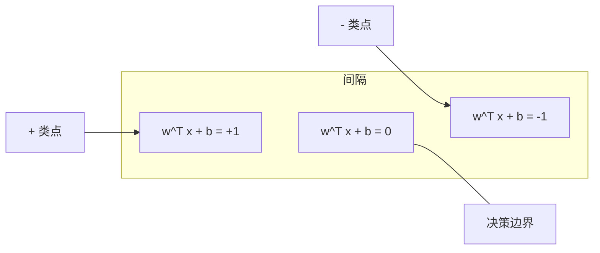
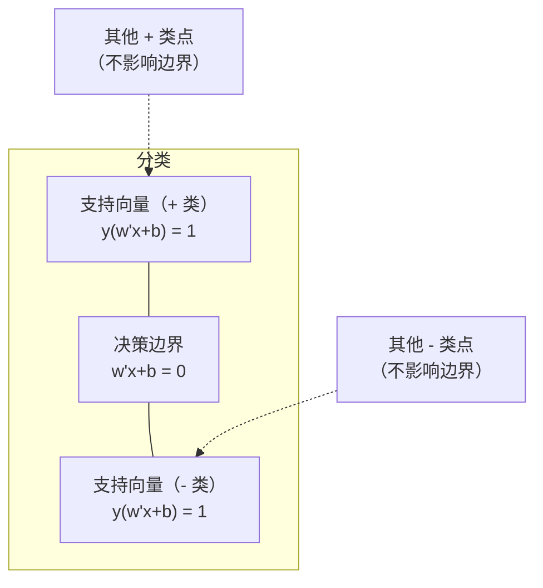
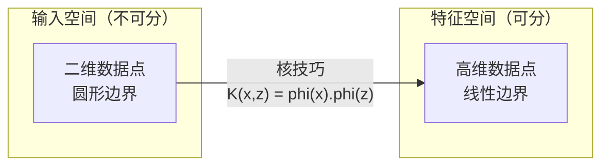

# 支持向量机

> 找到两个类别之间最宽的街道。这就是全部思想。

**类型：** 构建
**语言：** Python
**前置知识：** 第一阶段（第08课优化、第14课范数与距离、第18课凸优化）
**时间：** ~90 分钟

## 学习目标

- 使用铰链损失和梯度下降在原始规划上从零实现线性 SVM
- 解释最大间隔原则，并从训练好的模型中识别支持向量
- 比较线性、多项式和 RBF 核，解释核技巧如何避免显式高维映射
- 评估 C 参数在间隔宽度和分类错误之间控制的权衡

## 问题背景

你有两类数据点，需要画一条线（或超平面）来分隔它们。无数条线都可以做到。应该选哪条？

选间隔最大的那条。间隔是决策边界与两侧最近数据点之间的距离。间隔越宽，分类器越自信，对未见数据的泛化效果越好。

这一直觉引出了支持向量机（SVM）——ML 中数学上最优雅的算法之一。SVM 在深度学习出现前是主导的分类方法，至今仍是小数据集、高维数据以及需要有原则、有理论保证的可解释模型时的最佳选择。

SVM 直接连接第一阶段内容：优化问题是凸的（第18课），间隔用范数衡量（第14课），核技巧利用点积处理非线性边界而无需计算高维空间。

## 核心概念

### 最大间隔分类器

给定线性可分数据，标签 y_i 属于 {-1, +1}，特征向量 x_i，我们需要找超平面 w^T x + b = 0 分隔两类。

点 x_i 到超平面的距离为：

```
distance = |w^T x_i + b| / ||w||
```

对于正确分类的点：y_i * (w^T x_i + b) > 0。间隔是超平面到两侧最近点距离的两倍。



优化问题：

```
最大化    2 / ||w||     （间隔宽度）
约束      y_i * (w^T x_i + b) >= 1  对所有 i
```

等价形式（最小化 ||w||^2 更易优化）：

```
最小化    (1/2) ||w||^2
约束      y_i * (w^T x_i + b) >= 1  对所有 i
```

这是凸二次规划问题，有唯一全局最优解。恰好在间隔边界上的点（y_i * (w^T x_i + b) = 1 处）是支持向量。它们是唯一决定决策边界的点。移动或移除任何非支持向量点，边界不变。

### 支持向量：关键少数



大多数训练点无关紧要。只有支持向量才重要。这就是 SVM 在预测时内存高效的原因：只需存储支持向量，而非整个训练集。

支持向量的数量也为泛化误差提供了界。相对于数据集大小支持向量越少，泛化效果越好。

### 软间隔：用 C 参数处理噪声

真实数据很少完全可分。有些点可能在边界的错误一侧，或在间隔内部。软间隔规划通过引入松弛变量允许违反。

```
最小化    (1/2) ||w||^2 + C * sum(xi_i)
约束      y_i * (w^T x_i + b) >= 1 - xi_i
          xi_i >= 0  对所有 i
```

松弛变量 xi_i 衡量点 i 违反间隔的程度。C 控制权衡：

| C 值 | 行为 |
|------|------|
| 大 C | 严重惩罚违规。窄间隔，少误分类。过拟合 |
| 小 C | 允许更多违规。宽间隔，多误分类。欠拟合 |

C 是正则化强度的倒数。大 C = 少正则化。小 C = 多正则化。

### 铰链损失：SVM 的损失函数

软间隔 SVM 可以改写为无约束优化：

```
最小化    (1/2) ||w||^2 + C * sum(max(0, 1 - y_i * (w^T x_i + b)))
```

项 max(0, 1 - y_i * f(x_i)) 是铰链损失（hinge loss）。当点被正确分类且在间隔之外时为零。当点在间隔内或被误分类时为线性。

```
单个点的铰链损失：

损失
  |
  | \
  |  \
  |   \
  |    \
  |     \_______________
  |
  +-----|-----|-------->  y * f(x)
       0     1

y*f(x) >= 1 时损失为零（正确分类，在间隔之外）。
y*f(x) < 1 时有线性惩罚。
```

与逻辑损失（逻辑回归）对比：

```
铰链：     max(0, 1 - y*f(x))          在间隔处硬截断
逻辑：     log(1 + exp(-y*f(x)))        平滑，永远不会精确为零
```

铰链损失产生稀疏解（只有支持向量有非零贡献）。逻辑损失使用所有数据点。这使 SVM 在预测时更节省内存。

### 用梯度下降训练线性 SVM

可以使用铰链损失加 L2 正则化的梯度下降来训练线性 SVM，无需求解约束二次规划：

```
L(w, b) = (lambda/2) * ||w||^2 + (1/n) * sum(max(0, 1 - y_i * (w^T x_i + b)))

关于 w 的梯度：
  若 y_i * (w^T x_i + b) >= 1:  dL/dw = lambda * w
  若 y_i * (w^T x_i + b) < 1:   dL/dw = lambda * w - y_i * x_i

关于 b 的梯度：
  若 y_i * (w^T x_i + b) >= 1:  dL/db = 0
  若 y_i * (w^T x_i + b) < 1:   dL/db = -y_i
```

这称为原始规划（primal formulation）。每轮运行 O(n * d)，其中 n 是样本数，d 是特征数。对于大型稀疏高维数据（文本分类），这很快。

### 对偶规划与核技巧

SVM 问题的拉格朗日对偶（来自第一阶段第18课，KKT 条件）为：

```
最大化    sum(alpha_i) - (1/2) * sum_ij(alpha_i * alpha_j * y_i * y_j * (x_i . x_j))
约束      0 <= alpha_i <= C
          sum(alpha_i * y_i) = 0
```

对偶只涉及数据点之间的点积 x_i . x_j。这是关键洞察。将每个点积替换为核函数 K(x_i, x_j)，SVM 就能在不显式计算变换的情况下学习非线性边界。

```
线性核：      K(x, z) = x . z
多项式核：    K(x, z) = (x . z + c)^d
RBF（高斯）：K(x, z) = exp(-gamma * ||x - z||^2)
```

RBF 核将数据映射到无限维空间。输入空间中相近的点核值接近 1。相距远的点核值接近 0。它能学习任何平滑的决策边界。



核技巧在不进入高维空间的情况下计算高维空间中的点积。对于 D 维中 d 次多项式核，显式特征空间有 O(D^d) 维。但 K(x, z) 只需 O(D) 时间计算。

### 支持向量回归（SVR）

支持向量回归在数据周围拟合宽度为 epsilon 的管道。管道内的点损失为零。管道外的点受到线性惩罚。

```
最小化    (1/2) ||w||^2 + C * sum(xi_i + xi_i*)
约束      y_i - (w^T x_i + b) <= epsilon + xi_i
          (w^T x_i + b) - y_i <= epsilon + xi_i*
          xi_i, xi_i* >= 0
```

epsilon 参数控制管道宽度。管道越宽 = 支持向量越少 = 拟合越平滑。管道越窄 = 支持向量越多 = 拟合越紧密。

### SVM 为何败给深度学习（以及仍然胜出的场景）

SVM 从 1990 年代末到 2010 年代初主导了 ML 领域。深度学习超越它有几个原因：

| 因素 | SVM | 深度学习 |
|------|-----|---------|
| 特征工程 | 需要 | 自动学习特征 |
| 可扩展性 | 核方法 O(n²) 到 O(n³) | SGD 每轮 O(n) |
| 图像/文本/音频 | 需要手工设计特征 | 从原始数据学习 |
| 大数据集（>10万） | 慢 | 扩展性好 |
| GPU 加速 | 收益有限 | 巨大加速 |

SVM 在以下情况仍然胜出：
- 小数据集（数百到数千样本）
- 高维稀疏数据（TF-IDF 特征的文本）
- 需要数学保证时（间隔界）
- 训练时间必须最小时（线性 SVM 非常快）
- 有明确间隔结构的二元分类
- 异常检测（单类 SVM）

## 构建实现

### 第一步：铰链损失和梯度

基础部分。计算批次的铰链损失及其梯度。

```python
def hinge_loss(X, y, w, b):
    n = len(X)
    total_loss = 0.0
    for i in range(n):
        margin = y[i] * (dot(w, X[i]) + b)
        total_loss += max(0.0, 1.0 - margin)
    return total_loss / n
```

### 第二步：通过梯度下降训练线性 SVM

通过最小化正则化铰链损失来训练。无需二次规划求解器。

```python
class LinearSVM:
    def __init__(self, lr=0.001, lambda_param=0.01, n_epochs=1000):
        self.lr = lr
        self.lambda_param = lambda_param
        self.n_epochs = n_epochs
        self.w = None
        self.b = 0.0

    def fit(self, X, y):
        n_features = len(X[0])
        self.w = [0.0] * n_features
        self.b = 0.0

        for epoch in range(self.n_epochs):
            for i in range(len(X)):
                margin = y[i] * (dot(self.w, X[i]) + self.b)
                if margin >= 1:
                    self.w = [wj - self.lr * self.lambda_param * wj
                              for wj in self.w]
                else:
                    self.w = [wj - self.lr * (self.lambda_param * wj - y[i] * X[i][j])
                              for j, wj in enumerate(self.w)]
                    self.b -= self.lr * (-y[i])

    def predict(self, X):
        return [1 if dot(self.w, x) + self.b >= 0 else -1 for x in X]
```

### 第三步：核函数

实现线性、多项式和 RBF 核。

```python
def linear_kernel(x, z):
    return dot(x, z)

def polynomial_kernel(x, z, degree=3, c=1.0):
    return (dot(x, z) + c) ** degree

def rbf_kernel(x, z, gamma=0.5):
    diff = [xi - zi for xi, zi in zip(x, z)]
    return math.exp(-gamma * dot(diff, diff))
```

### 第四步：识别间隔和支持向量

训练后，识别哪些点是支持向量并计算间隔宽度。

```python
def find_support_vectors(X, y, w, b, tol=1e-3):
    support_vectors = []
    for i in range(len(X)):
        margin = y[i] * (dot(w, X[i]) + b)
        if abs(margin - 1.0) < tol:
            support_vectors.append(i)
    return support_vectors
```

完整实现（含所有演示）见 `code/svm.py`。

## 实际使用

使用 scikit-learn：

```python
from sklearn.svm import SVC, LinearSVC, SVR
from sklearn.preprocessing import StandardScaler
from sklearn.pipeline import Pipeline

clf = Pipeline([
    ("scaler", StandardScaler()),
    ("svm", SVC(kernel="rbf", C=1.0, gamma="scale")),
])
clf.fit(X_train, y_train)
print(f"准确率: {clf.score(X_test, y_test):.4f}")
print(f"支持向量数: {clf['svm'].n_support_}")
```

重要：训练 SVM 前始终对特征进行缩放。SVM 对特征量级敏感，因为间隔依赖于 ||w||，未缩放的特征会扭曲几何结构。

对于大数据集，使用 `LinearSVC`（原始规划，每轮 O(n)）而非 `SVC`（对偶规划，O(n²) 到 O(n³)）：

```python
from sklearn.svm import LinearSVC

clf = Pipeline([
    ("scaler", StandardScaler()),
    ("svm", LinearSVC(C=1.0, max_iter=10000)),
])
```

## 练习

1. 生成二维线性可分数据集。训练你的 LinearSVM 并识别支持向量。验证支持向量是最接近决策边界的点。

2. 在噪声数据集上将 C 从 0.001 变化到 1000。为每个 C 值绘制决策边界。观察从宽间隔（欠拟合）到窄间隔（过拟合）的过渡。

3. 创建类别边界为圆形（非线性）的数据集。证明线性 SVM 失败。计算 RBF 核矩阵并证明在核诱导的特征空间中类别变得可分。

4. 在同一数据集上比较铰链损失与逻辑损失。训练线性 SVM 和逻辑回归。统计各模型决策边界依赖的训练点数量（支持向量 vs 所有点）。

5. 实现 SVR（epsilon 不敏感损失）。用它拟合 y = sin(x) + 噪声。绘制预测周围的 epsilon 管道，并高亮支持向量（管道外的点）。

## 关键术语

| 术语 | 实际含义 |
|------|---------|
| 支持向量（Support vectors） | 最接近决策边界的训练点。唯一决定超平面的点 |
| 间隔（Margin） | 决策边界到最近支持向量的距离。SVM 最大化这个值 |
| 铰链损失（Hinge loss） | max(0, 1 - y*f(x))。正确分类且在间隔外时为零，否则线性惩罚 |
| C 参数 | 间隔宽度与分类错误之间的权衡。大 C = 窄间隔，小 C = 宽间隔 |
| 软间隔（Soft margin） | 通过松弛变量允许间隔违规的 SVM 规划。处理不可分数据 |
| 核技巧（Kernel trick） | 在不显式映射到高维特征空间的情况下计算其中的点积 |
| 线性核（Linear kernel） | K(x, z) = x . z。等同于标准点积。用于线性可分数据 |
| RBF 核 | K(x, z) = exp(-gamma * ||x-z||²)。映射到无限维。能学习任何平滑边界 |
| 多项式核（Polynomial kernel） | K(x, z) = (x . z + c)^d。映射到多项式组合的特征空间 |
| 对偶规划（Dual formulation） | SVM 问题的重新表述，只依赖数据点之间的点积。支持核方法 |
| SVR | 支持向量回归。在数据周围拟合 epsilon 管道。管道内的点损失为零 |
| 松弛变量（Slack variables） | xi_i：衡量点违反间隔的程度。间隔外正确分类点为零 |
| 最大间隔（Maximum margin） | 选择使到两类最近点距离最大化的超平面的原则 |

## 延伸阅读

- [Vapnik: The Nature of Statistical Learning Theory (1995)](https://link.springer.com/book/10.1007/978-1-4757-3264-1) - SVM 和统计学习理论的奠基著作
- [Cortes & Vapnik: Support-vector networks (1995)](https://link.springer.com/article/10.1007/BF00994018) - 原始 SVM 论文
- [Platt: Sequential Minimal Optimization (1998)](https://www.microsoft.com/en-us/research/publication/sequential-minimal-optimization-a-fast-algorithm-for-training-support-vector-machines/) - 使 SVM 训练实用化的 SMO 算法
- [scikit-learn SVM 文档](https://scikit-learn.org/stable/modules/svm.html) - 含实现细节的实用指南
- [LIBSVM: A Library for Support Vector Machines](https://www.csie.ntu.edu.tw/~cjlin/libsvm/) - 大多数 SVM 实现背后的 C++ 库
