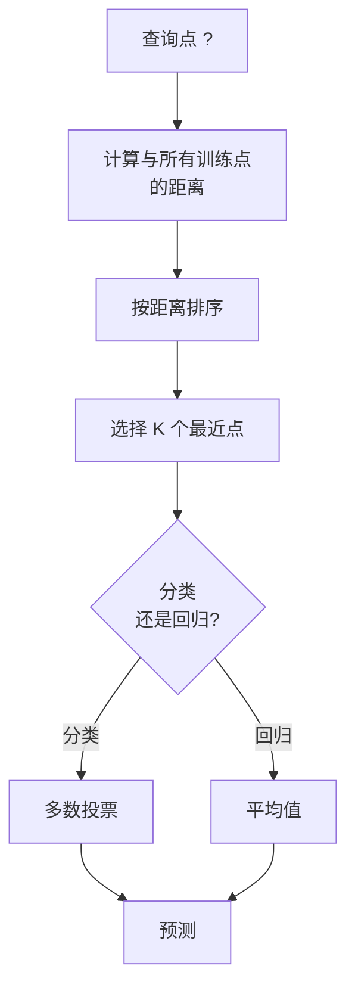
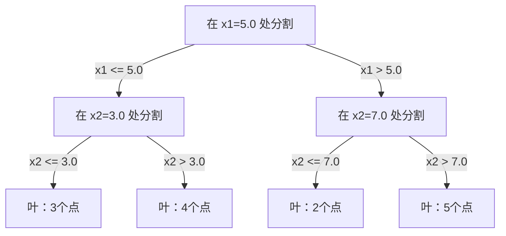

# K 近邻与距离

> 存储所有数据。通过观察邻居来预测。最简单但真正有效的算法。

**类型：** 构建
**语言：** Python
**前置知识：** 第一阶段（第14课范数与距离）
**时间：** ~90 分钟

## 学习目标

- 从零实现可配置 K 值和距离加权投票的 KNN 分类和回归
- 比较 L1、L2、余弦和 Minkowski 距离度量，并为给定数据类型选择合适的
- 解释维数灾难，演示 KNN 在高维空间中如何退化
- 构建 KD 树以实现高效的最近邻搜索，分析其优于暴力搜索的场景

## 问题背景

你有一个数据集。一个新数据点到来。你需要对其分类或预测其值。KNN 不像线性回归或 SVM 那样从数据中学习参数，而是找到 K 个最接近新点的训练点，让它们投票。

这就是 K 近邻算法。没有训练阶段。没有参数需要学习。没有需要最小化的损失函数。你存储整个训练集，在预测时计算距离。

听起来太简单不像能用。但 KNN 在许多问题上出人意料地有竞争力，尤其是在中小数据集上。深入理解它揭示了基本概念：距离度量的选择（连接到第一阶段第14课）、维数灾难，以及懒惰学习与积极学习的区别。

KNN 也在现代 AI 中无处不在，只是换了不同的名字。向量数据库对嵌入做 KNN 搜索。检索增强生成（RAG）找 K 个最近的文档片段。推荐系统找相似的用户或物品。算法是一样的，规模和数据结构不同。

## 核心概念

### KNN 的工作原理

给定带标签的数据集和一个新查询点：

1. 计算查询点到数据集中每个点的距离
2. 按距离排序
3. 取 K 个最近的点
4. 对于分类：K 个邻居中的多数投票
5. 对于回归：K 个邻居值的平均（或加权平均）



这就是整个算法。没有拟合。没有梯度下降。没有轮次（epoch）。

### 选择 K

K 是唯一的超参数，控制偏差-方差权衡：

| K | 行为 |
|---|------|
| K = 1 | 决策边界跟随每个点。训练误差为零。高方差。过拟合 |
| 小 K（3-5） | 对局部结构敏感。可以捕获复杂边界 |
| 大 K | 边界更平滑。对噪声更鲁棒。可能欠拟合 |
| K = N | 对每个点都预测多数类。最大偏差 |

对于有 N 个点的数据集，常见起点是 K = sqrt(N)。对于二元分类使用奇数 K 以避免平局。


### 距离度量

距离函数定义了"近"的含义。不同的度量产生不同的邻居和不同的预测。

**L2（欧几里得距离）**是默认值，直线距离：

```
d(a, b) = sqrt(sum((a_i - b_i)^2))
```

对特征缩放敏感。在 KNN 中使用 L2 前始终要标准化特征。

**L1（曼哈顿距离）**求绝对差之和。比 L2 对异常值更鲁棒，因为不对差值平方：

```
d(a, b) = sum(|a_i - b_i|)
```

**余弦距离**衡量向量之间的角度，忽略大小。对于文本和嵌入数据至关重要：

```
d(a, b) = 1 - (a . b) / (||a|| * ||b||)
```

**Minkowski 距离**用参数 p 推广 L1 和 L2：

```
d(a, b) = (sum(|a_i - b_i|^p))^(1/p)

p=1: 曼哈顿
p=2: 欧几里得
p->∞: 切比雪夫（最大绝对差）
```

使用哪种度量取决于数据：

| 数据类型 | 最佳度量 | 原因 |
|---------|---------|------|
| 数值特征，相似尺度 | L2（欧几里得） | 默认，适用于空间数据 |
| 数值特征，有异常值 | L1（曼哈顿） | 鲁棒，不放大大差异 |
| 文本嵌入 | 余弦 | 大小是噪声，方向是含义 |
| 高维稀疏 | 余弦或 L1 | L2 受维数灾难影响 |
| 混合类型 | 自定义距离 | 按特征类型组合度量 |

### 加权 KNN

标准 KNN 给所有 K 个邻居相同权重。但距离 0.1 的邻居应该比距离 5.0 的更重要。

**距离加权 KNN**按距离倒数加权每个邻居：

```
weight_i = 1 / (distance_i + epsilon)

对于分类：加权投票
对于回归：加权平均 = sum(w_i * y_i) / sum(w_i)
```

epsilon 防止查询点与训练点完全匹配时除以零。

加权 KNN 对 K 的选择不那么敏感，因为无论如何远的邻居贡献都很小。

### 维数灾难

KNN 在高维空间性能下降。这不是模糊的担忧，而是数学事实。

**问题1：距离收敛。** 随着维数增加，最大距离与最小距离之比趋近于 1。所有点与查询点变得同样"远"。

```
在 d 维空间，对于均匀随机点：

d=2:    max_dist / min_dist = 变化很大
d=100:  max_dist / min_dist ≈ 1.01
d=1000: max_dist / min_dist ≈ 1.001

当所有距离几乎相等时，"最近"失去意义。
```

**问题2：体积爆炸。** 为了在固定数据比例中找到 K 个邻居，需要将搜索半径扩展到覆盖特征空间的更大部分。高维中的"邻域"包含了大部分空间。

**问题3：角落主导。** 在 d 维单位超立方体中，大部分体积集中在角落附近，而不是中心。随着 d 增大，内切球包含的体积比例消失。

实际后果：KNN 在约 20-50 个特征以内效果良好。超过这个范围，需要先进行降维（PCA、UMAP、t-SNE），或使用利用数据内在低维性的树形搜索结构。

### KD 树：高效最近邻搜索

暴力 KNN 计算查询点到每个训练点的距离，即每次查询 O(n * d)。对于大数据集太慢。

KD 树沿特征轴递归划分空间。在每一层，沿一个维度的中位值分割。



找最近邻时，沿树遍历到包含查询的叶节点，然后回溯，只检查可能包含更近点的相邻分区。

低维情况下平均查询时间：O(log n)。但在高维（d > 20）时 KD 树退化为 O(n)，因为回溯越来越少地消除分支。

### 球树：适用于中等维数

球树将数据划分为嵌套的超球面，而非轴对齐的矩形。每个节点定义一个包含该子树所有点的球（中心 + 半径）。

相比 KD 树的优势：
- 在中等维数（最多约50维）效果更好
- 处理非轴对齐结构
- 更紧密的边界体积意味着搜索时更多分支被剪枝

两者都是精确算法。对于真正大规模搜索（数百万点、数百维），使用近似最近邻方法（HNSW、IVF、乘积量化）。这些在第一阶段第14课中介绍。

### 懒惰学习 vs 积极学习

KNN 是懒惰学习器：训练时不做任何工作，所有工作在预测时完成。大多数其他算法（线性回归、SVM、神经网络）是积极学习器：训练时做大量计算构建紧凑模型，然后预测很快。

| 方面 | 懒惰（KNN） | 积极（SVM、神经网络） |
|------|-----------|-------------------|
| 训练时间 | O(1) 只存储数据 | O(n * epochs) |
| 预测时间 | 每次查询 O(n * d) | O(d) 或 O(参数数) |
| 预测时内存 | 存储整个训练集 | 只存储模型参数 |
| 适应新数据 | 立即添加点 | 重新训练模型 |
| 决策边界 | 隐式，实时计算 | 显式，训练后固定 |

懒惰学习的理想场景：
- 数据集频繁变化（无需重新训练即可添加/删除点）
- 只需对极少数查询做预测
- 需要零训练时间
- 数据集足够小使得暴力搜索很快

### KNN 回归

对于回归，KNN 对 K 个邻居的目标值取平均，而非多数投票：

```
预测 = (1/K) * sum(y_i for i in K 个最近邻居)

或距离加权：
预测 = sum(w_i * y_i) / sum(w_i)
其中 w_i = 1 / distance_i
```

KNN 回归产生分段常数（或加权时分段平滑）预测。它无法外推到训练数据范围之外。如果训练目标都在 0 到 100 之间，KNN 永远不会预测 200。

## 构建实现

### 第一步：距离函数

实现 L1、L2、余弦和 Minkowski 距离。这些直接连接到第一阶段第14课。

```python
import math

def l2_distance(a, b):
    return math.sqrt(sum((ai - bi) ** 2 for ai, bi in zip(a, b)))

def l1_distance(a, b):
    return sum(abs(ai - bi) for ai, bi in zip(a, b))

def cosine_distance(a, b):
    dot_val = sum(ai * bi for ai, bi in zip(a, b))
    norm_a = math.sqrt(sum(ai ** 2 for ai in a))
    norm_b = math.sqrt(sum(bi ** 2 for bi in b))
    if norm_a == 0 or norm_b == 0:
        return 1.0
    return 1.0 - dot_val / (norm_a * norm_b)

def minkowski_distance(a, b, p=2):
    if p == float('inf'):
        return max(abs(ai - bi) for ai, bi in zip(a, b))
    return sum(abs(ai - bi) ** p for ai, bi in zip(a, b)) ** (1 / p)
```

### 第二步：KNN 分类器和回归器

构建可配置 K、距离度量和可选距离加权的完整 KNN。

```python
class KNN:
    def __init__(self, k=5, distance_fn=l2_distance, weighted=False,
                 task="classification"):
        self.k = k
        self.distance_fn = distance_fn
        self.weighted = weighted
        self.task = task
        self.X_train = None
        self.y_train = None

    def fit(self, X, y):
        self.X_train = X
        self.y_train = y

    def predict(self, X):
        return [self._predict_one(x) for x in X]
```

### 第三步：KD 树高效搜索

从零构建 KD 树，递归在每个维度的中位数上分割。

```python
class KDTree:
    def __init__(self, X, indices=None, depth=0):
        # 递归划分数据
        self.axis = depth % len(X[0])
        # 在当前轴的中位数处分割
        ...

    def query(self, point, k=1):
        # 遍历到叶节点，然后回溯
        ...
```

完整实现（含所有辅助方法和演示）见 `code/knn.py`。

### 第四步：特征缩放

KNN 需要特征缩放，因为距离对特征量级敏感。取值范围 0 到 1000 的特征会主导取值范围 0 到 1 的特征。

```python
def standardize(X):
    n = len(X)
    d = len(X[0])
    means = [sum(X[i][j] for i in range(n)) / n for j in range(d)]
    stds = [
        max(1e-10, (sum((X[i][j] - means[j]) ** 2 for i in range(n)) / n) ** 0.5)
        for j in range(d)
    ]
    return [[((X[i][j] - means[j]) / stds[j]) for j in range(d)] for i in range(n)], means, stds
```

## 实际使用

使用 scikit-learn：

```python
from sklearn.neighbors import KNeighborsClassifier
from sklearn.preprocessing import StandardScaler
from sklearn.pipeline import Pipeline

clf = Pipeline([
    ("scaler", StandardScaler()),
    ("knn", KNeighborsClassifier(n_neighbors=5, metric="euclidean")),
])
clf.fit(X_train, y_train)
print(f"准确率: {clf.score(X_test, y_test):.4f}")
```

Scikit-learn 在数据集足够大且维数足够低时自动使用 KD 树或球树。对于高维数据，它回退到暴力搜索。可以用 `algorithm` 参数控制。

对于大规模最近邻搜索（数百万向量），使用 FAISS、Annoy 或向量数据库：

```python
import faiss

index = faiss.IndexFlatL2(dimension)
index.add(embeddings)
distances, indices = index.search(query_vectors, k=5)
```

## 练习

1. 在包含 3 个类别的二维数据集上实现 KNN 分类。为 K=1、K=5、K=15 和 K=N 绘制决策边界。观察从过拟合到欠拟合的过渡。

2. 在 2、5、10、50、100 和 500 维生成 1000 个随机点。对于每个维数，计算最大成对距离与最小成对距离之比。绘制比值与维数的关系图，以可视化维数灾难。

3. 比较 L1、L2 和余弦距离在文本分类问题上的 KNN 效果（使用 TF-IDF 向量）。哪种度量准确率最高？为什么余弦对文本更好？

4. 实现 KD 树，测量在 1k、1万 和 10万 个点的 2D、10D 和 50D 数据集上的查询时间 vs 暴力搜索。在哪个维数时 KD 树不再比暴力搜索快？

5. 为 y = sin(x) + 噪声 构建加权 KNN 回归器。与 K=3、10、30 的非加权 KNN 比较。证明加权产生更平滑的预测，尤其是对于大 K。

## 关键术语

| 术语 | 实际含义 |
|------|---------|
| K 近邻 | 通过找到 K 个最接近查询的训练点来预测的非参数算法 |
| 懒惰学习（Lazy learning） | 训练时不做计算。所有工作在预测时完成。KNN 是典型例子 |
| 积极学习（Eager learning） | 训练时做大量计算构建紧凑模型。大多数 ML 算法是积极的 |
| 维数灾难（Curse of dimensionality） | 在高维空间，距离收敛，邻域扩展到覆盖大部分空间，使 KNN 无效 |
| KD 树 | 沿特征轴递归划分空间的二叉树。低维情况下查询 O(log n) |
| 球树（Ball tree） | 嵌套超球面的树。在中等维数（最多约50维）比 KD 树效果更好 |
| 加权 KNN | 邻居按距离倒数加权。更近的邻居对预测影响更大 |
| 特征缩放（Feature scaling） | 将特征归一化到可比范围。KNN 等基于距离的方法必须使用 |
| 多数投票（Majority vote） | 通过统计 K 个邻居中哪个类别最常见来分类 |
| 暴力搜索（Brute force search） | 计算到每个训练点的距离。每次查询 O(n*d)。精确但对大 n 慢 |
| 近似最近邻 | 比精确搜索快得多地找到近似最近点的算法（HNSW、LSH、IVF） |
| Voronoi 图 | 将空间划分为区域的图，每个区域包含比任何其他训练点更接近该训练点的所有点。K=1 的 KNN 产生 Voronoi 边界 |

## 延伸阅读

- [Cover & Hart: Nearest Neighbor Pattern Classification (1967)](https://ieeexplore.ieee.org/document/1053964) - 奠基 KNN 论文，证明误差率最多是贝叶斯最优的两倍
- [Friedman, Bentley, Finkel: An Algorithm for Finding Best Matches in Logarithmic Expected Time (1977)](https://dl.acm.org/doi/10.1145/355744.355745) - 原始 KD 树论文
- [Beyer et al.: When Is "Nearest Neighbor" Meaningful? (1999)](https://link.springer.com/chapter/10.1007/3-540-49257-7_15) - 最近邻的维数灾难形式分析
- [scikit-learn 最近邻文档](https://scikit-learn.org/stable/modules/neighbors.html) - 含算法选择的实用指南
- [FAISS: A Library for Efficient Similarity Search](https://github.com/facebookresearch/faiss) - Meta 的十亿规模近似最近邻搜索库
