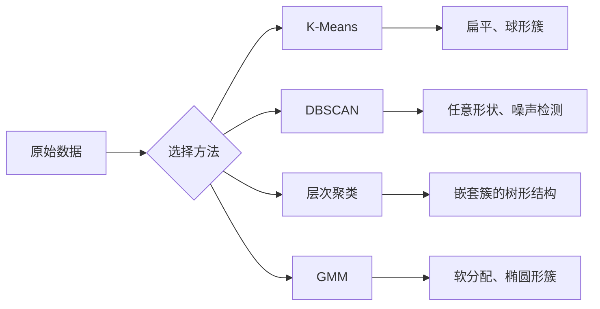

# 无监督学习

> 没有标签，没有教师。算法自己发现结构。

**类型：** 构建
**语言：** Python
**前置知识：** 第一阶段（范数与距离、概率与分布），第二阶段第1-6课
**时间：** ~90 分钟

## 学习目标

- 从零实现 K-Means、DBSCAN 和高斯混合模型，比较它们的聚类行为
- 使用轮廓系数和肘部法则评估聚类质量，选择最优 K
- 解释 DBSCAN 何时优于 K-Means，识别哪种算法能处理非球形聚类和异常值
- 使用聚类方法构建异常检测管道，标记偏离正常模式的点

## 问题背景

到目前为止的每一课都假设有标签数据："给定输入，给定正确输出。"在现实中，标签是昂贵的。医院有数百万患者记录，但没有人手动标注了每条记录的疾病类别。电商网站有数百万用户会话，但没有人手动标记了客户群体。安全团队有网络日志，但没有人标记了每个异常。

无监督学习在不被告知寻找什么的情况下发现模式。它将相似的数据点分组，发现隐藏结构，浮现异常。如果说监督学习是从有答案的教科书中学习，无监督学习就是盯着原始数据直到规律自行显现。

问题是：没有标签，你无法直接衡量"对"或"错"。你需要不同的工具来评估算法发现的结构是否有意义。

## 核心概念

### 聚类：将相似事物分组

聚类将每个数据点分配到一个组（簇），使同组内的点之间比与其他组的点更相似。问题始终是：什么叫"相似"？



### K-Means：主力算法

K-Means 将数据划分为恰好 K 个簇。每个簇有一个质心（其质量中心），每个点属于最近的质心。

Lloyd 算法：

1. 随机选 K 个点作为初始质心
2. 将每个数据点分配给最近的质心
3. 将每个质心重新计算为其分配点的均值
4. 重复步骤 2-3 直到分配不再变化

目标函数（惯性）衡量每个点到其分配质心的总平方距离。K-Means 最小化此值，但只能找到局部最小值。不同的初始化可能给出不同结果。

### 选择 K

两种标准方法：

**肘部法则（Elbow method）：** 对 K = 1, 2, 3, ..., n 运行 K-Means。绘制惯性 vs K 的图。寻找添加更多簇不再显著减少惯性的"肘部"。

**轮廓系数（Silhouette score）：** 对每个点，衡量它与自己的簇（a）相比与最近其他簇（b）的相似度。轮廓系数为 (b - a) / max(a, b)，从 -1（错误的簇）到 +1（聚类良好）。对所有点取平均得到全局分数。

### DBSCAN：基于密度的聚类

K-Means 假设簇是球形的，且需要提前指定 K。DBSCAN 两者都不假设。它将簇定义为被稀疏区域分隔的密集区域。

两个参数：
- **eps**：邻域的半径
- **min_samples**：形成密集区域所需的最少点数

三种点类型：
- **核心点（Core point）：** 在 eps 距离内至少有 min_samples 个点
- **边界点（Border point）：** 在某个核心点的 eps 范围内，但本身不是核心点
- **噪声点（Noise point）：** 既非核心点也非边界点。这些是异常值。

DBSCAN 将相互在 eps 范围内的核心点连接到同一个簇。边界点加入附近核心点的簇。噪声点不属于任何簇。

优势：可找到任意形状的簇，自动确定簇的数量，识别异常值。劣势：对不同密度的簇处理困难。

### 层次聚类

构建嵌套簇的树（树状图，dendrogram）。

自底向上（凝聚式）：
1. 以每个点作为自己的簇开始
2. 合并两个最近的簇
3. 重复直到只剩一个簇
4. 在所需层次切割树状图得到 K 个簇

簇间"近度"可以用以下方式衡量：
- **单链接（Single linkage）：** 两个簇中任意两点间的最小距离
- **全链接（Complete linkage）：** 任意两点间的最大距离
- **平均链接（Average linkage）：** 所有对之间的平均距离
- **Ward 方法：** 导致簇内总方差增加最小的合并

### 高斯混合模型（GMM）

K-Means 给出硬分配：每个点恰好属于一个簇。GMM 给出软分配：每个点有属于每个簇的概率。

GMM 假设数据是从 K 个高斯分布的混合生成的，每个都有自己的均值和协方差。期望最大化（EM）算法交替执行：

- **E 步**：计算每个点属于每个高斯的概率
- **M 步**：更新每个高斯的均值、协方差和混合权重以最大化数据的似然

GMM 可以建模椭圆形簇（不仅是 K-Means 的球形）并自然处理重叠簇。

### 何时使用哪种方法

| 方法 | 最适用于 | 避免在这些情况下使用 |
|------|---------|-------------------|
| K-Means | 大数据集、球形簇、已知 K | 不规则形状、存在异常值 |
| DBSCAN | 未知 K、任意形状、异常值检测 | 密度不均匀、非常高维 |
| 层次聚类 | 小数据集、需要树状图、未知 K | 大数据集（O(n²) 内存） |
| GMM | 重叠簇、需要软分配 | 非常大的数据集、维数过高 |

### 使用聚类进行异常检测

聚类自然支持异常检测：
- **K-Means**：距离任何质心都很远的点是异常值
- **DBSCAN**：噪声点按定义就是异常值
- **GMM**：在所有高斯分布下概率都低的点是异常值

## 构建实现

### 第一步：从零实现 K-Means

```python
import math
import random


def euclidean_distance(a, b):
    return math.sqrt(sum((ai - bi) ** 2 for ai, bi in zip(a, b)))


def kmeans(data, k, max_iterations=100, seed=42):
    random.seed(seed)
    n_features = len(data[0])

    centroids = random.sample(data, k)

    for iteration in range(max_iterations):
        clusters = [[] for _ in range(k)]
        assignments = []

        for point in data:
            distances = [euclidean_distance(point, c) for c in centroids]
            nearest = distances.index(min(distances))
            clusters[nearest].append(point)
            assignments.append(nearest)

        new_centroids = []
        for cluster in clusters:
            if len(cluster) == 0:
                new_centroids.append(random.choice(data))
                continue
            centroid = [
                sum(point[j] for point in cluster) / len(cluster)
                for j in range(n_features)
            ]
            new_centroids.append(centroid)

        if all(
            euclidean_distance(old, new) < 1e-6
            for old, new in zip(centroids, new_centroids)
        ):
            print(f"  在第 {iteration + 1} 次迭代时收敛")
            break

        centroids = new_centroids

    return assignments, centroids
```

### 第二步：肘部法则和轮廓系数

```python
def compute_inertia(data, assignments, centroids):
    total = 0.0
    for point, cluster_id in zip(data, assignments):
        total += euclidean_distance(point, centroids[cluster_id]) ** 2
    return total


def silhouette_score(data, assignments):
    n = len(data)
    if n < 2:
        return 0.0

    clusters = {}
    for i, c in enumerate(assignments):
        clusters.setdefault(c, []).append(i)

    if len(clusters) < 2:
        return 0.0

    scores = []
    for i in range(n):
        own_cluster = assignments[i]
        own_members = [j for j in clusters[own_cluster] if j != i]

        if len(own_members) == 0:
            scores.append(0.0)
            continue

        a = sum(euclidean_distance(data[i], data[j]) for j in own_members) / len(own_members)

        b = float("inf")
        for cluster_id, members in clusters.items():
            if cluster_id == own_cluster:
                continue
            avg_dist = sum(euclidean_distance(data[i], data[j]) for j in members) / len(members)
            b = min(b, avg_dist)

        if max(a, b) == 0:
            scores.append(0.0)
        else:
            scores.append((b - a) / max(a, b))

    return sum(scores) / len(scores)
```

### 第三步：从零实现 DBSCAN

```python
def dbscan(data, eps, min_samples):
    n = len(data)
    labels = [-1] * n
    cluster_id = 0

    def region_query(point_idx):
        neighbors = []
        for i in range(n):
            if euclidean_distance(data[point_idx], data[i]) <= eps:
                neighbors.append(i)
        return neighbors

    visited = [False] * n

    for i in range(n):
        if visited[i]:
            continue
        visited[i] = True

        neighbors = region_query(i)

        if len(neighbors) < min_samples:
            labels[i] = -1
            continue

        labels[i] = cluster_id
        seed_set = list(neighbors)
        seed_set.remove(i)

        j = 0
        while j < len(seed_set):
            q = seed_set[j]

            if not visited[q]:
                visited[q] = True
                q_neighbors = region_query(q)
                if len(q_neighbors) >= min_samples:
                    for nb in q_neighbors:
                        if nb not in seed_set:
                            seed_set.append(nb)

            if labels[q] == -1:
                labels[q] = cluster_id

            j += 1

        cluster_id += 1

    return labels
```

### 第四步：高斯混合模型（EM 算法）

```python
def gmm(data, k, max_iterations=100, seed=42):
    random.seed(seed)
    n = len(data)
    d = len(data[0])

    indices = random.sample(range(n), k)
    means = [list(data[i]) for i in indices]
    variances = [1.0] * k
    weights = [1.0 / k] * k

    def gaussian_pdf(x, mean, variance):
        d = len(x)
        coeff = 1.0 / ((2 * math.pi * variance) ** (d / 2))
        exponent = -sum((xi - mi) ** 2 for xi, mi in zip(x, mean)) / (2 * variance)
        return coeff * math.exp(max(exponent, -500))

    for iteration in range(max_iterations):
        # E 步
        responsibilities = []
        for i in range(n):
            probs = [weights[j] * gaussian_pdf(data[i], means[j], variances[j]) for j in range(k)]
            total = sum(probs)
            if total == 0:
                total = 1e-300
            responsibilities.append([p / total for p in probs])

        # M 步
        old_means = [list(m) for m in means]
        for j in range(k):
            r_sum = sum(responsibilities[i][j] for i in range(n))
            if r_sum < 1e-10:
                continue
            weights[j] = r_sum / n
            for dim in range(d):
                means[j][dim] = sum(
                    responsibilities[i][j] * data[i][dim] for i in range(n)
                ) / r_sum
            variances[j] = max(
                sum(responsibilities[i][j] * sum((data[i][dim] - means[j][dim]) ** 2
                    for dim in range(d)) for i in range(n)) / (r_sum * d),
                1e-6
            )

        shift = sum(euclidean_distance(old_means[j], means[j]) for j in range(k))
        if shift < 1e-6:
            break

    assignments = [responsibilities[i].index(max(responsibilities[i])) for i in range(n)]
    return assignments, means, weights, responsibilities
```

## 实际使用

使用 scikit-learn，这些算法只需一行代码：

```python
from sklearn.cluster import KMeans, DBSCAN, AgglomerativeClustering
from sklearn.mixture import GaussianMixture
from sklearn.metrics import silhouette_score as sklearn_silhouette

km = KMeans(n_clusters=3, random_state=42).fit(data)
db = DBSCAN(eps=1.5, min_samples=5).fit(data)
agg = AgglomerativeClustering(n_clusters=3).fit(data)
gmm_model = GaussianMixture(n_components=3, random_state=42).fit(data)
```

从零实现的版本展示了这些库的精确计算过程。K-Means 在分配和重计算之间交替。DBSCAN 从密集种子扩展簇。GMM 在期望和最大化之间交替。库版本添加了数值稳定性、更智能的初始化（K-Means++）和 GPU 加速，但核心逻辑相同。

## 练习

1. 实现 K-Means++ 初始化：不是随机选质心，而是随机选第一个，之后每个质心以正比于其到最近现有质心的平方距离的概率选取。与随机初始化比较收敛速度。

2. 向代码中添加层次聚合聚类。实现 Ward 链接并生成树状图（作为合并的嵌套列表）。在不同层次切割并与 K-Means 结果比较。

3. 构建简单的异常检测管道：在相同数据上运行 DBSCAN 和 GMM，标记两种方法都认为是异常值的点（DBSCAN 中的噪声，GMM 中的低概率）。测量重叠度并讨论两种方法不一致的情况。

## 关键术语

| 术语 | 常见说法 | 实际含义 |
|------|---------|---------|
| 聚类（Clustering） | "将相似事物分组" | 将数据划分为子集，使组内相似度超过组间相似度，由特定距离度量衡量 |
| 质心（Centroid） | "簇的中心" | 分配给该簇的所有点的均值；K-Means 用它作为簇的代表 |
| 惯性（Inertia） | "簇有多紧凑" | 每个点到其分配质心的平方距离之和；越低越紧凑 |
| 轮廓系数（Silhouette score） | "簇分离得有多好" | 对每个点，(b - a) / max(a, b)，其中 a 是簇内平均距离，b 是最近簇的平均距离 |
| 核心点（Core point） | "密集区域中的点" | 在 DBSCAN 中，eps 距离内至少有 min_samples 个邻居的点 |
| EM 算法 | "软 K-Means" | 期望最大化：迭代计算成员概率（E 步）并更新分布参数（M 步） |
| 树状图（Dendrogram） | "簇的树" | 显示层次聚类中簇合并顺序和距离的树状图 |
| 异常值（Anomaly） | "离群点" | 不符合预期模式的数据点，被 DBSCAN 识别为噪声或被 GMM 识别为低概率 |

## 延伸阅读

- [Stanford CS229 - Unsupervised Learning](https://cs229.stanford.edu/notes2022fall/main_notes.pdf) - Andrew Ng 关于聚类和 EM 的讲义
- [scikit-learn 聚类指南](https://scikit-learn.org/stable/modules/clustering.html) - 含视觉示例的所有聚类算法实用比较
- [DBSCAN 原始论文 (Ester et al., 1996)](https://www.aaai.org/Papers/KDD/1996/KDD96-037.pdf) - 引入基于密度聚类的论文
