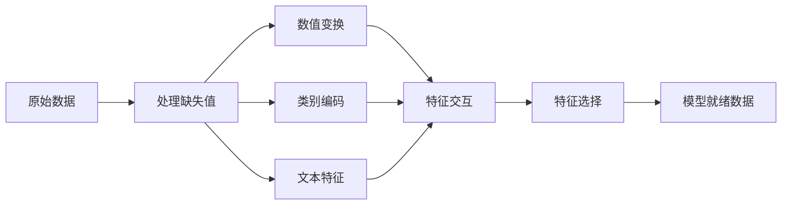

# 特征工程与特征选择

> 一个好特征胜过千个数据点。

**类型：** 构建
**语言：** Python
**前置知识：** 第一阶段（ML 统计学、线性代数），第二阶段第1-7课
**时间：** ~90 分钟

## 学习目标

- 实现数值变换（标准化、最小-最大缩放、对数变换、分箱）并解释各自的适用场景
- 为类别特征构建独热编码、标签编码和目标编码，并识别目标编码中的数据泄露风险
- 从零构建 TF-IDF 向量化器，解释为何它优于原始词频统计用于文本分类
- 应用基于过滤器的特征选择（方差阈值、相关性、互信息）来降低维数

## 问题背景

你有一个数据集。你选择了一个算法。你训练它。结果平平。你尝试更高级的算法。还是平平。你花一周调整超参数。提升有限。

然后有人把原始数据转换成更好的特征，简单的逻辑回归就胜过了你调过参的梯度提升集成。

这种情况经常发生。在经典 ML 中，数据的表示比算法的选择更重要。一个使用"面积"和"卧室数量"的房价模型，无论学习器多么复杂，都会胜过使用"地址原始字符串"的模型。算法只能处理你给它的东西。

特征工程是将原始数据转换为让模型更容易发现规律的表示的过程。特征选择是丢弃增加噪声而不增加信号的特征的过程。两者结合，是经典 ML 中杠杆最大的活动。

## 核心概念

### 特征处理流程



### 数值特征

原始数字很少是模型就绪的。常见变换：

**缩放（Scaling）：** 将特征置于相同范围，使基于距离的算法（K-Means、KNN、SVM）平等对待所有特征。最小-最大缩放映射到 [0, 1]。标准化（z-score）映射到均值=0，标准差=1。

**对数变换（Log transform）：** 压缩右偏分布（收入、人口、词频）。将乘法关系转换为加法关系。

**分箱（Binning）：** 将连续值转换为类别。当特征与目标的关系是非线性但分段的时候很有用（如年龄组）。

**多项式特征（Polynomial features）：** 创建 x²、x³、x1*x2 等项。让线性模型以更多特征为代价捕获非线性关系。

### 类别特征

模型需要数字。类别需要编码。

**独热编码（One-hot encoding）：** 为每个类别创建一个二进制列。"颜色 = 红/蓝/绿"变成三列：is_red、is_blue、is_green。对于低基数特征效果好，但类别多时会爆炸。

**标签编码（Label encoding）：** 将每个类别映射到整数：红=0，蓝=1，绿=2。引入虚假的顺序关系（模型可能认为绿 > 蓝 > 红）。只适用于在单个值上分裂的基于树的模型。

**目标编码（Target encoding）：** 用该类别的目标变量均值替换每个类别。强大但危险：数据泄露风险高。必须只在训练数据上计算，然后应用到测试数据。

### 文本特征

**词频统计（Count vectorizer）：** 统计每个词在文档中出现的次数。"the cat sat on the mat"变成 {the: 2, cat: 1, sat: 1, on: 1, mat: 1}。

**TF-IDF：** 词频-逆文档频率。按词在文档间的独特性加权。"the"等常见词权重低，罕见的、有特色的词权重高。

```
TF(词, 文档) = 词在文档中出现次数 / 文档总词数
IDF(词) = log(总文档数 / 包含该词的文档数)
TF-IDF = TF * IDF
```

### 缺失值

真实数据有空洞。处理策略：

- **删除行：** 只在缺失数据稀少且随机时使用
- **均值/中位数填充：** 简单，保留分布形状（中位数对异常值更鲁棒）
- **众数填充：** 用于类别特征
- **指示列：** 在填充前添加一个二进制列"was_this_missing"。数据缺失这一事实本身可能是有价值的信息
- **前向/后向填充：** 用于时间序列数据

### 特征交互

有时关系在组合中。"身高"和"体重"单独的预测力不如"BMI = 体重 / 身高²"。特征交互使特征空间倍增，因此要用领域知识选择正确的交互。

### 特征选择

更多特征并不总是更好。无关特征增加噪声、增加训练时间，可能导致过拟合。

**过滤方法（模型前）：**
- 相关性：移除彼此高度相关的特征（冗余）
- 互信息：衡量知道一个特征能减少多少关于目标的不确定性
- 方差阈值：移除几乎不变化的特征

**包装方法（基于模型）：**
- L1 正则化（Lasso）：将无关特征的权重精确驱动为零
- 递归特征消除：训练，移除最不重要的特征，重复

**为什么选择很重要：** 有 10 个好特征的模型通常优于有 10 个好特征加 90 个噪声特征的模型。噪声特征给模型提供了在不泛化的训练数据模式上过拟合的机会。

## 构建实现

### 第一步：从零实现数值变换

```python
import math


def min_max_scale(values):
    min_val = min(values)
    max_val = max(values)
    if max_val == min_val:
        return [0.0] * len(values)
    return [(v - min_val) / (max_val - min_val) for v in values]


def standardize(values):
    n = len(values)
    mean = sum(values) / n
    variance = sum((v - mean) ** 2 for v in values) / n
    std = math.sqrt(variance) if variance > 0 else 1.0
    return [(v - mean) / std for v in values]


def log_transform(values):
    return [math.log(v + 1) for v in values]


def bin_values(values, n_bins=5):
    min_val = min(values)
    max_val = max(values)
    bin_width = (max_val - min_val) / n_bins
    if bin_width == 0:
        return [0] * len(values)
    result = []
    for v in values:
        bin_idx = int((v - min_val) / bin_width)
        bin_idx = min(bin_idx, n_bins - 1)
        result.append(bin_idx)
    return result


def polynomial_features(row, degree=2):
    n = len(row)
    result = list(row)
    if degree >= 2:
        for i in range(n):
            result.append(row[i] ** 2)
        for i in range(n):
            for j in range(i + 1, n):
                result.append(row[i] * row[j])
    return result
```

### 第二步：从零实现类别编码

```python
def one_hot_encode(values):
    categories = sorted(set(values))
    cat_to_idx = {cat: i for i, cat in enumerate(categories)}
    n_cats = len(categories)

    encoded = []
    for v in values:
        row = [0] * n_cats
        row[cat_to_idx[v]] = 1
        encoded.append(row)

    return encoded, categories


def label_encode(values):
    categories = sorted(set(values))
    cat_to_int = {cat: i for i, cat in enumerate(categories)}
    return [cat_to_int[v] for v in values], cat_to_int


def target_encode(feature_values, target_values, smoothing=10):
    global_mean = sum(target_values) / len(target_values)

    category_stats = {}
    for feat, target in zip(feature_values, target_values):
        if feat not in category_stats:
            category_stats[feat] = {"sum": 0.0, "count": 0}
        category_stats[feat]["sum"] += target
        category_stats[feat]["count"] += 1

    encoding = {}
    for cat, stats in category_stats.items():
        cat_mean = stats["sum"] / stats["count"]
        weight = stats["count"] / (stats["count"] + smoothing)
        encoding[cat] = weight * cat_mean + (1 - weight) * global_mean

    return [encoding[v] for v in feature_values], encoding
```

### 第三步：从零实现文本特征

```python
def count_vectorize(documents):
    vocab = {}
    idx = 0
    for doc in documents:
        for word in doc.lower().split():
            if word not in vocab:
                vocab[word] = idx
                idx += 1

    vectors = []
    for doc in documents:
        vec = [0] * len(vocab)
        for word in doc.lower().split():
            vec[vocab[word]] += 1
        vectors.append(vec)

    return vectors, vocab


def tfidf(documents):
    n_docs = len(documents)

    vocab = {}
    idx = 0
    for doc in documents:
        for word in doc.lower().split():
            if word not in vocab:
                vocab[word] = idx
                idx += 1

    doc_freq = {}
    for doc in documents:
        seen = set()
        for word in doc.lower().split():
            if word not in seen:
                doc_freq[word] = doc_freq.get(word, 0) + 1
                seen.add(word)

    vectors = []
    for doc in documents:
        words = doc.lower().split()
        word_count = len(words)
        tf_map = {}
        for word in words:
            tf_map[word] = tf_map.get(word, 0) + 1

        vec = [0.0] * len(vocab)
        for word, count in tf_map.items():
            tf = count / word_count
            idf = math.log(n_docs / doc_freq[word])
            vec[vocab[word]] = tf * idf
        vectors.append(vec)

    return vectors, vocab
```

### 第四步：从零实现缺失值填充

```python
def impute_mean(values):
    present = [v for v in values if v is not None]
    if not present:
        return [0.0] * len(values), 0.0
    mean = sum(present) / len(present)
    return [v if v is not None else mean for v in values], mean


def impute_median(values):
    present = sorted(v for v in values if v is not None)
    if not present:
        return [0.0] * len(values), 0.0
    n = len(present)
    if n % 2 == 0:
        median = (present[n // 2 - 1] + present[n // 2]) / 2
    else:
        median = present[n // 2]
    return [v if v is not None else median for v in values], median


def add_missing_indicator(values):
    return [0 if v is not None else 1 for v in values]
```

### 第五步：从零实现特征选择

```python
def correlation(x, y):
    n = len(x)
    mean_x = sum(x) / n
    mean_y = sum(y) / n
    cov = sum((xi - mean_x) * (yi - mean_y) for xi, yi in zip(x, y)) / n
    std_x = math.sqrt(sum((xi - mean_x) ** 2 for xi in x) / n)
    std_y = math.sqrt(sum((yi - mean_y) ** 2 for yi in y) / n)
    if std_x == 0 or std_y == 0:
        return 0.0
    return cov / (std_x * std_y)


def mutual_information(feature, target, n_bins=10):
    feat_min = min(feature)
    feat_max = max(feature)
    bin_width = (feat_max - feat_min) / n_bins if feat_max != feat_min else 1.0
    feat_binned = [
        min(int((f - feat_min) / bin_width), n_bins - 1) for f in feature
    ]

    n = len(feature)
    target_classes = sorted(set(target))
    feat_bins = sorted(set(feat_binned))

    p_feat = {b: feat_binned.count(b) / n for b in feat_bins}
    p_target = {t: target.count(t) / n for t in target_classes}

    mi = 0.0
    for b in feat_bins:
        for t in target_classes:
            joint_count = sum(1 for fb, tv in zip(feat_binned, target) if fb == b and tv == t)
            p_joint = joint_count / n
            if p_joint > 0:
                mi += p_joint * math.log(p_joint / (p_feat[b] * p_target[t]))

    return mi


def variance_threshold(features, threshold=0.01):
    n_features = len(features[0])
    n_samples = len(features)
    selected = []

    for j in range(n_features):
        col = [features[i][j] for i in range(n_samples)]
        mean = sum(col) / n_samples
        var = sum((v - mean) ** 2 for v in col) / n_samples
        if var >= threshold:
            selected.append(j)

    return selected


def remove_correlated(features, threshold=0.9):
    n_features = len(features[0])
    n_samples = len(features)

    to_remove = set()
    for i in range(n_features):
        if i in to_remove:
            continue
        col_i = [features[r][i] for r in range(n_samples)]
        for j in range(i + 1, n_features):
            if j in to_remove:
                continue
            col_j = [features[r][j] for r in range(n_samples)]
            corr = abs(correlation(col_i, col_j))
            if corr >= threshold:
                to_remove.add(j)

    return [i for i in range(n_features) if i not in to_remove]
```

## 实际使用

使用 scikit-learn，这些变换是可组合的流程：

```python
from sklearn.preprocessing import StandardScaler, OneHotEncoder, PolynomialFeatures
from sklearn.impute import SimpleImputer
from sklearn.feature_extraction.text import TfidfVectorizer
from sklearn.feature_selection import mutual_info_classif, VarianceThreshold
from sklearn.compose import ColumnTransformer
from sklearn.pipeline import Pipeline

numeric_pipe = Pipeline([
    ("imputer", SimpleImputer(strategy="median")),
    ("scaler", StandardScaler()),
])

categorical_pipe = Pipeline([
    ("encoder", OneHotEncoder(sparse_output=False)),
])

preprocessor = ColumnTransformer([
    ("num", numeric_pipe, ["sqft", "age"]),
    ("cat", categorical_pipe, ["neighborhood"]),
])
```

从零实现的版本展示了每个变换内部发生的确切事情。库版本添加了边界情况处理、稀疏矩阵支持和流程组合，但数学是一样的。

## 输出产物

本课产生：
- `outputs/prompt-feature-engineer.md` - 从原始数据系统地进行特征工程的提示词

## 练习

1. 向数值变换中添加鲁棒缩放（使用中位数和四分位距而非均值和标准差）。与标准缩放在含有极端异常值的数据上比较。

2. 实现留一目标编码：对每行，计算排除该行自身目标值的目标均值。展示这与简单目标编码相比如何减少过拟合。

3. 构建自动化特征选择流程，结合方差阈值、相关性过滤和互信息排名。应用到住房数据集，比较使用所有特征 vs 选定特征时的模型性能（使用简单线性回归）。

## 关键术语

| 术语 | 常见说法 | 实际含义 |
|------|---------|---------|
| 特征工程（Feature engineering） | "创建新列" | 将原始数据转换为向模型暴露规律的表示 |
| 标准化（Standardization） | "使其正常化" | 减去均值并除以标准差，使特征均值=0，标准差=1 |
| 独热编码（One-hot encoding） | "创建哑变量" | 每个类别创建一个二进制列，每行恰好一列为 1 |
| 目标编码（Target encoding） | "用答案来编码" | 将每个类别替换为该类别的平均目标值，加平滑防止过拟合 |
| TF-IDF | "高级词频统计" | 词频乘以逆文档频率：按词在语料库中的独特性加权 |
| 填充（Imputation） | "填空" | 用估计值（均值、中位数、众数或模型预测）替换缺失值 |
| 特征选择（Feature selection） | "丢弃坏列" | 移除增加噪声或冗余的特征，只保留对目标有信号的特征 |
| 互信息（Mutual information） | "一件事关于另一件事告诉你多少" | 观察变量 X 能减少关于变量 Y 的不确定性的度量 |
| 数据泄露（Data leakage） | "意外作弊" | 在训练期间使用预测时不会有的信息，给出虚假乐观的结果 |

## 延伸阅读

- [Feature Engineering and Selection (Max Kuhn & Kjell Johnson)](http://www.feat.engineering/) - 涵盖特征工程全貌的免费在线书籍
- [scikit-learn 预处理指南](https://scikit-learn.org/stable/modules/preprocessing.html) - 所有标准变换的实用参考
- [Target Encoding Done Right (Micci-Barreca, 2001)](https://dl.acm.org/doi/10.1145/507533.507538) - 带平滑的目标编码原始论文
