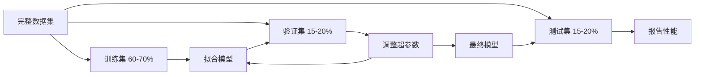
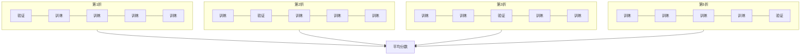

# 模型评估

> 模型的好坏取决于你衡量它的方式。

**类型：** 构建
**语言：** Python
**前置知识：** 第一阶段（概率与分布、ML 统计学），第二阶段第1-8课
**时间：** ~90 分钟

## 学习目标

- 从零实现 K 折和分层 K 折交叉验证，解释为何分层对不平衡数据很重要
- 从零计算精确率、召回率、F1、AUC-ROC 和回归指标（MSE、RMSE、MAE、R²）
- 解读学习曲线，诊断模型是受高偏差还是高方差影响
- 识别常见评估错误，包括数据泄露、错误的指标选择和测试集污染

## 问题背景

你训练了一个模型，在数据上达到 95% 的准确率。它好吗？

也许好，也许不好。如果 95% 的数据属于一个类别，总是预测该类别的模型也能得到 95% 的准确率，却完全没用。如果你在训练数据上评估，95% 这个数字没有意义，因为模型只是记住了答案。如果数据集有时间维度，在随机打乱后分割，模型可能在用未来数据预测过去。

模型评估是大多数 ML 项目出错的地方。错误的指标使坏模型看起来不错。错误的分割让模型作弊。错误的比较让你选择更差的模型。正确评估不是可选的，这是生产中可用的模型和见到真实数据就失败的模型之间的区别。

## 核心概念

### 训练集、验证集、测试集



三种分割，三种目的：

- **训练集**：模型从这些数据中学习，训练期间看到这些样本。
- **验证集**：用于调整超参数和在模型间选择。模型从未在这些数据上训练，但你的决策受其影响。
- **测试集**：只在最后接触一次，报告最终性能。如果你查看测试性能然后返回修改模型，它不再是测试集，已成为第二个验证集。

测试集是你报告的性能反映模型在真正未见数据上表现的保证。

### K 折交叉验证

对于小数据集，单次训练/验证分割浪费数据且给出嘈杂的估计。K 折交叉验证使用所有数据既用于训练又用于验证：



1. 将数据分为 K 个等大小的折
2. 对于每个折，在其余 K-1 折上训练，在该折上验证
3. 对 K 个验证分数取平均

K=5 或 K=10 是标准选择。每个数据点恰好被用于验证一次。平均分数比任何单次分割更稳定。

**分层 K 折（Stratified K-fold）**：在每个折中保留类别分布。如果数据集是 70% A 类和 30% B 类，每个折都有大致相同的比例。这对不平衡数据集很重要，随机分割可能将所有少数类样本放在一个折中。

### 分类指标

**混淆矩阵**：基础。对于二元分类：

|  | 预测正例 | 预测负例 |
|--|---------|---------|
| 实际正例 | 真正例（TP） | 假负例（FN） |
| 实际负例 | 假正例（FP） | 真负例（TN） |

从这个矩阵出发，所有其他指标可以导出：

- **准确率（Accuracy）** = (TP + TN) / (TP + TN + FP + FN)。正确预测的比例。类别不平衡时具有误导性。
- **精确率（Precision）** = TP / (TP + FP)。在所有预测为正例的样本中，有多少实际是正例？当假正例代价高时使用（如垃圾邮件过滤误标真实邮件）。
- **召回率（Recall，敏感性）** = TP / (TP + FN)。在所有实际正例中，有多少被找到了？当假负例代价高时使用（如癌症筛查漏掉肿瘤）。
- **F1 分数** = 2 * 精确率 * 召回率 / (精确率 + 召回率)。精确率和召回率的调和均值。当两者都不明显主导时平衡两者。
- **AUC-ROC**：接收者操作特征曲线下面积。在各种分类阈值绘制真正例率 vs 假正例率。AUC = 0.5 意味着随机猜测，AUC = 1.0 意味着完美分离。与阈值无关：衡量模型将正例排在负例之上的能力，与你选择的截断点无关。

### 回归指标

- **MSE**（均方误差）= mean((y_true - y_pred)²)。对大误差进行二次惩罚。对异常值敏感。
- **RMSE**（均方根误差）= sqrt(MSE)。与目标变量单位相同。比 MSE 更易解释。
- **MAE**（平均绝对误差）= mean(|y_true - y_pred|)。线性处理所有误差。比 MSE 对异常值更鲁棒。
- **R²** = 1 - SS_res / SS_tot，其中 SS_res = sum((y_true - y_pred)²)，SS_tot = sum((y_true - y_mean)²)。模型解释的方差比例。R² = 1.0 是完美，R² = 0.0 意味着模型不比始终预测均值更好，R² 可以为负（模型比均值更差）。

### 学习曲线

绘制训练和验证分数作为训练集大小的函数：

- **高偏差（欠拟合）**：两条曲线都收敛到低分数。更多数据不会帮助。需要更复杂的模型。
- **高方差（过拟合）**：训练分数高但验证分数低得多。两者之间的差距很大。更多数据应该有帮助。

### 验证曲线

绘制训练和验证分数作为超参数的函数：

- 低复杂度：两个分数都低（欠拟合）
- 合适复杂度：两个分数都高且接近
- 高复杂度：训练分数保持高，但验证分数下降（过拟合）

最优超参数值是验证分数达到峰值的地方。

### 常见评估错误

**数据泄露**：测试集信息泄漏到训练中。示例：在分割前对完整数据集拟合缩放器、在时间序列预测中包含未来数据、使用从目标派生的特征。**始终先分割，再预处理**。

**类别不平衡**：99% 的交易合法，1% 是欺诈。总是预测"合法"的模型得到 99% 准确率。改用精确率、召回率、F1 或 AUC-ROC。

**错误的指标**：应该优化召回率（医疗诊断）时却优化准确率，或数据有大量异常值时（用 MAE 代替）却优化 RMSE。

**不使用分层分割**：对于不平衡数据，随机分割可能在验证折中放入极少的少数类样本，给出不稳定的估计。

**测试过于频繁**：每次查看测试性能并调整，你就过拟合了测试集。测试集只能使用一次。

## 构建实现

### 第一步：训练/验证/测试分割

```python
import random
import math


def train_val_test_split(X, y, train_ratio=0.6, val_ratio=0.2, seed=42):
    random.seed(seed)
    n = len(X)
    indices = list(range(n))
    random.shuffle(indices)

    train_end = int(n * train_ratio)
    val_end = int(n * (train_ratio + val_ratio))

    train_idx = indices[:train_end]
    val_idx = indices[train_end:val_end]
    test_idx = indices[val_end:]

    X_train = [X[i] for i in train_idx]
    y_train = [y[i] for i in train_idx]
    X_val = [X[i] for i in val_idx]
    y_val = [y[i] for i in val_idx]
    X_test = [X[i] for i in test_idx]
    y_test = [y[i] for i in test_idx]

    return X_train, y_train, X_val, y_val, X_test, y_test
```

### 第二步：K 折和分层 K 折交叉验证

```python
def kfold_split(n, k=5, seed=42):
    random.seed(seed)
    indices = list(range(n))
    random.shuffle(indices)

    fold_size = n // k
    folds = []

    for i in range(k):
        start = i * fold_size
        end = start + fold_size if i < k - 1 else n
        val_idx = indices[start:end]
        train_idx = indices[:start] + indices[end:]
        folds.append((train_idx, val_idx))

    return folds


def stratified_kfold_split(y, k=5, seed=42):
    random.seed(seed)

    class_indices = {}
    for i, label in enumerate(y):
        class_indices.setdefault(label, []).append(i)

    for label in class_indices:
        random.shuffle(class_indices[label])

    folds = [{"train": [], "val": []} for _ in range(k)]

    for label, indices in class_indices.items():
        fold_size = len(indices) // k
        for i in range(k):
            start = i * fold_size
            end = start + fold_size if i < k - 1 else len(indices)
            val_part = indices[start:end]
            train_part = indices[:start] + indices[end:]
            folds[i]["val"].extend(val_part)
            folds[i]["train"].extend(train_part)

    return [(f["train"], f["val"]) for f in folds]
```

### 第三步：混淆矩阵和分类指标

```python
def confusion_matrix(y_true, y_pred):
    tp = sum(1 for yt, yp in zip(y_true, y_pred) if yt == 1 and yp == 1)
    tn = sum(1 for yt, yp in zip(y_true, y_pred) if yt == 0 and yp == 0)
    fp = sum(1 for yt, yp in zip(y_true, y_pred) if yt == 0 and yp == 1)
    fn = sum(1 for yt, yp in zip(y_true, y_pred) if yt == 1 and yp == 0)
    return tp, tn, fp, fn


def accuracy(y_true, y_pred):
    tp, tn, fp, fn = confusion_matrix(y_true, y_pred)
    total = tp + tn + fp + fn
    return (tp + tn) / total if total > 0 else 0.0


def precision(y_true, y_pred):
    tp, tn, fp, fn = confusion_matrix(y_true, y_pred)
    return tp / (tp + fp) if (tp + fp) > 0 else 0.0


def recall(y_true, y_pred):
    tp, tn, fp, fn = confusion_matrix(y_true, y_pred)
    return tp / (tp + fn) if (tp + fn) > 0 else 0.0


def f1_score(y_true, y_pred):
    p = precision(y_true, y_pred)
    r = recall(y_true, y_pred)
    return 2 * p * r / (p + r) if (p + r) > 0 else 0.0


def auc_roc(y_true, y_scores):
    thresholds = sorted(set(y_scores), reverse=True)
    tpr_list = []
    fpr_list = []
    total_positives = sum(y_true)
    total_negatives = len(y_true) - total_positives

    for threshold in thresholds:
        y_pred = [1 if s >= threshold else 0 for s in y_scores]
        tp = sum(1 for yt, yp in zip(y_true, y_pred) if yt == 1 and yp == 1)
        fp = sum(1 for yt, yp in zip(y_true, y_pred) if yt == 0 and yp == 1)
        tpr = tp / total_positives if total_positives > 0 else 0.0
        fpr = fp / total_negatives if total_negatives > 0 else 0.0
        tpr_list.append(tpr)
        fpr_list.append(fpr)

    pairs = sorted(zip(fpr_list, tpr_list))
    fpr_sorted = [p[0] for p in pairs]
    tpr_sorted = [p[1] for p in pairs]

    area = 0.0
    for i in range(1, len(fpr_sorted)):
        width = fpr_sorted[i] - fpr_sorted[i - 1]
        height = (tpr_sorted[i] + tpr_sorted[i - 1]) / 2
        area += width * height

    return area
```

### 第四步：回归指标

```python
def mse(y_true, y_pred):
    n = len(y_true)
    return sum((yt - yp) ** 2 for yt, yp in zip(y_true, y_pred)) / n


def rmse(y_true, y_pred):
    return math.sqrt(mse(y_true, y_pred))


def mae(y_true, y_pred):
    n = len(y_true)
    return sum(abs(yt - yp) for yt, yp in zip(y_true, y_pred)) / n


def r_squared(y_true, y_pred):
    mean_y = sum(y_true) / len(y_true)
    ss_res = sum((yt - yp) ** 2 for yt, yp in zip(y_true, y_pred))
    ss_tot = sum((yt - mean_y) ** 2 for yt in y_true)
    if ss_tot == 0:
        return 0.0
    return 1.0 - ss_res / ss_tot
```

## 实际使用

使用 scikit-learn，评估已内置到工作流中：

```python
from sklearn.model_selection import cross_val_score, StratifiedKFold, learning_curve
from sklearn.metrics import (
    accuracy_score, precision_score, recall_score, f1_score,
    roc_auc_score, confusion_matrix, mean_squared_error, r2_score,
)
from sklearn.linear_model import LogisticRegression

model = LogisticRegression()
scores = cross_val_score(model, X, y, cv=StratifiedKFold(5), scoring="f1")
```

从零实现的版本展示了交叉验证的精确操作（没有魔法，只是 for 循环和索引追踪），每个指标如何计算（只是计数 TP/FP/TN/FN），以及为什么分层很重要（保留每个折的类别比例）。库版本添加了并行性、更多评分选项和与管道的集成。

## 输出产物

本课产生：
- `outputs/skill-evaluation.md` - 涵盖分类和回归模型评估策略的技能文档

## 练习

1. 实现精确率-召回率曲线：在不同阈值下绘制精确率 vs 召回率。计算平均精确率（PR 曲线下面积）。在不平衡数据集上比较 PR 曲线与 ROC 曲线，解释各自何时更有信息价值。

2. 构建嵌套交叉验证循环：外层循环评估模型性能，内层循环调整超参数。用它公平地比较两个模型，不将验证数据泄露到评估中。

3. 实现模型比较的置换检验：打乱标签、重新训练、测量性能。重复 100 次建立零分布。计算观测模型性能相对于该分布的 p 值。

## 关键术语

| 术语 | 常见说法 | 实际含义 |
|------|---------|---------|
| 过拟合（Overfitting） | "记住训练数据" | 模型捕获训练数据中的噪声，在训练上表现好但在未见数据上表现差 |
| 交叉验证（Cross-validation） | "在不同子集上测试" | 系统地轮换哪部分数据用于验证，对所有轮换结果取平均 |
| 精确率（Precision） | "有多少预测正例是正确的" | TP / (TP + FP)：实际为正例的正例预测比例 |
| 召回率（Recall） | "找到了多少实际正例" | TP / (TP + FN)：被正确识别的实际正例比例 |
| AUC-ROC | "模型分离类别的能力" | 在所有阈值下真正例率 vs 假正例率曲线下面积，从 0.5（随机）到 1.0（完美） |
| R²（R 方） | "解释了多少方差" | 1 - (残差平方和 / 总平方和)：模型捕获的目标方差比例 |
| 数据泄露（Data leakage） | "模型作弊了" | 在训练期间使用预测时不会有的信息，导致乐观的评估 |
| 学习曲线（Learning curve） | "性能随更多数据如何变化" | 训练和验证分数 vs 训练集大小的图，揭示欠拟合或过拟合 |
| 分层分割（Stratified split） | "保持类别比例平衡" | 分割数据使每个子集与完整数据集有相同的每个类别比例 |

## 延伸阅读

- [scikit-learn 模型选择指南](https://scikit-learn.org/stable/model_selection.html) - 交叉验证、指标和超参数调整的综合参考
- [Beyond Accuracy: Precision and Recall (Google ML Crash Course)](https://developers.google.com/machine-learning/crash-course/classification/precision-and-recall) - 含交互示例的清晰解释
- [A Survey of Cross-Validation Procedures (Arlot & Celisse, 2010)](https://projecteuclid.org/journals/statistics-surveys/volume-4/issue-none/A-survey-of-cross-validation-procedures-for-model-selection/10.1214/09-SS054.full) - 不同 CV 策略何时及为何有效的严格处理
