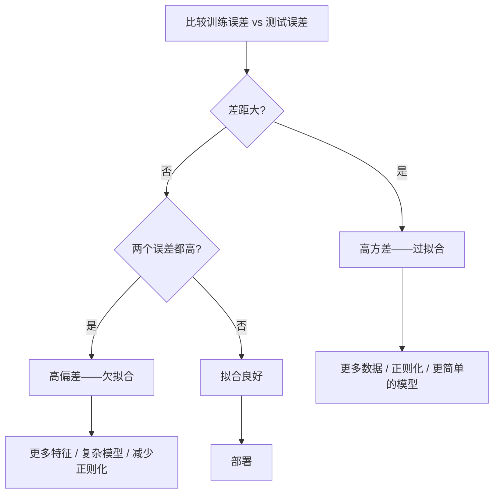

# 偏差-方差权衡

> 每一个模型误差都来自三个来源之一：偏差、方差或噪声。你只能控制前两个。

**类型：** 学习
**语言：** Python
**前置知识：** 第二阶段第01-09课（ML 基础、回归、分类、评估）
**时间：** ~75 分钟

## 学习目标

- 推导期望预测误差的偏差-方差分解，解释不可约噪声的作用
- 使用训练和测试误差模式诊断模型是受高偏差还是高方差影响
- 解释正则化技术（L1、L2、dropout、早停）如何用偏差换取方差
- 实现实验，可视化越来越复杂的模型上的偏差-方差权衡

## 问题背景

你训练了一个模型，在测试数据上有一些误差。这些误差从哪里来？

如果模型太简单（对曲线数据集用线性回归），它会始终错过真实规律。这是偏差。如果模型太复杂（对15个数据点用20次多项式），它会完美拟合训练数据，但对新数据给出极其不同的预测。这是方差。

你不能在固定模型容量下同时最小化两者。降低偏差，方差就上升。降低方差，偏差就上升。理解这个权衡是机器学习中最有用的诊断技能。它告诉你是否要使模型更复杂或更简单，是否要获取更多数据或工程更好的特征，是否要更多或更少正则化。

## 核心概念

### 偏差：系统误差

偏差衡量模型平均预测与真实值之间的差距。如果你在来自同一分布的许多不同训练集上训练相同模型并对预测取平均，偏差就是该平均值与真实值之间的差距。

高偏差意味着模型太刚性，无法捕获真实规律。无论给多少数据，拟合抛物线的直线都会始终错过曲线。这是欠拟合。

```
高偏差（欠拟合）：
  模型总是预测大致相同的错误结果。
  训练误差：高
  测试误差：高
  两者之间的差距：小
```

### 方差：对训练数据的敏感性

方差衡量在不同数据子集上训练时预测变化多少。如果训练集的小变化导致模型的大变化，方差就很高。

高方差意味着模型在拟合训练数据中的噪声，而非底层信号。20次多项式会穿过每个训练点，但在它们之间剧烈震荡。这是过拟合。

```
高方差（过拟合）：
  模型完美拟合训练数据，但在新数据上失败。
  训练误差：低
  测试误差：高
  两者之间的差距：大
```

### 分解

对于任意点 x，平方损失下期望预测误差的精确分解为：

```
期望误差 = 偏差² + 方差 + 不可约噪声

其中：
  偏差²   = (E[f_hat(x)] - f(x))^2
  方差    = E[(f_hat(x) - E[f_hat(x)])^2]
  噪声    = E[(y - f(x))^2]             (sigma²)
```

- `f(x)` 是真实函数
- `f_hat(x)` 是你的模型预测
- `E[...]` 是对不同训练集的期望
- `y` 是观测标签（真实函数加噪声）

噪声项是不可约的。没有模型能在嘈杂数据上做得比 sigma² 更好。你的工作是在偏差² 和方差之间找到正确的平衡。

### 模型复杂度 vs 误差


经典的 U 形曲线：

| 复杂度 | 偏差 | 方差 | 总误差 |
|-------|------|------|-------|
| 太低 | 高 | 低 | 高（欠拟合） |
| 恰当 | 中等 | 中等 | 最低 |
| 太高 | 低 | 高 | 高（过拟合） |

### 正则化作为偏差-方差控制

正则化故意增加偏差以减少方差。它约束模型使其无法追逐噪声。

- **L2（岭回归）：** 将所有权重收缩向零。保留所有特征但减少其影响。
- **L1（Lasso）：** 将某些权重精确推为零。执行特征选择。
- **Dropout：** 训练期间随机禁用神经元。强制冗余表示。
- **早停（Early stopping）：** 在模型完全拟合训练数据前停止训练。

正则化强度（lambda、dropout 率、训练轮数）直接控制你在偏差-方差曲线上的位置。更多正则化意味着更多偏差、更少方差。

### 双下降：现代视角

经典理论说：过了最优点，更多复杂度总是有害的。但 2019 年以来的研究显示了出乎意料的现象。如果继续增加模型容量远超内插阈值（模型有足够参数完美拟合训练数据），测试误差可能再次下降。


这种"双下降"现象解释了为什么大量过参数化的神经网络（参数远多于训练样本）仍然能很好地泛化。经典偏差-方差权衡没有错，但对现代情形而言并不完整。

关于双下降的关键观察：
- 它发生在线性模型、决策树和神经网络中
- 更多数据在内插区域实际上可能有害（样本维度的双下降）
- 更多训练轮数也能引起它（轮数维度的双下降）
- 正则化平滑峰值但不消除它

为什么会发生这种情况？在内插阈值处，模型刚好有足够容量拟合所有训练点。它被迫进入一个穿过每个点的非常特定的解，数据中的小扰动会导致拟合的大变化。这就是方差在何处达到峰值。超过阈值后，模型有许多可能的解完美拟合数据。学习算法（如具有隐式正则化的梯度下降）倾向于选择其中最简单的。这种对简单解的隐式偏好就是为何过参数化模型能泛化。

| 区域 | 参数 vs 样本 | 行为 |
|------|------------|------|
| 欠参数化 | p << n | 经典权衡适用 |
| 内插阈值 | p ~ n | 方差达到峰值，测试误差突增 |
| 过参数化 | p >> n | 隐式正则化启动，测试误差下降 |

### 诊断你的模型



| 症状 | 诊断 | 修复 |
|------|------|------|
| 高训练误差，高测试误差 | 偏差 | 更多特征、复杂模型、减少正则化 |
| 低训练误差，高测试误差 | 方差 | 更多数据、正则化、更简单模型、dropout |
| 低训练误差，低测试误差 | 拟合良好 | 发布它 |
| 训练误差下降，测试误差上升 | 过拟合进行中 | 早停 |

### 实用策略

**当偏差是问题时：**
- 添加多项式或交互特征
- 使用更灵活的模型（树集成代替线性）
- 减少正则化强度
- 训练更长时间（如果尚未收敛）

**当方差是问题时：**
- 获取更多训练数据
- 使用袋装法（随机森林）
- 增加正则化（更高 lambda，更多 dropout）
- 特征选择（移除嘈杂特征）
- 使用交叉验证早期检测

### 集成方法与方差减少

集成方法是对抗方差的最实用工具。

**袋装法（Bagging）** 在训练数据的不同自助样本上训练多个模型，然后对预测取平均。每个单独模型具有高方差，但平均后方差大大降低。随机森林是袋装法应用于决策树。

数学原理：如果平均 N 个独立预测，每个的方差为 sigma²，平均值的方差为 sigma²/N。模型并非真正独立（都见到了相似数据），所以减少量小于 1/N，但仍然很大。

**提升法（Boosting）** 通过顺序构建模型来减少偏差，每个新模型关注当前集成的误差。梯度提升和 AdaBoost 是主要例子。提升法在添加太多模型时可能过拟合，所以需要早停或正则化。

| 方法 | 主要效果 | 偏差变化 | 方差变化 |
|------|---------|---------|---------|
| 袋装法 | 减少方差 | 无变化 | 减少 |
| 提升法 | 减少偏差 | 减少 | 可能增加 |
| 堆叠 | 两者都减少 | 取决于元学习器 | 取决于基础模型 |
| Dropout | 隐式袋装 | 轻微增加 | 减少 |

**实用规则：** 如果你的基础模型高方差（深树、高次多项式），使用袋装法。如果基础模型高偏差（浅树桩、简单线性模型），使用提升法。

### 学习曲线

学习曲线绘制训练和验证误差作为训练集大小的函数。它们是你拥有的最实用的诊断工具。与单次训练/测试比较不同，学习曲线显示模型的轨迹，告诉你更多数据是否有帮助。

如何阅读学习曲线：

| 场景 | 训练误差 | 验证误差 | 差距 | 含义 | 操作 |
|------|---------|---------|------|------|------|
| 高偏差 | 高 | 高 | 小 | 模型无法捕获规律 | 更多特征、复杂模型、减少正则化 |
| 高方差 | 低 | 高 | 大 | 模型记住了训练数据 | 更多数据、正则化、更简单模型 |
| 拟合良好 | 中等 | 中等 | 小 | 模型泛化良好 | 发布它 |
| 高方差但改善中 | 低 | 随更多数据下降 | 缩小中 | 数据可以修复的方差问题 | 收集更多数据 |
| 高偏差，平坦 | 高 | 高且平坦 | 小且平坦 | 更多数据无帮助 | 更改模型架构 |

关键洞察：如果两条曲线都已趋于平稳且差距小，但两个误差都高，更多数据无用。你需要更好的模型。如果差距仍在缩小，更多数据有帮助。

## 构建实现

`code/bias_variance.py` 中的代码运行完整的偏差-方差分解实验。

### 第一步：从已知函数生成合成数据

使用 `f(x) = sin(1.5x) + 0.5x` 加高斯噪声。知道真实函数让我们能计算精确的偏差和方差。

```python
def true_function(x):
    return np.sin(1.5 * x) + 0.5 * x

def generate_data(n_samples=30, noise_std=0.5, x_range=(-3, 3), seed=None):
    rng = np.random.RandomState(seed)
    x = rng.uniform(x_range[0], x_range[1], n_samples)
    y = true_function(x) + rng.normal(0, noise_std, n_samples)
    return x, y
```

### 第二步：自助采样和多项式拟合

对于每个多项式次数，从许多自助训练集拟合多项式，在固定测试网格上记录预测。这给出每个测试点的预测分布。

```python
def fit_polynomial(x_train, y_train, degree, lam=0.0):
    X = np.column_stack([x_train ** d for d in range(degree + 1)])
    if lam > 0:
        penalty = lam * np.eye(X.shape[1])
        penalty[0, 0] = 0
        w = np.linalg.solve(X.T @ X + penalty, X.T @ y_train)
    else:
        w = np.linalg.lstsq(X, y_train, rcond=None)[0]
    return w
```

### 第三步：计算偏差²、方差分解

有了 200 组在每个测试点的预测，可以直接从定义计算分解：

```python
mean_pred = predictions.mean(axis=0)
bias_sq = np.mean((mean_pred - y_true) ** 2)
variance = np.mean(predictions.var(axis=0))
total_error = np.mean(np.mean((predictions - y_true) ** 2, axis=1))
```

## 实际使用

sklearn 提供 `learning_curve` 和 `validation_curve` 来自动化这些诊断：

```python
from sklearn.model_selection import validation_curve, learning_curve
from sklearn.pipeline import make_pipeline
from sklearn.preprocessing import PolynomialFeatures
from sklearn.linear_model import Ridge

# 验证曲线：扫描模型复杂度
degrees = list(range(1, 16))
for d in degrees:
    pipe = make_pipeline(PolynomialFeatures(d), Ridge(alpha=0.01))
    # 在 d 处评估训练和验证分数...

# 学习曲线：扫描训练集大小
pipe = make_pipeline(PolynomialFeatures(5), Ridge(alpha=0.01))
train_sizes, train_scores, val_scores = learning_curve(
    pipe, X, y, train_sizes=np.linspace(0.1, 1.0, 10),
    cv=5, scoring="neg_mean_squared_error"
)
```

### 完整诊断工作流

实践中按顺序运行这些诊断：

1. 训练模型，计算训练和测试误差
2. 如果两者都高：有偏差问题，跳到步骤4
3. 如果训练低但测试高：有方差问题。生成学习曲线看更多数据是否有帮助
4. 生成验证曲线扫描主要复杂度参数，找到最优点
5. 在最优点生成学习曲线，如果差距仍大需要更多数据或正则化
6. 使用 `cross_val_score` 尝试不同 alpha 值的岭回归/Lasso

## 输出产物

本课产生：`outputs/prompt-model-diagnostics.md`

## 练习

1. 以 `noise_std=0`（无噪声）运行分解。不可约误差项会怎样？最优复杂度改变吗？

2. 将训练集大小从 30 增加到 300。这如何影响方差分量？最优多项式次数会移动吗？

3. 向实验添加 L2 正则化（岭回归）。对固定高次多项式（15次），从 0 到 100 扫描 lambda。绘制偏差² 和方差作为 lambda 的函数。

4. 将真实函数从多项式修改为 `sin(x)`。偏差-方差分解如何改变？是否仍有清晰的最优次数？

5. 实现简单的自助聚合（袋装）包装器：在自助样本上训练 10 个模型并平均预测。证明这在不太增加偏差的情况下减少了方差。

## 关键术语

| 术语 | 常见说法 | 实际含义 |
|------|---------|---------|
| 偏差（Bias） | "模型太简单" | 来自错误假设的系统误差。平均模型预测与真实值之间的差距 |
| 方差（Variance） | "模型在过拟合" | 来自对训练数据敏感性的误差。不同训练集下预测变化多少 |
| 不可约误差（Irreducible error） | "数据中的噪声" | 来自真实数据生成过程中随机性的误差。没有模型可以消除它 |
| 欠拟合（Underfitting） | "学得不够多" | 模型高偏差。即使在训练数据上也错过了真实规律 |
| 过拟合（Overfitting） | "记住了数据" | 模型高方差。拟合了训练数据中不能泛化的噪声 |
| 正则化（Regularization） | "约束模型" | 添加惩罚减少模型复杂度，用偏差换取更低方差 |
| 双下降（Double descent） | "更多参数有帮助" | 当模型容量远超内插阈值时测试误差再次下降 |
| 模型复杂度（Model complexity） | "模型有多灵活" | 模型拟合任意规律的能力。由架构、特征或正则化控制 |

## 延伸阅读

- [Hastie, Tibshirani, Friedman: Elements of Statistical Learning, Ch. 7](https://hastie.su.domains/ElemStatLearn/) - 偏差-方差分解的权威处理
- [Belkin et al., Reconciling modern machine learning practice and the bias-variance trade-off (2019)](https://arxiv.org/abs/1812.11118) - 双下降论文
- [Nakkiran et al., Deep Double Descent (2019)](https://arxiv.org/abs/1912.02292) - 轮数维度和样本维度的双下降
- [Scott Fortmann-Roe: Understanding the Bias-Variance Tradeoff](http://scott.fortmann-roe.com/docs/BiasVariance.html) - 清晰的视觉解释
