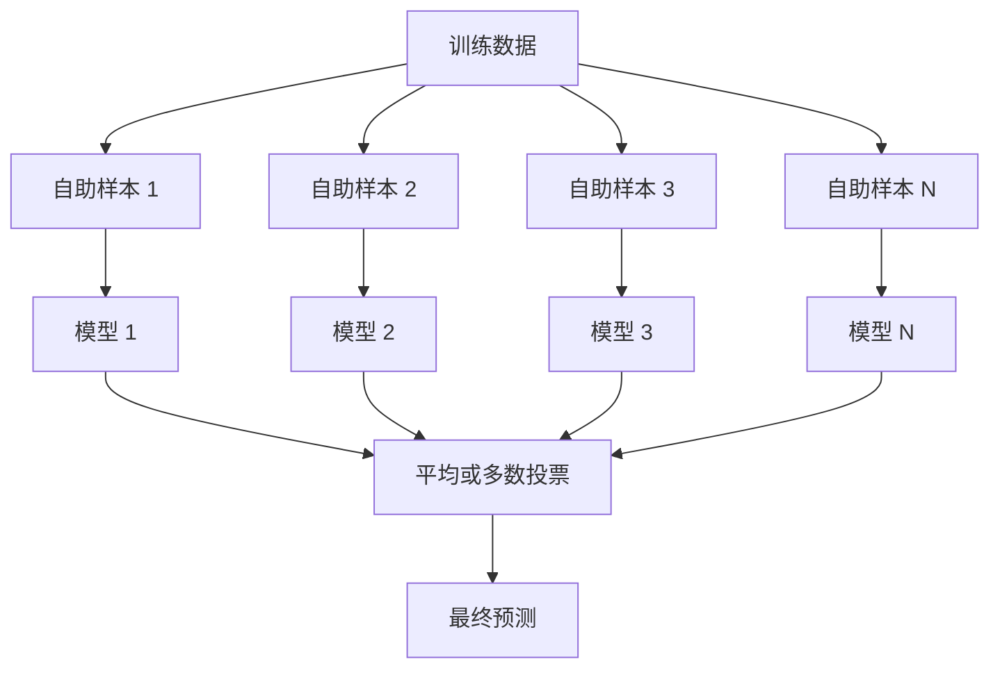
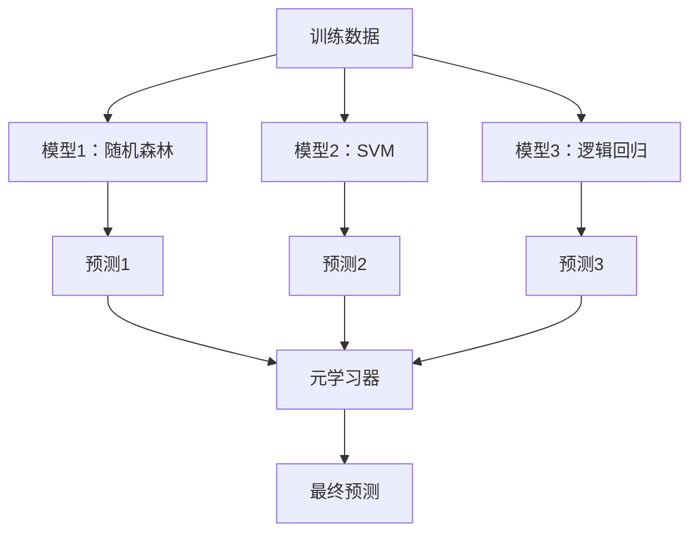

# 集成方法

> 一群弱学习器，正确组合后，变成强学习器。这不是比喻，这是定理。

**类型：** 构建
**语言：** Python
**前置知识：** 第二阶段第10课（偏差-方差权衡）
**时间：** ~120 分钟

## 学习目标

- 从零实现 AdaBoost 和梯度提升，解释提升法如何顺序减少偏差
- 构建袋装集成，展示平均去相关模型如何在不增加偏差的情况下减少方差
- 从各方法针对的误差分量角度比较袋装法、提升法和堆叠法
- 评估集成多样性，解释为何多数投票准确率随更多独立弱学习器而提高

## 问题背景

单棵决策树训练快、易解释，但过拟合。单个线性模型在复杂边界上欠拟合。你可以花几天时间设计完美的模型架构，或者组合一堆不完美的模型，得到比任何单个模型都好的结果。

集成方法正是这样做的。它们是在表格数据 Kaggle 竞赛中获胜最可靠的技术，驱动着大多数生产 ML 系统，并展示了偏差-方差权衡的实际效果。袋装法减少方差。提升法减少偏差。堆叠法学习在哪些输入上信任哪些模型。

## 核心概念

### 为什么集成有效

假设你有 N 个独立分类器，每个准确率 p > 0.5。多数投票的准确率为：

```
P(多数正确) = 对所有 k > N/2 求和 C(N,k) * p^k * (1-p)^(N-k)
```

对于 21 个各有 60% 准确率的分类器，多数投票准确率约为 74%。101 个分类器时，升至 84%。当模型犯不同的错误时，错误相互抵消。

关键要求是**多样性**。如果所有模型犯同样的错误，组合它们毫无帮助。集成有效是因为通过以下方式产生多样化的模型：

- 不同的训练子集（袋装法）
- 不同的特征子集（随机森林）
- 顺序纠错（提升法）
- 不同的模型家族（堆叠法）

### 袋装法（自助聚合，Bagging）

袋装法通过在训练数据的不同自助样本上训练每个模型来创建多样性。



自助样本是从原始数据有放回地随机抽取，大小相同。约 63.2% 的唯一样本出现在每个自助样本中。剩余 36.8%（袋外样本）提供了免费的验证集。

袋装法减少方差而不太增加偏差。每棵单独的树过拟合到其自助样本，但各树的过拟合不同，所以平均消除了噪声。

**随机森林**是袋装法加上额外技巧：在每次分裂时只考虑特征的随机子集。这在树之间强制更多多样性。候选特征的典型数量：分类用 `sqrt(n_features)`，回归用 `n_features / 3`。

### 提升法（顺序纠错，Boosting）

提升法顺序训练模型。每个新模型关注前面模型错误的样本。


提升法减少偏差。每个新模型纠正当前集成的系统误差。最终预测是所有模型的加权求和，表现更好的模型权重更高。

权衡：如果运行太多轮，提升法可能过拟合，因为它不断拟合更难的样本，其中一些可能是噪声。

### AdaBoost

AdaBoost（自适应提升）是第一个实用的提升算法。它适用于任何基学习器，通常是决策树桩（深度为1的树）。

算法：

```
1. 初始化样本权重：w_i = 1/N 对所有 i

2. 对 t = 1 到 T:
   a. 在加权数据上训练弱学习器 h_t
   b. 计算加权误差：
      err_t = sum(w_i * I(h_t(x_i) != y_i)) / sum(w_i)
   c. 计算模型权重：
      alpha_t = 0.5 * ln((1 - err_t) / err_t)
   d. 更新样本权重：
      w_i = w_i * exp(-alpha_t * y_i * h_t(x_i))
   e. 归一化权重使之和为1

3. 最终预测：H(x) = sign(sum(alpha_t * h_t(x)))
```

误差较低的模型获得更高的 alpha。被误分类的样本获得更高权重，使下一个模型关注它们。

### 梯度提升

梯度提升将提升法推广到任意损失函数。不是对样本重新加权，而是将每个新模型拟合到当前集成的残差（损失的负梯度）。

```
1. 初始化：F_0(x) = argmin_c sum(L(y_i, c))

2. 对 t = 1 到 T:
   a. 计算伪残差：
      r_i = -dL(y_i, F_{t-1}(x_i)) / dF_{t-1}(x_i)
   b. 将树 h_t 拟合到残差 r_i
   c. 找到最优步长：
      gamma_t = argmin_gamma sum(L(y_i, F_{t-1}(x_i) + gamma * h_t(x_i)))
   d. 更新：
      F_t(x) = F_{t-1}(x) + learning_rate * gamma_t * h_t(x)

3. 最终预测：F_T(x)
```

对于平方误差损失，伪残差就是实际残差：`r_i = y_i - F_{t-1}(x_i)`。每棵树字面上拟合前一个集成的误差。

学习率（收缩）控制每棵树的贡献量。更小的学习率需要更多树，但泛化更好。典型值：0.01 到 0.3。

### XGBoost：为什么主导表格数据

XGBoost（极端梯度提升）是梯度提升加工程优化，使其快速、准确且抗过拟合：

- **正则化目标：** 对叶节点权重的 L1 和 L2 惩罚，防止单棵树过于自信
- **二阶近似：** 使用损失的一阶和二阶导数，给出更好的分裂决策
- **稀疏感知分裂：** 原生处理缺失值，在每次分裂时学习缺失数据的最优方向
- **列采样：** 像随机森林一样，在每次分裂时对特征采样以增加多样性
- **加权分位数草图：** 高效找到分布式数据中连续特征的分裂点
- **缓存感知块结构：** 针对 CPU 缓存行优化的内存布局

对于表格数据，XGBoost（及其后继 LightGBM）始终优于神经网络。这种情况短期内不会改变。如果数据以行列形式存在，从梯度提升开始。

### 堆叠（元学习，Stacking）

堆叠使用多个基础模型的预测作为元学习器的特征。



元学习器学习在哪些输入上信任哪个基础模型。如果随机森林在某些区域更好，SVM 在其他区域更好，元学习器将学会相应地路由。

为避免数据泄露，基础模型预测必须通过训练集上的交叉验证生成。永远不要在同一数据上训练基础模型并生成元特征。

### 投票

最简单的集成。直接组合预测。

- **硬投票：** 类别标签的多数投票。
- **软投票：** 平均预测概率，选择平均概率最高的类别。通常更好，因为它使用了置信度信息。

## 构建实现

### 第一步：决策树桩（基学习器）

`code/ensembles.py` 中的代码从零实现了所有内容。从决策树桩开始：只有单次分裂的树。

```python
class DecisionStump:
    def __init__(self):
        self.feature_idx = None
        self.threshold = None
        self.polarity = 1
        self.alpha = None

    def fit(self, X, y, weights):
        n_samples, n_features = X.shape
        best_error = float("inf")

        for f in range(n_features):
            thresholds = np.unique(X[:, f])
            for thresh in thresholds:
                for polarity in [1, -1]:
                    pred = np.ones(n_samples)
                    pred[polarity * X[:, f] < polarity * thresh] = -1
                    error = np.sum(weights[pred != y])
                    if error < best_error:
                        best_error = error
                        self.feature_idx = f
                        self.threshold = thresh
                        self.polarity = polarity

    def predict(self, X):
        n = X.shape[0]
        pred = np.ones(n)
        idx = self.polarity * X[:, self.feature_idx] < self.polarity * self.threshold
        pred[idx] = -1
        return pred
```

### 第二步：从零实现 AdaBoost

```python
class AdaBoostScratch:
    def __init__(self, n_estimators=50):
        self.n_estimators = n_estimators
        self.stumps = []
        self.alphas = []

    def fit(self, X, y):
        n = X.shape[0]
        weights = np.full(n, 1 / n)

        for _ in range(self.n_estimators):
            stump = DecisionStump()
            stump.fit(X, y, weights)
            pred = stump.predict(X)

            err = np.sum(weights[pred != y])
            err = np.clip(err, 1e-10, 1 - 1e-10)

            alpha = 0.5 * np.log((1 - err) / err)
            weights *= np.exp(-alpha * y * pred)
            weights /= weights.sum()

            stump.alpha = alpha
            self.stumps.append(stump)
            self.alphas.append(alpha)

    def predict(self, X):
        total = sum(a * s.predict(X) for a, s in zip(self.alphas, self.stumps))
        return np.sign(total)
```

### 第三步：从零实现梯度提升

```python
class GradientBoostingScratch:
    def __init__(self, n_estimators=100, learning_rate=0.1, max_depth=3):
        self.n_estimators = n_estimators
        self.lr = learning_rate
        self.max_depth = max_depth
        self.trees = []
        self.initial_pred = None

    def fit(self, X, y):
        self.initial_pred = np.mean(y)
        current_pred = np.full(len(y), self.initial_pred)

        for _ in range(self.n_estimators):
            residuals = y - current_pred
            tree = SimpleRegressionTree(max_depth=self.max_depth)
            tree.fit(X, residuals)
            update = tree.predict(X)
            current_pred += self.lr * update
            self.trees.append(tree)

    def predict(self, X):
        pred = np.full(X.shape[0], self.initial_pred)
        for tree in self.trees:
            pred += self.lr * tree.predict(X)
        return pred
```

## 实际使用

### 何时使用哪种方法

| 方法 | 减少 | 最适用于 | 注意 |
|------|------|---------|------|
| 袋装法/随机森林 | 方差 | 嘈杂数据、多特征 | 不能解决偏差问题 |
| AdaBoost | 偏差 | 干净数据、简单基学习器 | 对异常值和噪声敏感 |
| 梯度提升 | 偏差 | 表格数据、竞赛 | 训练慢，不调参易过拟合 |
| XGBoost / LightGBM | 两者 | 生产表格 ML | 超参数众多 |
| 堆叠 | 两者 | 获取最后 1-2% 准确率 | 复杂，元学习器可能过拟合 |
| 投票 | 方差 | 快速组合多样化模型 | 只有模型多样时才有帮助 |

### 表格数据的生产技术栈

对于大多数表格预测问题，尝试顺序：

1. 使用默认参数的 **LightGBM 或 XGBoost**
2. 调整 n_estimators、learning_rate、max_depth、min_child_weight
3. 如果需要最后 0.5%，构建包含 3-5 个多样化模型的堆叠集成
4. 全程使用交叉验证

尽管研究持续尝试，神经网络在表格数据上几乎总是比梯度提升差。TabNet、NODE 等架构偶尔能匹敌，但很少能胜过调优好的 XGBoost。

## 输出产物

本课产生 `outputs/prompt-ensemble-selector.md` —— 帮助你为给定数据集选择正确集成方法的提示词。描述你的数据（大小、特征类型、噪声水平、类别平衡）和你正在解决的问题。提示词会引导你完成决策清单，推荐方法，建议起始超参数，并警告该方法的常见错误。还产生 `outputs/skill-ensemble-builder.md` 含完整选择指南。

## 练习

1. 修改 AdaBoost 实现以追踪每轮后的训练准确率。绘制准确率 vs 估计器数量的图。何时收敛？

2. 通过向回归树添加随机特征子采样从零实现随机森林。以 `max_features=sqrt(n_features)` 训练 100 棵树并平均预测。与单棵树比较方差减少。

3. 在梯度提升实现中添加早停：每轮追踪验证损失，当 10 个连续轮中无改善时停止。它实际需要多少棵树？

4. 构建包含三个基础模型（逻辑回归、决策树、K 近邻）和逻辑回归元学习器的堆叠集成。使用 5 折交叉验证生成元特征。与每个单独的基础模型比较。

5. 在同一数据集上以默认参数运行 XGBoost。与你的从零梯度提升比较准确率。计时两者。速度差多大？

## 关键术语

| 术语 | 常见说法 | 实际含义 |
|------|---------|---------|
| 袋装法（Bagging） | "在随机子集上训练" | 自助聚合：在自助样本上训练模型，平均预测以减少方差 |
| 提升法（Boosting） | "关注难例" | 顺序训练模型，每个纠正当前集成的误差，以减少偏差 |
| AdaBoost | "对数据重新加权" | 通过样本权重更新进行提升；被误分类的点对下一个学习器获得更高权重 |
| 梯度提升（Gradient boosting） | "拟合残差" | 通过将每个新模型拟合到损失函数的负梯度进行提升 |
| XGBoost | "Kaggle 武器" | 梯度提升加正则化、二阶优化和系统级速度技巧 |
| 堆叠（Stacking） | "模型叠加模型" | 将基础模型的预测用作元学习器的输入特征 |
| 随机森林（Random forest） | "许多随机化的树" | 决策树的袋装法，在每次分裂时添加随机特征子采样以增加多样性 |
| 集成多样性（Ensemble diversity） | "犯不同的错误" | 模型在错误上必须不相关，集成才能优于单个模型 |
| 袋外误差（Out-of-bag error） | "免费验证" | 不在自助样本中的样本（约36.8%）作为验证集，无需保留数据 |

## 延伸阅读

- [Schapire & Freund: Boosting: Foundations and Algorithms](https://mitpress.mit.edu/9780262526036/) - AdaBoost 创造者写的书
- [Friedman: Greedy Function Approximation: A Gradient Boosting Machine (2001)](https://statweb.stanford.edu/~jhf/ftp/trebst.pdf) - 原始梯度提升论文
- [Chen & Guestrin: XGBoost (2016)](https://arxiv.org/abs/1603.02754) - XGBoost 论文
- [Wolpert: Stacked Generalization (1992)](https://www.sciencedirect.com/science/article/abs/pii/S0893608005800231) - 原始堆叠论文
- [scikit-learn 集成方法](https://scikit-learn.org/stable/modules/ensemble.html) - 实用参考
