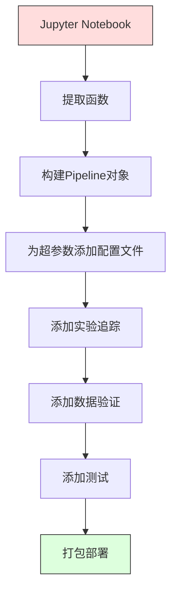

# ML 流水线

> 模型不是产品，流水线才是。流水线是从原始数据到部署预测的一切，每个步骤都必须可复现。

**类型：** 构建
**语言：** Python
**前置条件：** 第2阶段 第12课（超参数调优）
**时间：** ~120分钟

## 学习目标

- 从零构建一个ML流水线，将数据填补、缩放、编码和模型训练链接成一个单一的可复现对象
- 识别数据泄漏场景，解释流水线如何通过只在训练数据上拟合变换器来防止数据泄漏
- 构建一个对数值特征和类别特征应用不同预处理的 ColumnTransformer
- 实现流水线序列化，证明相同的拟合流水线在训练和生产环境中产生相同结果

## 问题所在

你有一个加载数据、用中位数填充缺失值、缩放特征、训练模型并打印准确率的notebook。它能工作。你部署了它。

一个月后，有人重新训练模型，得到了不同的结果。中位数是在包含测试数据的完整数据集上计算的（数据泄漏）。缩放参数没有保存，所以推理使用了不同的统计数据。特征工程代码在训练和服务之间复制粘贴，两个副本已经出现了分歧。生产中出现了一个编码器从未见过的类别列新值。

这些不是假设情况。它们是ML系统在生产中失败的最常见原因。流水线通过将每个转换步骤打包成一个单一的、有序的、可复现的对象来解决所有这些问题。

## 核心概念

### 什么是流水线

流水线是一个有序的数据转换序列，后面跟着一个模型。每个步骤将前一个步骤的输出作为输入。整个流水线在训练数据上拟合一次。在推理时，同一个拟合的流水线转换新数据并产生预测。


流水线保证：
- 转换只在训练数据上拟合（无泄漏）
- 推理时应用相同的转换
- 整个对象可以被序列化并作为一个工件部署
- 交叉验证对每个折应用流水线，防止微妙的泄漏

### 数据泄漏：隐形杀手

数据泄漏发生在测试集或未来数据的信息污染了训练。流水线防止最常见的形式。

**有泄漏（错误）：**
```python
X = df.drop("target", axis=1)
y = df["target"]

scaler = StandardScaler()
X_scaled = scaler.fit_transform(X)

X_train, X_test = X_scaled[:800], X_scaled[800:]
y_train, y_test = y[:800], y[800:]
```

标准化器看到了测试数据。均值和标准差包含了测试样本。这虚高了准确率估计。

**正确做法：**
```python
X_train, X_test = X[:800], X[800:]

scaler = StandardScaler()
X_train_scaled = scaler.fit_transform(X_train)
X_test_scaled = scaler.transform(X_test)
```

使用流水线时，你不需要考虑这些。流水线自动处理它。

### sklearn Pipeline

sklearn 的 `Pipeline` 链接变换器和一个估计器。它暴露了 `.fit()`、`.predict()` 和 `.score()` 方法，按顺序应用所有步骤。

```python
from sklearn.pipeline import Pipeline
from sklearn.preprocessing import StandardScaler
from sklearn.linear_model import LogisticRegression

pipe = Pipeline([
    ("scaler", StandardScaler()),
    ("model", LogisticRegression()),
])

pipe.fit(X_train, y_train)
predictions = pipe.predict(X_test)
```

当你调用 `pipe.fit(X_train, y_train)` 时：
1. 标准化器对 X_train 调用 `fit_transform`
2. 模型对缩放后的 X_train 调用 `fit`

当你调用 `pipe.predict(X_test)` 时：
1. 标准化器对 X_test 调用 `transform`（而不是 `fit_transform`）
2. 模型对缩放后的 X_test 调用 `predict`

标准化器在拟合期间永远不会看到测试数据。这就是关键所在。

### ColumnTransformer：不同列的不同流水线

真实数据集有需要不同预处理的数值列和类别列。`ColumnTransformer` 处理这个问题。

```python
from sklearn.compose import ColumnTransformer
from sklearn.preprocessing import StandardScaler, OneHotEncoder
from sklearn.impute import SimpleImputer

numeric_pipe = Pipeline([
    ("impute", SimpleImputer(strategy="median")),
    ("scale", StandardScaler()),
])

categorical_pipe = Pipeline([
    ("impute", SimpleImputer(strategy="most_frequent")),
    ("encode", OneHotEncoder(handle_unknown="ignore")),
])

preprocessor = ColumnTransformer([
    ("num", numeric_pipe, ["age", "income", "score"]),
    ("cat", categorical_pipe, ["city", "gender", "plan"]),
])

full_pipeline = Pipeline([
    ("preprocess", preprocessor),
    ("model", GradientBoostingClassifier()),
])
```

OneHotEncoder 中的 `handle_unknown="ignore"` 对于生产至关重要。当新类别出现时（模型从未见过的城市），它产生一个零向量而不是崩溃。

### 实验追踪

流水线使训练可复现，但你还需要追踪跨实验发生的事情：使用了哪些超参数，哪个数据集版本，指标是什么，运行的是哪个代码。

**MLflow** 是最常见的开源解决方案：

```python
import mlflow

with mlflow.start_run():
    mlflow.log_param("max_depth", 5)
    mlflow.log_param("n_estimators", 100)
    mlflow.log_param("learning_rate", 0.1)

    pipe.fit(X_train, y_train)
    accuracy = pipe.score(X_test, y_test)

    mlflow.log_metric("accuracy", accuracy)
    mlflow.sklearn.log_model(pipe, "model")
```

每次运行都记录了参数、指标、工件和完整模型。你可以比较运行、复现任何实验，并部署任何模型版本。

**Weights & Biases (wandb)** 提供相同的功能，并带有托管仪表盘：

```python
import wandb

wandb.init(project="my-pipeline")
wandb.config.update({"max_depth": 5, "n_estimators": 100})

pipe.fit(X_train, y_train)
accuracy = pipe.score(X_test, y_test)

wandb.log({"accuracy": accuracy})
```

### 模型版本控制

在实验追踪之后，你需要管理模型版本。哪个模型在生产中？哪个在暂存？哪个是上周的？

MLflow 的模型注册表提供：
- **版本追踪：** 每个保存的模型获得一个版本号
- **阶段转换：** "暂存"、"生产"、"归档"
- **审批工作流：** 模型必须明确晋升到生产环境
- **回滚：** 立即切换回上一个版本

### 使用 DVC 进行数据版本控制

代码用 git 版本控制。数据也应该被版本控制，但 git 无法处理大文件。DVC（数据版本控制）解决这个问题。

```
dvc init
dvc add data/training.csv
git add data/training.csv.dvc data/.gitignore
git commit -m "Track training data"
dvc push
```

DVC 将实际数据存储在远程存储（S3、GCS、Azure），并在 git 中保留一个记录哈希值的小 `.dvc` 文件。当你检出一个 git 提交时，`dvc checkout` 恢复使用的确切数据。

这意味着每个 git 提交都固定了代码和数据。完全可复现。

### 可复现实验

可复现实验需要四样东西：

1. **固定随机种子：** 为 numpy、random 和框架（torch、sklearn）设置种子
2. **固定依赖版本：** 带精确版本的 requirements.txt 或 poetry.lock
3. **版本化数据：** DVC 或类似工具
4. **配置文件：** 所有超参数在配置中，而不是硬编码

```python
import numpy as np
import random

def set_seed(seed=42):
    random.seed(seed)
    np.random.seed(seed)
    try:
        import torch
        torch.manual_seed(seed)
        torch.cuda.manual_seed_all(seed)
        torch.backends.cudnn.deterministic = True
    except ImportError:
        pass
```

### 从 Notebook 到生产流水线



典型的演进路径：

1. **Notebook 探索：** 快速实验、可视化、特征想法
2. **提取函数：** 将预处理、特征工程、评估移到模块中
3. **构建Pipeline：** 将转换链接到 sklearn Pipeline 或自定义类中
4. **配置管理：** 将所有超参数移到 YAML/JSON 配置中
5. **实验追踪：** 添加 MLflow 或 wandb 日志
6. **数据验证：** 训练前检查模式、分布和缺失值模式
7. **测试：** 变换器的单元测试、完整流水线的集成测试
8. **部署：** 序列化流水线，包装在 API（FastAPI、Flask）中，容器化

### 常见流水线错误

| 错误 | 为什么有问题 | 修复方法 |
|------|------------|---------|
| 在分割前对完整数据拟合 | 数据泄漏 | 使用 Pipeline 配合 cross_val_score |
| 特征工程在流水线之外 | 训练与服务时的转换不同 | 将所有转换放入 Pipeline |
| 不处理未知类别 | 新值导致生产崩溃 | OneHotEncoder(handle_unknown="ignore") |
| 硬编码列名 | 模式更改时中断 | 从配置中使用列名列表 |
| 无数据验证 | 在坏数据上静默产生错误预测 | 预测前添加模式检查 |
| 训练/服务偏差 | 模型在生产中看到不同特征 | 训练和服务使用一个 Pipeline 对象 |

## 构建它

`code/pipeline.py` 中的代码从零构建完整的ML流水线：

### 第1步：自定义变换器

```python
class CustomTransformer:
    def __init__(self):
        self.means = None
        self.stds = None

    def fit(self, X):
        self.means = np.mean(X, axis=0)
        self.stds = np.std(X, axis=0)
        self.stds[self.stds == 0] = 1.0
        return self

    def transform(self, X):
        return (X - self.means) / self.stds

    def fit_transform(self, X):
        return self.fit(X).transform(X)
```

### 第2步：从零构建 Pipeline

```python
class PipelineFromScratch:
    def __init__(self, steps):
        self.steps = steps

    def fit(self, X, y=None):
        X_current = X.copy()
        for name, step in self.steps[:-1]:
            X_current = step.fit_transform(X_current)
        name, model = self.steps[-1]
        model.fit(X_current, y)
        return self

    def predict(self, X):
        X_current = X.copy()
        for name, step in self.steps[:-1]:
            X_current = step.transform(X_current)
        name, model = self.steps[-1]
        return model.predict(X_current)
```

### 第3步：带流水线的交叉验证

代码演示了带流水线的交叉验证如何防止数据泄漏：标准化器在每个折的训练数据上单独拟合。

### 第4步：使用 sklearn 的完整生产流水线

带有 `ColumnTransformer`、多个预处理路径和模型的完整流水线，通过适当的交叉验证和实验日志训练。

## 练习

1. 构建一个处理包含3个数值列和2个类别列的数据集的流水线。使用 `ColumnTransformer` 对数值列应用中位数填补+缩放，对类别列应用最频繁值填补+独热编码。用5折交叉验证训练。

2. 故意引入数据泄漏：在分割前在完整数据集上拟合标准化器。比较交叉验证分数（有泄漏）与流水线交叉验证分数（无泄漏）。差异有多大？

3. 用 `joblib.dump` 序列化你的流水线。在单独的脚本中加载它并运行预测。验证预测是否相同。

4. 向流水线添加一个为两个最重要的数值列创建多项式特征（2次）的自定义变换器。它应该放在流水线的哪里？

5. 为流水线设置 MLflow 追踪。用不同的超参数运行5次实验。使用 MLflow UI（`mlflow ui`）比较运行并选择最佳模型。

## 关键术语

| 术语 | 人们说的 | 实际含义 |
|------|---------|---------|
| 流水线（Pipeline） | "转换+模型的链条" | 拟合变换器和模型的有序序列，作为一个单元应用以防止泄漏 |
| 数据泄漏（Data leakage） | "测试信息泄漏到训练" | 使用预测时不可用的信息来构建模型，虚高性能估计 |
| ColumnTransformer | "每列不同的预处理" | 对列的不同子集应用不同流水线，合并结果 |
| 实验追踪（Experiment tracking） | "记录你的运行" | 记录每次训练运行的参数、指标、工件和代码版本 |
| MLflow | "追踪和部署模型" | 用于实验追踪、模型注册表和部署的开源平台 |
| DVC | "数据的Git" | 大型数据文件的版本控制系统，在git中存储哈希，在远程存储中存储数据 |
| 模型注册表（Model registry） | "模型版本目录" | 跟踪带阶段标签（暂存、生产、归档）的模型版本的系统 |
| 训练/服务偏差（Training/serving skew） | "在notebook中能运行" | 训练期间与推理期间数据处理方式的差异，导致静默错误 |
| 可复现性（Reproducibility） | "相同代码，相同结果" | 从相同代码、数据和配置获得相同结果的能力 |

## 延伸阅读

- [scikit-learn Pipeline 文档](https://scikit-learn.org/stable/modules/compose.html) -- 官方流水线参考
- [MLflow 文档](https://mlflow.org/docs/latest/index.html) -- 实验追踪和模型注册表
- [DVC 文档](https://dvc.org/doc) -- 数据版本控制
- [Sculley et al., Hidden Technical Debt in Machine Learning Systems (2015)](https://papers.nips.cc/paper/2015/hash/86df7dcfd896fcaf2674f757a2463eba-Abstract.html) -- ML系统复杂性的开创性论文
- [Google ML Best Practices: Rules of ML](https://developers.google.com/machine-learning/guides/rules-of-ml) -- 实用的生产ML建议
