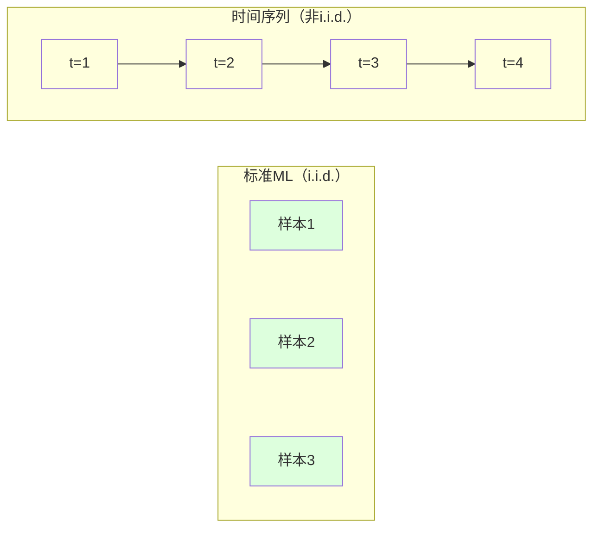
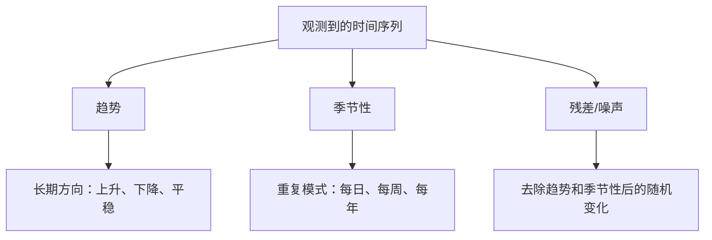
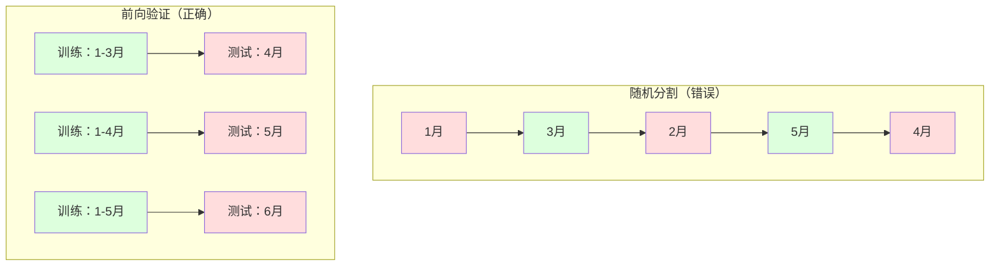

# 时间序列基础

> 过去的表现确实预示未来的结果——前提是你先检验平稳性。

**类型：** 构建
**语言：** Python
**前置条件：** 第2阶段 第01-09课
**时间：** ~90分钟

## 学习目标

- 将时间序列分解为趋势、季节性和残差分量，并检验平稳性
- 实现滞后特征和滚动统计，将时间序列转换为有监督学习问题
- 构建防止未来数据泄漏到训练中的前向验证框架
- 解释为什么随机训练/测试分割对时间序列无效，并演示与正确时间分割的性能差距

## 问题所在

你有按时间排序的数据。每日销售额、每小时温度、每分钟CPU使用率、每周股价。你想预测下一个值、下一周、下一季度。

你拿起标准ML工具包：随机训练/测试分割、交叉验证、特征矩阵输入、预测输出。每一步都是错的。

时间序列打破了标准ML依赖的假设。样本不是独立的——今天的温度依赖于昨天的。随机分割会将未来信息泄漏到过去。在回测中看起来很好的特征在生产中会失败，因为它们依赖随时间变化的模式。

使用随机交叉验证的95%准确率模型，用正确的基于时间的评估可能只有55%。这个差异不是技术细节。这是纸上有效的模型和生产中有效的模型之间的差异。

## 核心概念

### 是什么使时间序列与众不同

标准ML假设i.i.d.——独立同分布。每个样本从相同的分布中独立抽取。时间序列违反了两者：

- **不独立。** 今天的股价依赖于昨天的。本周的销售额与上周的相关。
- **不同分布。** 分布随时间变化。12月的销售额与3月的销售额看起来不同。

这些违反不是小事。它们改变了你如何构建特征、如何评估模型以及哪些算法有效。



在标准ML中，样本可以互换。打乱它们不会改变任何东西。在时间序列中，顺序就是一切。打乱会破坏信号。

### 时间序列的分量

每个时间序列都是以下内容的组合：



- **趋势**：长期方向。收入每年增长10%。全球气温上升。
- **季节性**：固定间隔的重复模式。零售销售在12月激增。空调使用在7月达到峰值。
- **残差**：去除趋势和季节性后剩下的。如果残差看起来像白噪声，分解捕获了信号。

### 平稳性（Stationarity）

如果时间序列的统计属性（均值、方差、自相关）不随时间变化，则该序列是平稳的。大多数预测方法假设平稳性。

**为什么重要：** 非平稳序列的均值会漂移。在1月数据上训练的模型学到了不同于2月的均值。它会系统性地出错。

**如何检验：** 计算滚动均值和滚动标准差。如果它们漂移，序列是非平稳的。

**如何修复：** 差分。不是建模原始值，而是建模相邻值之间的变化：

```
diff[t] = value[t] - value[t-1]
```

如果一轮差分不能使序列平稳，再应用一次（二阶差分）。大多数现实世界的序列最多需要两轮。

**示例：**

原始序列：[100, 102, 106, 112, 120]
一阶差分：[2, 4, 6, 8]（仍然呈上升趋势）
二阶差分：[2, 2, 2]（常数——平稳）

原始序列有二次趋势。一阶差分将其变为线性趋势。二阶差分使其平坦。实践中你很少需要超过两轮。

**形式化检验：** 增广迪基-富勒（ADF）检验是平稳性的标准统计检验。零假设是"序列是非平稳的"。p值低于0.05意味着你可以拒绝零假设并得出平稳性的结论。

### 自相关（Autocorrelation）

自相关衡量时间t的值与时间t-k（k步之前）的值的相关程度。自相关函数（ACF）绘制每个滞后k的相关性。

**ACF告诉你：**
- 序列能记住多远。如果ACF在滞后5后降到零，超过5步之前的值是无关的。
- 是否存在季节性。如果ACF在滞后12处出现峰值（月度数据），则存在年度季节性。
- 要创建多少滞后特征。使用ACF变得可忽略的滞后数。

**偏自相关函数（PACF）** 去除间接相关。如果今天与3天前的相关只是因为两者都与昨天相关，则PACF在滞后3处将为零，而ACF在滞后3处则不会。

### 滞后特征：将时间序列转换为有监督学习

标准ML模型需要特征矩阵X和目标y。时间序列给你一列值。桥接是滞后特征。

取序列 [10, 12, 14, 13, 15] 并创建滞后1和滞后2特征：

| lag_2 | lag_1 | target |
|-------|-------|--------|
| 10    | 12    | 14     |
| 12    | 14    | 13     |
| 14    | 13    | 15     |

现在你有了标准回归问题。任何ML模型（线性回归、随机森林、梯度提升）都可以从滞后预测目标。

你可以工程化的额外特征：
- **滚动统计：** 过去k个值的均值、标准差、最小值、最大值
- **日历特征：** 星期几、月份、是否假日、是否周末
- **差分值：** 与上一步的变化
- **扩展统计：** 累积均值、累积和
- **比率特征：** 当前值 / 滚动均值（与近期平均值的距离）
- **交互特征：** lag_1 * 星期几（工作日对动量的影响）

**多少滞后？** 使用自相关函数。如果ACF在滞后10之前有显著值，至少使用10个滞后。如果有周季节性，包括滞后7（可能还有14）。更多滞后给模型更多历史，但也有更多特征要拟合，增加过拟合风险。

**目标对齐陷阱。** 创建滞后特征时，目标必须是时间t的值，所有特征必须使用时间t-1或更早的值。如果你意外地将时间t的值作为特征，你有一个完美的预测器——也是一个完全无用的模型。这是时间序列特征工程中最常见的错误。

### 前向验证（Walk-Forward Validation）

这是本课最重要的概念。标准K折交叉验证将样本随机分配到训练集和测试集。对于时间序列，这会泄漏未来信息。



前向验证：
1. 训练到时间t的数据
2. 在时间t+1预测（或t+1到t+k的多步预测）
3. 将窗口向前滑动
4. 重复

每个测试折只包含所有训练数据之后的数据。没有未来泄漏。这给出了模型部署后性能的诚实估计。

**扩展窗口**使用所有历史数据进行训练（窗口增长）。**滑动窗口**使用固定大小的训练窗口（窗口滑动）。当你认为旧数据仍然相关时使用扩展。当世界发生变化且旧数据有害时使用滑动。

### ARIMA 直觉

ARIMA是经典的时间序列模型。它有三个分量：

- **AR（自回归）：** 从过去值预测。AR(p) 使用最后p个值。
- **I（积分）：** 差分以实现平稳性。I(d) 应用d轮差分。
- **MA（移动平均）：** 从过去的预测误差预测。MA(q) 使用最后q个误差。

ARIMA(p, d, q) 结合了所有三者。你根据ACF/PACF分析或自动搜索（auto-ARIMA）选择p、d、q。

### 何时使用什么

| 方法 | 最适合 | 处理季节性 | 处理外部特征 |
|------|--------|-----------|------------|
| 滞后特征 + ML | 有许多外部特征的表格数据 | 用日历特征 | 是 |
| ARIMA | 单变量序列，短期 | SARIMA变体 | 否（ARIMAX有限） |
| 指数平滑 | 简单趋势+季节性 | 是（Holt-Winters） | 否 |
| Prophet | 商业预测、假日 | 是（傅里叶项） | 有限 |
| 神经网络（LSTM、Transformer） | 长序列、多序列 | 已学习 | 是 |

对于大多数实际问题，滞后特征 + 梯度提升是最强的起点。它自然处理外部特征，不需要平稳性，易于调试。

### 预测时间跨度和策略

单步预测预测一个时间步。多步预测预测多个步骤。有三种策略：

**递归（迭代）：** 预测一步，将预测作为下一步的输入。简单但误差累积——每次预测使用前一次预测，因此错误会复合。

**直接：** 为每个时间跨度训练单独的模型。模型1预测t+1，模型5预测t+5。没有误差累积，但每个模型训练样本更少，它们不共享信息。

**多输出：** 训练一个同时输出所有时间跨度的模型。跨时间跨度共享信息，但需要支持多输出的模型（或自定义损失函数）。

对于大多数实际问题，短时间跨度（1-5步）使用递归，较长时间跨度使用直接。

### 时间序列中的常见错误

| 错误 | 为什么发生 | 如何修复 |
|------|-----------|---------|
| 随机训练/测试分割 | 标准ML的习惯 | 使用前向验证或时间分割 |
| 使用未来特征 | 时间t的特征意外包含 | 审计每个特征的时间对齐 |
| 对季节性过拟合 | 模型记住日历模式 | 在测试集中保留完整的季节周期 |
| 忽略尺度变化 | 收入翻倍但模式保持不变 | 建模百分比变化而不是绝对值 |
| 太多滞后特征 | "更多历史更好" | 使用ACF确定相关的滞后 |
| 不差分 | "模型会自己想到" | 树模型处理趋势；线性模型需要平稳性 |

## 构建它

`code/time_series.py` 中的代码从零实现核心构建块。

### 滞后特征创建器

```python
def make_lag_features(series, n_lags):
    n = len(series)
    X = np.full((n, n_lags), np.nan)
    for lag in range(1, n_lags + 1):
        X[lag:, lag - 1] = series[:-lag]
    valid = ~np.isnan(X).any(axis=1)
    return X[valid], series[valid]
```

这将一维序列转换为特征矩阵，每行有最后`n_lags`个值作为特征，当前值作为目标。

### 前向交叉验证

```python
def walk_forward_split(n_samples, n_splits=5, min_train=50):
    assert min_train < n_samples, "min_train必须小于n_samples"
    step = max(1, (n_samples - min_train) // n_splits)
    for i in range(n_splits):
        train_end = min_train + i * step
        test_end = min(train_end + step, n_samples)
        if train_end >= n_samples:
            break
        yield slice(0, train_end), slice(train_end, test_end)
```

每个分割确保训练数据严格在测试数据之前。训练窗口随每个折扩展。

### 简单自回归模型

纯AR模型只是对滞后特征的线性回归：

```python
class SimpleAR:
    def __init__(self, n_lags=5):
        self.n_lags = n_lags
        self.weights = None
        self.bias = None

    def fit(self, series):
        X, y = make_lag_features(series, self.n_lags)
        X_b = np.column_stack([np.ones(len(X)), X])
        theta = np.linalg.lstsq(X_b, y, rcond=None)[0]
        self.bias = theta[0]
        self.weights = theta[1:]
        return self
```

这在概念上与第02课的线性回归相同，但应用于同一变量的时间滞后版本。

### 平稳性检验

```python
def check_stationarity(series, window=50):
    rolling_mean = np.array([
        series[max(0, i - window):i].mean()
        for i in range(1, len(series) + 1)
    ])
    rolling_std = np.array([
        series[max(0, i - window):i].std()
        for i in range(1, len(series) + 1)
    ])
    return rolling_mean, rolling_std
```

如果滚动均值漂移或滚动标准差变化，序列是非平稳的。应用差分再次检查。

### 自相关

```python
def autocorrelation(series, max_lag=20):
    n = len(series)
    mean = series.mean()
    var = series.var()
    acf = np.zeros(max_lag + 1)
    for k in range(max_lag + 1):
        cov = np.mean((series[:n-k] - mean) * (series[k:] - mean))
        acf[k] = cov / var if var > 0 else 0
    return acf
```

## 使用它

使用sklearn，你可以直接使用任何回归器的滞后特征：

```python
from sklearn.linear_model import Ridge
from sklearn.ensemble import GradientBoostingRegressor

X, y = make_lag_features(series, n_lags=10)

for train_idx, test_idx in walk_forward_split(len(X)):
    model = Ridge(alpha=1.0)
    model.fit(X[train_idx], y[train_idx])
    predictions = model.predict(X[test_idx])
```

sklearn 提供 `TimeSeriesSplit` 实现前向验证：

```python
from sklearn.model_selection import TimeSeriesSplit

tscv = TimeSeriesSplit(n_splits=5)
for train_index, test_index in tscv.split(X):
    X_train, X_test = X[train_index], X[test_index]
    y_train, y_test = y[train_index], y[test_index]
    model.fit(X_train, y_train)
    score = model.score(X_test, y_test)
```

### 评估指标

- **MAE（平均绝对误差）：** |y_true - y_pred| 的平均值。以原始单位易于解释。
- **RMSE（均方根误差）：** 均方误差的平方根。比MAE更惩罚大误差。
- **MAPE（平均绝对百分比误差）：** |error / true_value| * 100 的平均值。与尺度无关。
- **朴素基线比较：** 始终与简单基线比较。季节性朴素基线预测一个周期前的值。如果你的模型无法击败朴素基线，就有问题了。

### 必须击败的基线

在构建任何模型之前，建立基线：

1. **最后值（持续性）。** 预测明天与今天相同。对于许多序列，这很难击败。
2. **季节性朴素。** 预测今天与上周同一天相同。如果你的模型无法击败这个，它没有学到超出季节性的任何有用模式。
3. **移动平均。** 预测最后k个值的平均值。平滑噪声但无法捕捉突变。

如果你的花哨ML模型输给了季节性朴素基线，你有一个错误。最常见的原因：特征中的未来泄漏、错误的评估方法，或序列真的是随机的且不可预测的。

## 练习

1. **平稳性实验。** 生成一个有线性趋势的序列。用滚动统计检验平稳性。应用一阶差分。再检查。对二次趋势需要多少轮差分？

2. **滞后选择。** 计算季节性序列（周期=7）的ACF。哪些滞后有最高的自相关？只使用那些滞后（不是连续滞后）创建滞后特征。与使用滞后1到7相比，准确率是否提高？

3. **前向验证 vs 随机分割。** 在滞后特征上训练岭回归。用随机80/20分割和前向验证评估。随机分割高估了多少性能？

4. **特征工程。** 向滞后特征添加滚动均值（窗口=7）、滚动标准差（窗口=7）和星期几特征。用前向验证比较有无这些额外特征的准确率。

5. **多步预测。** 修改AR模型预测5步而不是1步。比较两种策略：(a) 预测一步，将预测作为下一步的输入（递归），(b) 为每个时间跨度训练单独的模型（直接）。哪个更准确？

## 关键术语

| 术语 | 人们说的 | 实际含义 |
|------|---------|---------|
| 平稳性（Stationarity） | "统计特性不随时间变化" | 均值、方差和自相关结构随时间保持不变的序列 |
| 差分（Differencing） | "减去相邻值" | 计算y[t] - y[t-1]以去除趋势并实现平稳性 |
| 自相关（ACF） | "序列如何与自身相关" | 时间序列与其自身滞后副本的相关，作为滞后的函数 |
| 偏自相关（PACF） | "只有直接相关" | 去除所有较短滞后效应后的滞后k自相关 |
| 滞后特征（Lag features） | "过去值作为输入" | 使用y[t-1], y[t-2], ..., y[t-k]作为特征来预测y[t] |
| 前向验证（Walk-forward validation） | "尊重时间的交叉验证" | 训练数据始终在时间上先于测试数据的评估 |
| ARIMA | "经典时间序列模型" | 自回归积分移动平均：结合过去值（AR）、差分（I）和过去误差（MA） |
| 季节性（Seasonality） | "重复的日历模式" | 与日历周期（每日、每周、每年）相关的时间序列中的规律、可预测的周期 |
| 趋势（Trend） | "长期方向" | 序列水平随时间持续增加或减少 |
| 扩展窗口（Expanding window） | "使用所有历史" | 前向验证，训练集随每个折增长 |
| 滑动窗口（Sliding window） | "固定大小的历史" | 前向验证，训练集是向前滑动的固定长度窗口 |

## 延伸阅读

- [Hyndman and Athanasopoulos, Forecasting: Principles and Practice (第3版)](https://otexts.com/fpp3/) -- 关于时间序列预测的最佳免费教材
- [scikit-learn Time Series Split](https://scikit-learn.org/stable/modules/generated/sklearn.model_selection.TimeSeriesSplit.html) -- sklearn的前向分割器
- [statsmodels ARIMA文档](https://www.statsmodels.org/stable/generated/statsmodels.tsa.arima.model.ARIMA.html) -- 带诊断的ARIMA实现
- [Makridakis et al., The M5 Competition (2022)](https://www.sciencedirect.com/science/article/pii/S0169207021001874) -- 大规模预测竞赛，展示ML方法vs统计方法
