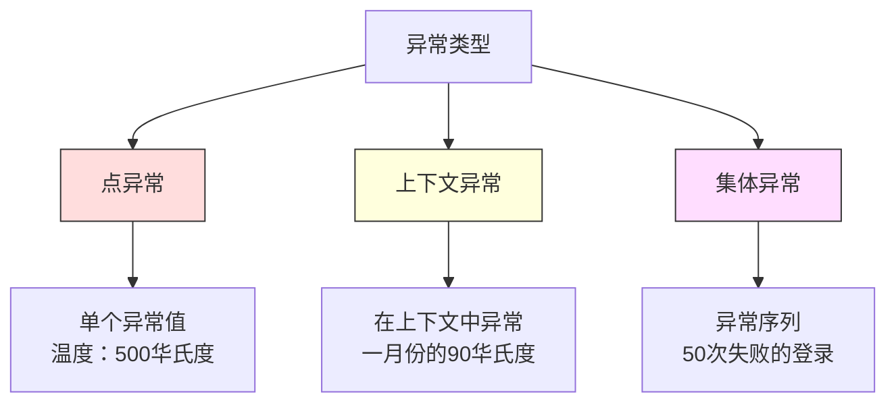
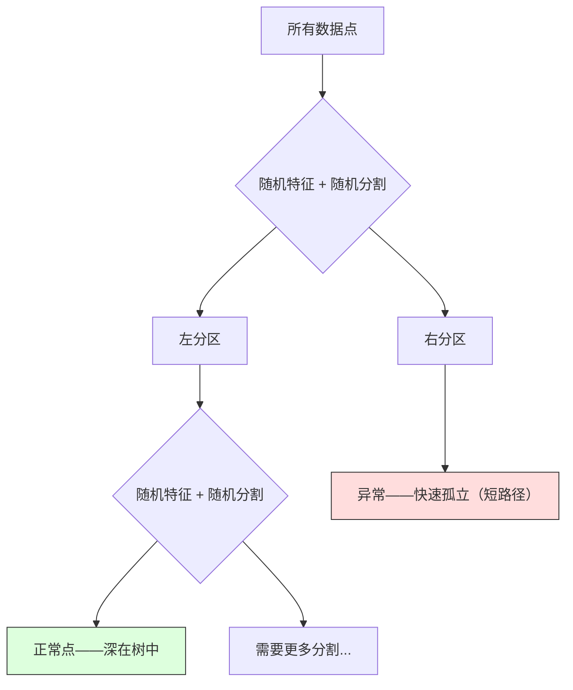

# 异常检测

> 正常很容易定义。异常是任何不符合的东西。

**类型：** 构建
**语言：** Python
**前置条件：** 第2阶段 第01-09课
**时间：** ~75分钟

## 学习目标

- 从零实现Z分数、IQR和孤立森林异常检测方法
- 区分点异常、上下文异常和集体异常，并为每种类型选择合适的检测方法
- 解释为什么异常检测被定义为建模正常数据，而不是对异常进行分类
- 比较无监督异常检测与有监督分类，评估新型异常覆盖范围和精确率之间的权衡

## 问题所在

一张信用卡在下午2点在纽约使用，然后在2点05分在东京使用。工厂传感器读数为150度，正常范围为80-120度。服务器每秒发送50,000个请求，而日均只有200个。

这些都是异常。发现它们很重要。欺诈每年造成数十亿损失。设备故障造成停机成本。网络入侵导致数据泄露。

挑战：你很少有异常的标注样本。欺诈占交易的0.1%。设备故障一年发生几次。你无法训练标准分类器，因为"异常"类中几乎没有什么可学习的。即使你有一些标注，你看到的异常也不是你将遇到的所有类型。明天的欺诈方案与今天的不同。

异常检测翻转了这个问题。不是学习什么是异常的，而是学习什么是正常的。任何偏离正常的都是可疑的。这在没有标注的情况下有效，能适应新类型的异常，并能扩展到大型数据集。

## 核心概念

### 异常类型

并非所有异常都相同：

- **点异常（Point anomalies）。** 无论上下文如何，单个数据点都是不寻常的。温度读数500度。来自通常花费50元账户的50,000元交易。
- **上下文异常（Contextual anomalies）。** 给定其上下文，数据点是不寻常的。90度在夏天是正常的，在冬天则是异常的。相同的值，不同的上下文。
- **集体异常（Collective anomalies）。** 一组数据点作为整体是不寻常的，尽管每个单独的点可能是正常的。五次登录失败是正常的。连续五十次是暴力攻击。

大多数方法检测点异常。上下文异常需要时间或位置特征。集体异常需要序列感知方法。



### 无监督框架

在标准分类中，你有两个类别的标注。在异常检测中，你通常面临以下三种情况之一：

1. **完全无监督。** 完全没有标注。你在所有数据上拟合检测器，希望异常足够稀少，不会破坏"正常"模型。
2. **半监督。** 你只有正常数据的干净数据集。你在这个干净集上拟合，然后对其他所有内容评分。当可能时，这是最强的设置。
3. **弱监督。** 你有一些标注的异常。用它们进行评估，而不是训练。进行无监督训练，然后在标注子集上测量精确率/召回率。

关键洞察：异常检测从根本上不同于分类。你在建模正常数据的分布，而不是两个类别之间的决策边界。

### 有监督 vs 无监督：权衡

如果你有标注的异常，你应该使用它们进行训练（有监督分类）还是只用于评估（无监督检测）？

**有监督（视为分类）：**
- 捕获你以前见过的确切类型的异常
- 在已知异常类型上精确率更高
- 完全错过新型异常类型
- 出现新异常类型时需要重新训练
- 需要足够的异常样本（通常太少）

**无监督（建模正常，标记偏差）：**
- 捕获任何偏离正常的行为，包括新型异常
- 不需要标注的异常
- 更高的误报率（不是所有不寻常的都是坏的）
- 对分布偏移更鲁棒

实践中，最好的系统结合两者：无监督检测用于广泛覆盖，有监督模型用于已知高优先级异常类型，人工审查用于模糊案例。

### Z分数方法

最简单的方法。计算每个特征的均值和标准差。标记任何距均值超过k个标准差的点。

```text
z_score = (x - mean) / std
如果 |z_score| > threshold 则为异常
```

默认阈值为3.0（对于高斯分布，99.7%的正常数据落在3个标准差内）。

**优势：** 简单。快速。可解释（"这个值比正常值高4.5个标准差"）。

**弱点：** 假设数据是正态分布的。对训练数据中的异常值敏感（异常值会移动均值并膨胀标准差，使其更难检测）。在多峰分布上失败。

**适用情况：** 数据大致呈钟形的单特征监控。服务器响应时间、制造公差、具有稳定基线的传感器读数。

**失败情况：** 多簇数据（两个办公室位置具有不同的基线温度）、偏斜数据（交易金额，$1000很少但不是异常）、训练集中有异常值的数据。

### IQR方法

比Z分数更鲁棒。使用四分位范围而不是均值和标准差。

```
Q1 = 第25百分位数
Q3 = 第75百分位数
IQR = Q3 - Q1
下界 = Q1 - factor * IQR
上界 = Q3 + factor * IQR
如果 x < 下界 或 x > 上界 则为异常
```

默认因子为1.5。

**优势：** 对异常值鲁棒（百分位数不受极端值影响）。适用于偏斜分布。没有正态性假设。

**弱点：** 仅单变量（独立地对每个特征应用）。无法检测仅在联合考虑特征时才异常的异常（一个点在每个特征中可能各自正常，但在联合空间中却是异常的）。

**实用注意：** IQR中的1.5因子对应箱线图中的须。须之外的点是潜在的异常值。使用3.0代替1.5使检测器更保守（更少的标记，更少的误报）。正确的因子取决于你对误报的容忍度。

### 孤立森林（Isolation Forest）

关键洞察：异常很少且不同。在对数据的随机划分中，异常更容易被孤立——它们需要更少的随机分割才能与其他数据分离。



**工作原理：**
1. 构建许多随机树（孤立森林）
2. 在每个节点，选择随机特征和在特征最小值和最大值之间的随机分割值
3. 继续分割直到每个点都被孤立（在自己的叶节点中）
4. 异常在所有树中平均路径长度更短

**为什么有效：** 正常点存在于密集区域。需要许多随机分割才能将一个点与其邻居分离。异常存在于稀疏区域。一两次随机分割就足以孤立它们。

异常分数基于所有树的平均路径长度，由随机二叉搜索树的预期路径长度归一化：

```
score(x) = 2^(-average_path_length(x) / c(n))
```

其中 `c(n)` 是n个样本的预期路径长度。分数接近1意味着异常。分数接近0.5意味着正常。分数接近0意味着非常正常（在密集簇深处）。

**优势：** 没有分布假设。适用于高维数据。扩展性好（样本大小的次线性，因为每棵树使用子样本）。处理混合特征类型。

**弱点：** 在密集区域的异常上表现不佳（遮蔽效应）。当许多特征不相关时，随机分割效果较差。

**关键超参数：**
- `n_estimators`：树的数量。100通常足够。更多树给出更稳定的分数，但计算更慢。
- `max_samples`：每棵树的样本数量。原论文默认为256。更小的值使单棵树不那么精确，但增加多样性。子采样使孤立森林快速——每棵树只看到一小部分数据。
- `contamination`：预期的异常比例。仅用于设置阈值，不影响分数本身。

### 局部离群因子（LOF）

LOF比较一个点与其邻居的局部密度。在密集区域周围的稀疏区域中的点是异常的。

**工作原理：**
1. 对每个点，找其k个最近邻
2. 计算局部可达密度（邻域有多密集）
3. 将每个点的密度与其邻居的密度比较
4. 如果一个点的密度远低于其邻居，它就是异常值

**LOF分数：**
- LOF接近1.0意味着与邻居密度相似（正常）
- LOF大于1.0意味着密度低于邻居（可能异常）
- LOF远大于1.0（例如2.0+）意味着密度显著更低（可能是异常）

"局部"部分至关重要。考虑一个有两个簇的数据集：1000个点的密集簇和50个点的稀疏簇。稀疏簇边缘的点在全局上并不异常——它有50个邻居。但如果其直接邻居比它更密集，它在局部上是异常的。LOF捕获了全局方法错过的这种细节。

### 比较

| 方法 | 假设 | 速度 | 处理高维 | 检测局部异常 |
|------|------|------|---------|------------|
| Z分数 | 正态分布 | 非常快 | 是（每特征） | 否 |
| IQR | 无（每特征） | 非常快 | 是（每特征） | 否 |
| 孤立森林 | 无 | 快 | 是 | 部分 |
| LOF | 距离有意义 | 慢 | 差 | 是 |

### 评估挑战

评估异常检测器比评估分类器更难：

- **极端类别不平衡。** 异常占0.1%，对所有内容预测"正常"给出99.9%准确率。准确率无用。
- **AUROC具有误导性。** 在严重不平衡时，即使模型在实际阈值处错过了大多数异常，AUROC也可能看起来好。
- **更好的指标：** Precision@k（在前k个标记项中，有多少是真实异常），AUPRC（精确率-召回率曲线下面积），在固定误报率下的召回率。

```mermaid
flowchart LR
    A[原始数据] --> B[只在正常数据上训练]
    B --> C[对所有测试数据评分]
    C --> D[按异常分数排名]
    D --> E[评估前K个标记项]
    E --> F[Precision@K / AUPRC]

    style A fill:#f9f,stroke:#333
    style F fill:#9f9,stroke:#333
```

### 异常检测流水线

实践中，异常检测遵循以下工作流程：

1. **收集基线数据。** 理想情况下，是你知道没有（或很少）异常的时期。
2. **特征工程。** 原始特征加上派生特征（滚动统计、时间特征、比率）。
3. **训练检测器。** 在基线数据上拟合。模型学习什么是"正常"。
4. **对新数据评分。** 每个新观测得到一个异常分数。
5. **阈值选择。** 选择分数截止值。这是商业决策，而不是技术决策。
6. **警报和调查。** 标记的点进入人工审查或自动响应。
7. **反馈收集。** 记录标记项是否为真实异常或误报。使用这些数据评估检测器并随时间调整阈值。

流水线永远不会"完成"。数据分布会移动，新的异常类型会出现，阈值需要调整。将异常检测视为一个活系统，而不是一次性模型。

## 构建它

`code/anomaly_detection.py` 中的代码从零实现Z分数、IQR和孤立森林。

### Z分数检测器

```python
def zscore_detect(X, threshold=3.0):
    mean = X.mean(axis=0)
    std = X.std(axis=0)
    std[std == 0] = 1.0
    z = np.abs((X - mean) / std)
    return z.max(axis=1) > threshold
```

简单且向量化。如果任何特征超过阈值，则标记一个点。

### IQR检测器

```python
def iqr_detect(X, factor=1.5):
    q1 = np.percentile(X, 25, axis=0)
    q3 = np.percentile(X, 75, axis=0)
    iqr = q3 - q1
    iqr[iqr == 0] = 1.0
    lower = q1 - factor * iqr
    upper = q3 + factor * iqr
    outside = (X < lower) | (X > upper)
    return outside.any(axis=1)
```

### 从零实现孤立森林

```python
class IsolationTree:
    def __init__(self, max_depth):
        self.max_depth = max_depth

    def fit(self, X, depth=0):
        n, p = X.shape
        if depth >= self.max_depth or n <= 1:
            self.is_leaf = True
            self.size = n
            return self
        self.is_leaf = False
        self.feature = np.random.randint(p)
        x_min = X[:, self.feature].min()
        x_max = X[:, self.feature].max()
        if x_min == x_max:
            self.is_leaf = True
            self.size = n
            return self
        self.threshold = np.random.uniform(x_min, x_max)
        left_mask = X[:, self.feature] < self.threshold
        self.left = IsolationTree(self.max_depth).fit(X[left_mask], depth + 1)
        self.right = IsolationTree(self.max_depth).fit(X[~left_mask], depth + 1)
        return self
```

孤立点的路径长度决定其异常分数。路径越短，异常程度越高。

归一化因子 `c(n)` 是有n个元素的二叉搜索树中不成功搜索的预期路径长度。它等于 `2 * H(n-1) - 2*(n-1)/n`，其中 `H` 是调和数。

## 使用它

使用sklearn（库实现）：

```python
from sklearn.ensemble import IsolationForest
from sklearn.neighbors import LocalOutlierFactor

iso = IsolationForest(n_estimators=100, contamination=0.05, random_state=42)
iso.fit(X_train)
predictions = iso.predict(X_test)

lof = LocalOutlierFactor(n_neighbors=20, contamination=0.05, novelty=True)
lof.fit(X_train)
predictions = lof.predict(X_test)
```

`contamination` 参数决定将连续异常分数转换为二元预测的阈值。它不改变底层分数本身。

### 集成异常检测

就像集成方法改进分类一样，结合多个异常检测器改进检测。最简单的方法：

1. 运行多个检测器（Z分数、IQR、孤立森林、LOF）
2. 将每个检测器的分数归一化到[0, 1]
3. 对归一化分数取平均
4. 标记平均分数超过阈值的点

这减少了误报，因为不同方法有不同的失败模式。被所有四种方法标记的点几乎肯定是异常的。只被一种方法标记的点可能是该方法的特性。

### 选择阈值

阈值选择是商业决策，不是技术决策。

考虑两种情景：
- **欺诈检测。** 遗漏欺诈很昂贵。误报让人工分析师花5分钟调查。设置低阈值以捕获更多欺诈，接受更多误报。
- **设备维护。** 误报意味着不必要的关机，成本50,000元。遗漏的故障意味着500,000元的维修。设置阈值以平衡这些成本。

## 练习

1. **阈值调整。** 以0.5的步长从1.0到5.0运行Z分数检测器。在每个阈值绘制精确率和召回率。你的数据的最佳平衡点在哪里？

2. **多变量异常。** 创建2D数据，其中每个特征单独看起来正常，但组合是异常的（例如，远离主要簇对角线的点）。显示每特征的Z分数错过这些，但孤立森林捕获了它们。

3. **从零实现LOF。** 使用k最近邻实现局部离群因子。与sklearn的LocalOutlierFactor在相同数据上比较。使用k=10和k=50——k的选择如何影响结果？

4. **流式异常检测。** 修改Z分数检测器以在流式设置中工作：随着新点到达更新运行均值和方差（Welford在线算法）。在相同数据上与批量Z分数比较。

5. **真实世界评估。** 取一个有已知异常的数据集（例如Kaggle的信用卡欺诈）。使用precision@100、precision@500和AUPRC评估所有四种方法。哪种方法最好？为什么？

## 关键术语

| 术语 | 人们说的 | 实际含义 |
|------|---------|---------|
| 异常（Anomaly） | "异常值，不寻常的点" | 显著偏离正常数据预期模式的数据点 |
| 点异常（Point anomaly） | "单个奇怪的值" | 无论上下文如何，单个观测都是不寻常的 |
| 上下文异常（Contextual anomaly） | "正常值，错误上下文" | 给定其上下文（时间、位置等）不寻常的观测，但在另一个上下文中可能是正常的 |
| 孤立森林（Isolation Forest） | "随机分割找异常值" | 使用随机树分割孤立异常的集成，异常比正常点需要更少的分割 |
| 局部离群因子（Local Outlier Factor） | "将密度与邻居比较" | 标记局部密度远低于其邻居密度的点的方法 |
| Z分数（Z-score） | "距均值的标准差" | (x - mean) / std，以标准差为单位测量点距中心的距离 |
| IQR（四分位距） | "四分位范围" | Q3 - Q1，测量数据中间50%的分布，用于鲁棒的异常值检测 |
| 污染率（Contamination） | "预期的异常比例" | 告诉检测器它应该标记多少比例数据为异常的超参数 |
| Precision@k | "前k个标记中有多少是真实的" | 仅在k个最可疑点上计算的精确率，对不平衡异常检测有用 |
| AUPRC | "精确率-召回率曲线下面积" | 总结所有阈值下精确率-召回率性能的指标，对不平衡数据比AUROC更好 |

## 延伸阅读

- [Liu et al., Isolation Forest (2008)](https://cs.nju.edu.cn/zhouzh/zhouzh.files/publication/icdm08b.pdf) -- 原始孤立森林论文
- [Breunig et al., LOF: Identifying Density-Based Local Outliers (2000)](https://dl.acm.org/doi/10.1145/342009.335388) -- 原始LOF论文
- [scikit-learn 离群值检测文档](https://scikit-learn.org/stable/modules/outlier_detection.html) -- 所有sklearn异常检测器的概述
- [Chandola et al., Anomaly Detection: A Survey (2009)](https://dl.acm.org/doi/10.1145/1541880.1541882) -- 异常检测方法的全面综述
- [Goldstein and Uchida, A Comparative Evaluation of Unsupervised Anomaly Detection Algorithms (2016)](https://journals.plos.org/plosone/article?id=10.1371/journal.pone.0152173) -- 在真实数据集上10种方法的实证比较
