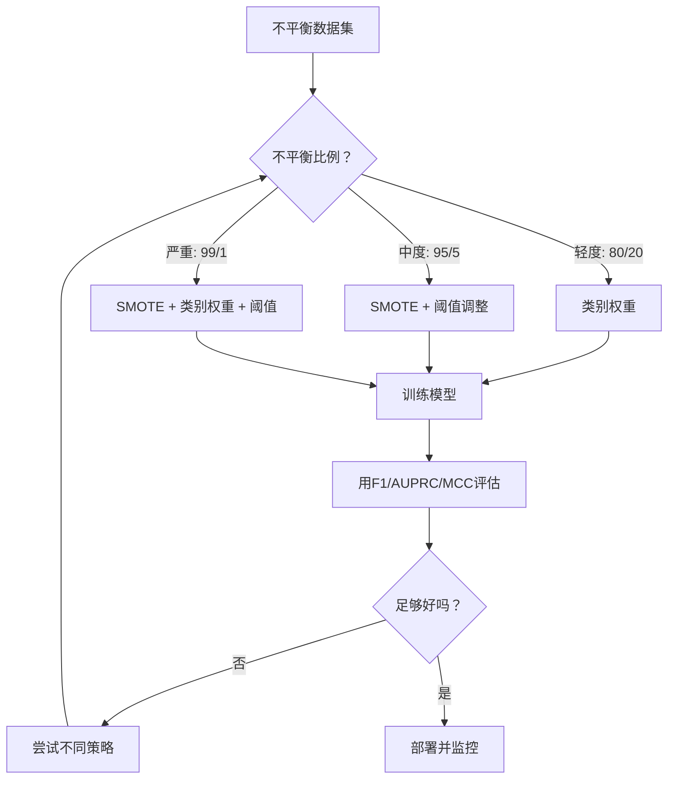
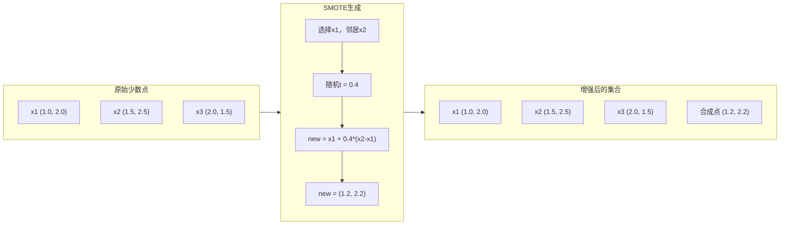

# 处理不平衡数据

> 当99%的数据是"正常"时，准确率就是谎言。

**类型：** 构建
**语言：** Python
**前置条件：** 第2阶段 第01-09课（尤其是评估指标）
**时间：** ~90分钟

## 学习目标

- 从零实现SMOTE，并解释合成过采样与随机复制的区别
- 使用F1、AUPRC和马修斯相关系数（而非准确率）评估不平衡分类器
- 比较类别权重、阈值调整和重采样策略，并为给定的不平衡比例选择正确的方法
- 构建结合SMOTE、类别权重和阈值优化的完整不平衡数据流水线

## 问题所在

你构建了一个欺诈检测模型。它获得了99.9%的准确率。你庆祝了。然后你意识到它对每笔交易都预测"非欺诈"。

这不是错误。当只有0.1%的交易是欺诈性的时，这是合理的做法。模型学会了预测多数类别总能最小化整体误差。它在技术上是正确的，但完全没用。

这在真正重要的分类问题中随处可见。疾病诊断：阳性率1%。网络入侵：攻击0.01%。制造缺陷：有缺陷0.5%。垃圾邮件过滤：垃圾邮件20%。客户流失预测：流失5%。少数类别越重要，它往往就越稀少。

准确率失败是因为它平等对待所有正确预测。正确标记合法交易和正确捕获欺诈都算作一点准确率。但捕获欺诈是模型存在的全部理由。我们需要迫使模型关注稀少但重要类别的指标、技术和训练策略。

## 核心概念

### 为什么准确率失败

考虑一个包含1000个样本的数据集：990个负样本，10个正样本。总是预测负的模型：

|  | 预测正 | 预测负 |
|--|---|---|
| 实际正 | 0 (TP) | 10 (FN) |
| 实际负 | 0 (FP) | 990 (TN) |

准确率 = (0 + 990) / 1000 = 99.0%

该模型捕获了零欺诈。零疾病。零缺陷。但准确率说99%。这就是为什么准确率对不平衡问题是危险的。

### 更好的指标

**精确率（Precision）** = TP / (TP + FP)。被标记为正的所有内容中，有多少实际上是正的？高精确率意味着少误报。

**召回率（Recall）** = TP / (TP + FN)。所有实际为正的内容中，我们捕获了多少？高召回率意味着少漏报。

**F1分数** = 2 * precision * recall / (precision + recall)。调和均值。比算术均值更惩罚精确率和召回率之间的极端不平衡。

**F-beta分数** = (1 + beta^2) * precision * recall / (beta^2 * precision + recall)。当beta > 1时，召回率更重要。当beta < 1时，精确率更重要。F2在欺诈检测中很常见（漏掉欺诈比误报更糟糕）。

**AUPRC**（精确率-召回率曲线下面积）。类似AUC-ROC，但对不平衡数据更有信息量。随机分类器的AUPRC等于正类别的比例（不像ROC的0.5）。这使得改进更容易看到。

**马修斯相关系数（MCC）** = (TP * TN - FP * FN) / sqrt((TP+FP)(TP+FN)(TN+FP)(TN+FN))。范围从-1到+1。只有当模型在两个类别上都表现良好时才给出高分。即使类别大小差异很大，也能平衡。

对于上面"总是预测负"的模型：precision = 0/0（未定义，通常设为0），recall = 0/10 = 0，F1 = 0，MCC = 0。这些指标正确地识别该模型毫无用处。

### 不平衡数据流水线



### SMOTE：合成少数类过采样技术

随机过采样复制现有的少数样本。这有效，但存在过拟合风险，因为模型反复看到相同的点。

SMOTE创建新的合成少数样本，这些样本合理但不是副本。算法：

1. 对每个少数样本x，在其他少数样本中找其k个最近邻
2. 随机选择一个邻居
3. 在x和该邻居之间的线段上创建一个新样本

公式：`new_sample = x + random(0, 1) * (neighbor - x)`

这在真实少数点之间插值，在特征空间的同一区域创建样本，而不只是复制现有数据。



### 采样策略比较

**随机过采样**：复制少数样本以匹配多数数量。
- 优点：简单，无信息损失
- 缺点：完全相同的副本导致过拟合，增加训练时间

**随机欠采样**：删除多数样本以匹配少数数量。
- 优点：训练快，简单
- 缺点：丢弃可能有用的多数数据，更高方差

**SMOTE**：通过插值创建合成少数样本。
- 优点：生成新数据点，比随机过采样减少过拟合
- 缺点：可能在决策边界附近创建噪声样本，不考虑多数类别分布

| 策略 | 数据变化 | 风险 | 何时使用 |
|------|---------|------|---------|
| 过采样 | 少数类复制 | 过拟合 | 小数据集，中度不平衡 |
| 欠采样 | 多数类删除 | 信息损失 | 大数据集，需要快速训练 |
| SMOTE | 合成少数类添加 | 边界噪声 | 中度不平衡，足够的少数类样本用于k-NN |

### 类别权重

不是改变数据，而是改变模型对待错误的方式。对少数类别的误分类分配更高的权重。

对于有950个负样本和50个正样本的二元问题：
- 负类别权重 = n_samples / (2 * n_negative) = 1000 / (2 * 950) = 0.526
- 正类别权重 = n_samples / (2 * n_positive) = 1000 / (2 * 50) = 10.0

正类别获得19倍的权重。误分类一个正样本的代价与误分类19个负样本一样大。模型被迫关注少数类别。

在逻辑回归中，这修改了损失函数：

```
weighted_loss = -sum(w_i * [y_i * log(p_i) + (1-y_i) * log(1-p_i)])
```

其中 w_i 取决于样本i的类别。

类别权重在数学上等价于期望中的过采样，但不创建新的数据点。这使它们更快，并避免了复制样本的过拟合风险。

### 阈值调整

大多数分类器输出概率。默认阈值为0.5：如果P(正) >= 0.5，预测正。但0.5是任意的。当类别不平衡时，最优阈值通常要低得多。

过程：
1. 训练模型
2. 在验证集上获取预测概率
3. 扫描从0.0到1.0的阈值
4. 在每个阈值计算F1（或你选择的指标）
5. 选择使指标最大化的阈值


模型可能对欺诈交易输出P(欺诈) = 0.15。在阈值0.5时，这被分类为非欺诈。在阈值0.10时，它被正确捕获。概率校准不如排名重要——只要欺诈的概率高于非欺诈，就存在一个分离它们的阈值。

### 成本敏感学习

类别权重的泛化。不是统一成本，而是分配特定的误分类成本：

| | 预测正 | 预测负 |
|--|---|---|
| 实际正 | 0 (正确) | C_FN = 100 |
| 实际负 | C_FP = 1 | 0 (正确) |

遗漏欺诈交易（FN）的成本是误报（FP）的100倍。模型优化总成本，而不是总错误数量。

当你能估计现实世界成本时，这是最合理的方法。漏诊癌症与导致额外活检的误报有非常不同的成本。明确这些成本迫使做出正确的权衡。

## 构建它

### 第1步：生成不平衡数据集

```python
def make_imbalanced_data(n_majority=950, n_minority=50, seed=42):
    rng = np.random.RandomState(seed)

    X_maj = rng.randn(n_majority, 2) * 1.0 + np.array([0.0, 0.0])
    X_min = rng.randn(n_minority, 2) * 0.8 + np.array([2.5, 2.5])

    X = np.vstack([X_maj, X_min])
    y = np.concatenate([np.zeros(n_majority), np.ones(n_minority)])

    shuffle_idx = rng.permutation(len(y))
    return X[shuffle_idx], y[shuffle_idx]
```

### 第2步：从零实现SMOTE

```python
def smote(X_minority, k=5, n_synthetic=100, seed=42):
    rng = np.random.RandomState(seed)
    n_samples = len(X_minority)
    k = min(k, n_samples - 1)
    synthetic = []

    for _ in range(n_synthetic):
        idx = rng.randint(0, n_samples)
        neighbors = find_k_neighbors(X_minority, idx, k)
        neighbor_idx = neighbors[rng.randint(0, len(neighbors))]
        t = rng.random()
        new_point = X_minority[idx] + t * (X_minority[neighbor_idx] - X_minority[idx])
        synthetic.append(new_point)

    return np.array(synthetic)
```

### 第3步：带类别权重的逻辑回归

```python
def logistic_regression_weighted(X, y, weights, lr=0.01, epochs=200):
    n_samples, n_features = X.shape
    w = np.zeros(n_features)
    b = 0.0

    for _ in range(epochs):
        z = X @ w + b
        pred = sigmoid(z)
        error = pred - y
        weighted_error = error * weights

        gradient_w = (X.T @ weighted_error) / n_samples
        gradient_b = np.mean(weighted_error)

        w -= lr * gradient_w
        b -= lr * gradient_b

    return w, b


def compute_class_weights(y):
    classes, counts = np.unique(y, return_counts=True)
    n_samples = len(y)
    n_classes = len(classes)
    weight_map = {}
    for cls, count in zip(classes, counts):
        weight_map[cls] = n_samples / (n_classes * count)
    return np.array([weight_map[yi] for yi in y])
```

### 第4步：阈值调整

```python
def find_optimal_threshold(y_true, y_probs, metric="f1"):
    best_threshold = 0.5
    best_score = -1.0

    for threshold in np.arange(0.05, 0.96, 0.01):
        y_pred = (y_probs >= threshold).astype(int)
        tp = np.sum((y_pred == 1) & (y_true == 1))
        fp = np.sum((y_pred == 1) & (y_true == 0))
        fn = np.sum((y_pred == 0) & (y_true == 1))

        if metric == "f1":
            precision = tp / (tp + fp) if (tp + fp) > 0 else 0.0
            recall = tp / (tp + fn) if (tp + fn) > 0 else 0.0
            score = 2 * precision * recall / (precision + recall) if (precision + recall) > 0 else 0.0

        if score > best_score:
            best_score = score
            best_threshold = threshold

    return best_threshold, best_score
```

## 使用它

使用scikit-learn和imbalanced-learn：

```python
from sklearn.linear_model import LogisticRegression
from sklearn.metrics import classification_report, f1_score
from sklearn.model_selection import train_test_split
from imblearn.over_sampling import SMOTE
from imblearn.pipeline import Pipeline

X_train, X_test, y_train, y_test = train_test_split(X, y, stratify=y)

# 带类别权重
model_weighted = LogisticRegression(class_weight="balanced")
model_weighted.fit(X_train, y_train)
print(classification_report(y_test, model_weighted.predict(X_test)))

# 带SMOTE
smote = SMOTE(random_state=42)
X_resampled, y_resampled = smote.fit_resample(X_train, y_train)
model_smote = LogisticRegression()
model_smote.fit(X_resampled, y_resampled)
print(classification_report(y_test, model_smote.predict(X_test)))

# 组合流水线
pipeline = Pipeline([
    ("smote", SMOTE()),
    ("model", LogisticRegression(class_weight="balanced")),
])
pipeline.fit(X_train, y_train)
print(classification_report(y_test, pipeline.predict(X_test)))
```

## 练习

1. **边界SMOTE**：修改SMOTE实现，只为靠近决策边界的少数点生成合成样本（那些k最近邻包含多数类别样本的点）。在类别重叠的数据集上与标准SMOTE比较结果。

2. **成本矩阵优化**：实现成本敏感学习，其中成本矩阵是一个参数。创建一个接受成本矩阵并返回最小化预期成本的最优预测的函数。测试不同的成本比例（1:10, 1:100, 1:1000）并绘制精确率-召回率权衡如何变化。

3. **阈值校准**：实现Platt缩放（在模型的原始输出上拟合逻辑回归以产生校准概率）。比较校准前后的精确率-召回率曲线。显示校准不改变排名（AUC保持不变），但使概率更有意义。

4. **平衡Bagging集成**：训练多个模型，每个在平衡的自助样本（所有少数类别+随机多数子集）上训练。平均它们的预测。与带SMOTE的单个模型比较这种方法。测量性能和不同运行之间的方差。

5. **不平衡比例实验**：取一个平衡的数据集，逐渐增加不平衡比例（50/50, 70/30, 90/10, 95/5, 99/1）。对于每个比例，有无SMOTE都进行训练。绘制两种方法的F1 vs 不平衡比例。在什么比例时SMOTE开始产生有意义的差异？

## 关键术语

| 术语 | 人们说的 | 实际含义 |
|------|---------|---------|
| 类别不平衡（Class imbalance） | "一个类别样本多得多" | 数据集中类别分布显著偏斜，导致模型倾向于多数类别 |
| SMOTE | "合成过采样" | 通过在现有少数样本和其k个最近少数邻居之间插值来创建新的少数样本 |
| 类别权重（Class weights） | "使稀有类别的错误更昂贵" | 将损失函数乘以类别特定的权重，使模型更重地惩罚少数类别的误分类 |
| 阈值调整（Threshold tuning） | "移动决策边界" | 将分类的概率截止值从默认的0.5改变为优化所需指标的值 |
| 精确率-召回率权衡 | "两者不可兼得" | 降低阈值捕获更多正例（召回率提高）但也增加更多误报（精确率下降），反之亦然 |
| AUPRC | "PR曲线下面积" | 将精确率-召回率曲线总结为单个数字；当类别严重不平衡时比AUC-ROC更有信息量 |
| 马修斯相关系数（MCC） | "平衡的指标" | 预测标签和实际标签之间的相关性，只有当模型在两个类别上都表现良好时才产生高分 |
| 成本敏感学习（Cost-sensitive learning） | "不同的错误代价不同" | 将现实世界的误分类成本纳入训练目标，使模型优化总成本而不是错误数量 |
| 随机过采样（Random oversampling） | "复制少数类" | 重复少数类别样本以平衡类别数量；简单但存在对复制点过拟合的风险 |

## 延伸阅读

- [SMOTE: Synthetic Minority Over-sampling Technique (Chawla et al., 2002)](https://arxiv.org/abs/1106.1813) -- 原始SMOTE论文，仍然是不平衡学习中引用最多的工作
- [Learning from Imbalanced Data (He & Garcia, 2009)](https://ieeexplore.ieee.org/document/5128907) -- 涵盖采样、成本敏感和算法方法的全面综述
- [imbalanced-learn文档](https://imbalanced-learn.org/stable/) -- 带SMOTE变体、欠采样策略和流水线集成的Python库
- [The Precision-Recall Plot Is More Informative than the ROC Plot (Saito & Rehmsmeier, 2015)](https://journals.plos.org/plosone/article?id=10.1371/journal.pone.0118432) -- 对不平衡问题何时以及为什么优先选择PR曲线而不是ROC曲线
