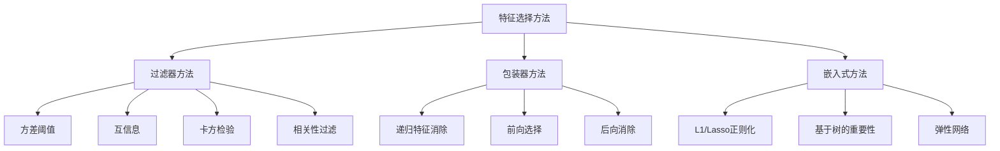
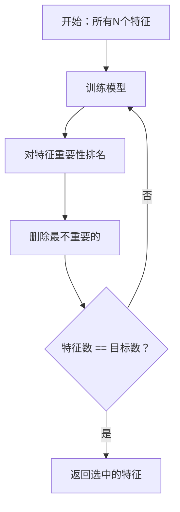
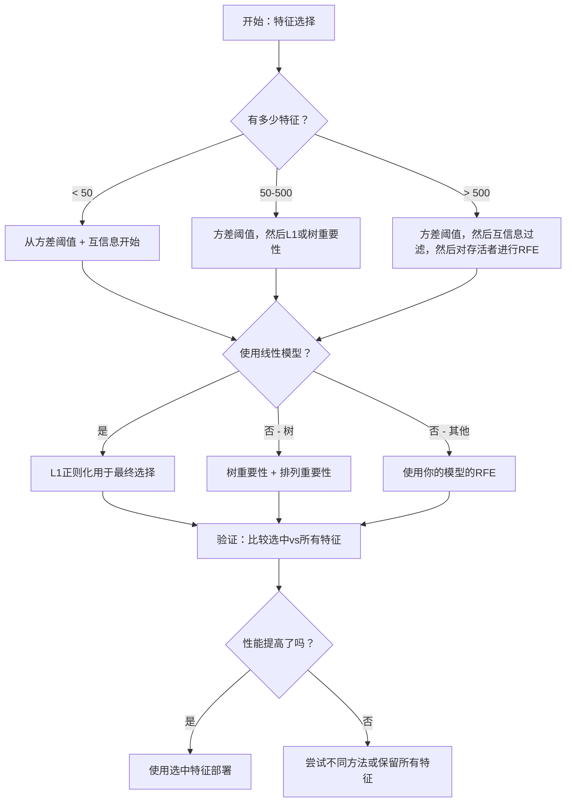

# 特征选择

> 更多特征并不是更好。正确的特征才是更好的。

**类型：** 构建
**语言：** Python
**前置条件：** 第2阶段 第01-09课，第08课（特征工程）
**时间：** ~75分钟

## 学习目标

- 从零实现过滤器方法（方差阈值、互信息、卡方检验）和包装器方法（RFE、前向选择）
- 解释为什么互信息能捕获相关性遗漏的非线性特征-目标关系
- 比较L1正则化（嵌入式选择）与RFE（包装器选择）并评估它们的计算权衡
- 构建结合多种方法的特征选择流水线，并在保留数据上展示改进的泛化性

## 问题所在

你有500个特征。你的模型训练缓慢，不断过拟合，没有人能解释它学到了什么。你添加更多特征希望改进性能。结果变得更糟。

这就是维度灾难的体现。随着特征数量的增长，特征空间的体积呈指数增长。数据点变得稀疏。点之间的距离收敛。模型需要指数级更多的数据来找到真实模式。噪声特征淹没信号特征。过拟合成为默认状态。

特征选择是解药。去除噪声。移除冗余。保留携带目标实际信息的特征。结果：训练更快，泛化更好，模型可以实际解释。

目标不是使用所有可用信息。而是使用正确的信息。

## 核心概念

### 三类特征选择方法

每种特征选择方法都属于三个类别之一：



**过滤器方法**使用统计量独立地对每个特征评分。它们不使用模型。快速，但错过特征交互。

**包装器方法**训练模型来评估特征子集。它们使用模型性能作为分数。结果更好，但代价高昂，因为它们多次重新训练模型。

**嵌入式方法**将特征选择作为模型训练的一部分。L1正则化将权重驱动到零。决策树在最有用的特征上分裂。选择发生在拟合期间，而不是单独的步骤。

### 方差阈值

最简单的过滤器。如果特征在样本间几乎不变，它几乎不携带任何信息。

考虑一个在1000个样本中有999个为0.0的特征。其方差接近零。没有模型可以使用它来区分类别。移除它。

```
variance(x) = mean((x - mean(x))^2)
```

设置阈值（例如0.01）。删除每个方差低于阈值的特征。这在不查看目标变量的情况下以接近零的代价删除明显无用的特征。

限制：特征可以有高方差而仍然是纯噪声。方差阈值是必要的但不充分的。

### 互信息（Mutual Information）

互信息衡量了解特征X的值能减少多少关于目标Y的不确定性。

```
I(X; Y) = sum_x sum_y p(x, y) * log(p(x, y) / (p(x) * p(y)))
```

如果X和Y是独立的，p(x, y) = p(x) * p(y)，所以对数项为零，I(X; Y) = 0。X告诉你关于Y的信息越多，互信息越高。

比相关性的关键优势：互信息捕获非线性关系。特征可能与目标的相关性为零，但互信息高，因为关系是二次的或周期性的。

对于连续特征，先离散化为箱（基于直方图的估计）。箱的数量影响估计——箱太少会丢失信息，箱太多会增加噪声。常见选择：sqrt(n)个箱或Sturges规则（1 + log2(n)）。


### 递归特征消除（RFE）

RFE是包装器方法。它使用模型自身的特征重要性来迭代剪枝：

1. 使用所有特征训练模型
2. 按重要性对特征排名（线性模型的系数，树的不纯度减少）
3. 删除最不重要的特征
4. 重复直到剩下所需数量的特征



RFE考虑特征交互，因为模型同时看到所有剩余特征。删除一个特征会改变其他特征的重要性。这使它比过滤器方法更彻底。

代价：你训练模型N - 目标次。对于500个特征和目标10，那是490次训练运行。对于昂贵的模型，这很慢。你可以通过每步删除多个特征（例如每轮删除底部10%）来加速。

### L1（Lasso）正则化

L1正则化将权重绝对值添加到损失函数中：

```
loss = prediction_error + alpha * sum(|w_i|)
```

alpha参数控制特征被剪枝的积极程度。更高的alpha意味着更多权重变为精确的零。

为什么是精确的零？L1惩罚在权重空间中创建菱形约束区域。最优解倾向于落在这个菱形的角上，其中一个或多个权重为零。L2正则化（岭）创建圆形约束，权重缩小但很少达到零。

这是嵌入式特征选择：模型在训练期间学习忽略哪些特征。权重为零的特征实际上被移除了。

优势：单次训练运行，处理相关特征（选择一个并将其他设为零），内置于大多数线性模型实现中。

限制：只适用于线性模型。无法捕获非线性特征重要性。

### 基于树的特征重要性

决策树及其集成（随机森林、梯度提升）自然地对特征进行排名。每次分裂减少不纯度（分类的Gini或熵，回归的方差）。产生更大不纯度减少的特征更重要。

对于有T棵树的随机森林：

```
importance(feature_j) = (1/T) * 所有树上之和 of
    所有在feature_j上分裂的节点 of
        (n_samples * impurity_decrease)
```

这给每个特征一个归一化的重要性分数。它自动处理非线性关系和特征交互。

注意：基于树的重要性偏向于有许多唯一值的特征（高基数）。随机ID列将显得重要，因为它完美地分割每个样本。将排列重要性作为健全性检查。

### 排列重要性（Permutation Importance）

一种与模型无关的方法：

1. 训练模型并在验证数据上记录基线性能
2. 对每个特征：随机打乱其值，测量性能下降
3. 下降越大，特征越重要

如果打乱特征不损害性能，模型不依赖它。如果性能崩溃，该特征至关重要。

排列重要性避免了基于树的重要性的基数偏差。但它很慢：每个特征进行一次完整评估，为稳定性重复多次。

### 比较表

| 方法 | 类型 | 速度 | 非线性 | 特征交互 |
|------|------|------|--------|---------|
| 方差阈值 | 过滤器 | 非常快 | 否 | 否 |
| 互信息 | 过滤器 | 快 | 是 | 否 |
| 相关性过滤 | 过滤器 | 快 | 否 | 否 |
| RFE | 包装器 | 慢 | 取决于模型 | 是 |
| L1/Lasso | 嵌入式 | 快 | 否（线性） | 否 |
| 树重要性 | 嵌入式 | 中等 | 是 | 是 |
| 排列重要性 | 与模型无关 | 慢 | 是 | 是 |

### 决策流程图



## 构建它

### 第1步：生成具有已知特征结构的合成数据

```python
def make_feature_selection_data(n_samples=500, seed=42):
    rng = np.random.RandomState(seed)

    x1 = rng.randn(n_samples)
    x2 = rng.randn(n_samples)
    x3 = rng.randn(n_samples)
    x4 = x1 + 0.1 * rng.randn(n_samples)
    x5 = x2 + 0.1 * rng.randn(n_samples)

    informative = np.column_stack([x1, x2, x3, x4, x5])
    correlated = np.column_stack([...])  # 与信息特征高度相关
    noise = rng.randn(n_samples, 10) * 0.5

    X = np.hstack([informative, correlated, noise])
    y = (2 * x1 - 1.5 * x2 + x3 + 0.5 * rng.randn(n_samples) > 0).astype(int)
    return X, y, feature_names
```

我们知道真实情况：特征0-4是信息性的，特征5-9与信息特征相关，特征10-19是纯噪声。好的选择方法应该将0-4排最高，将10-19排最低。

### 第2步：方差阈值

```python
def variance_threshold(X, threshold=0.01):
    variances = np.var(X, axis=0)
    mask = variances > threshold
    return mask, variances
```

### 第3步：互信息（离散）

```python
def mutual_information(X, y, n_bins=10):
    n_samples, n_features = X.shape
    mi_scores = np.zeros(n_features)

    y_vals, y_counts = np.unique(y, return_counts=True)
    p_y = y_counts / n_samples

    for f in range(n_features):
        x_binned = discretize(X[:, f], n_bins)
        x_vals, x_counts = np.unique(x_binned, return_counts=True)
        p_x = dict(zip(x_vals, x_counts / n_samples))

        mi = 0.0
        for xv in x_vals:
            for yi, yv in enumerate(y_vals):
                joint_mask = (x_binned == xv) & (y == yv)
                p_xy = np.sum(joint_mask) / n_samples
                if p_xy > 0:
                    mi += p_xy * np.log(p_xy / (p_x[xv] * p_y[yi]))
        mi_scores[f] = mi

    return mi_scores
```

### 第4步：递归特征消除

```python
def rfe(X, y, n_features_to_select=5, lr=0.1, epochs=100):
    n_total = X.shape[1]
    remaining = list(range(n_total))
    rankings = np.ones(n_total, dtype=int)
    rank = n_total

    while len(remaining) > n_features_to_select:
        X_subset = X[:, remaining]
        w, _ = simple_logistic_importance(X_subset, y, lr, epochs)
        importances = np.abs(w)

        least_idx = np.argmin(importances)
        original_idx = remaining[least_idx]
        rankings[original_idx] = rank
        rank -= 1
        remaining.pop(least_idx)

    for idx in remaining:
        rankings[idx] = 1

    selected_mask = rankings == 1
    return selected_mask, rankings
```

### 第5步：L1特征选择

```python
def soft_threshold(w, alpha):
    return np.sign(w) * np.maximum(np.abs(w) - alpha, 0)


def l1_feature_selection(X, y, alpha=0.1, lr=0.01, epochs=500):
    n_samples, n_features = X.shape
    w = np.zeros(n_features)
    b = 0.0

    for _ in range(epochs):
        z = X @ w + b
        pred = 1.0 / (1.0 + np.exp(-np.clip(z, -500, 500)))
        error = pred - y

        gradient_w = (X.T @ error) / n_samples
        gradient_b = np.mean(error)

        w -= lr * gradient_w
        w = soft_threshold(w, lr * alpha)
        b -= lr * gradient_b

    selected_mask = np.abs(w) > 1e-6
    return selected_mask, w
```

## 使用它

使用scikit-learn，特征选择内置于流水线中：

```python
from sklearn.feature_selection import (
    VarianceThreshold,
    mutual_info_classif,
    RFE,
    SelectFromModel,
)
from sklearn.linear_model import Lasso, LogisticRegression
from sklearn.ensemble import RandomForestClassifier

# 方差阈值
vt = VarianceThreshold(threshold=0.01)
X_filtered = vt.fit_transform(X)

# 互信息
mi_scores = mutual_info_classif(X, y)
top_k = np.argsort(mi_scores)[-10:]

# RFE
rfe_selector = RFE(LogisticRegression(), n_features_to_select=10)
rfe_selector.fit(X, y)
X_rfe = rfe_selector.transform(X)

# L1（Lasso）
lasso_selector = SelectFromModel(Lasso(alpha=0.01))
lasso_selector.fit(X, y)
X_lasso = lasso_selector.transform(X)

# 树重要性
rf = RandomForestClassifier(n_estimators=100)
rf.fit(X, y)
importances = rf.feature_importances_
```

从零实现展示了每种方法内部发生了什么。方差阈值只是计算`var(X, axis=0)`并应用掩码。互信息是在联表中计数联合和边际频率。RFE是一个训练、排名和剪枝的循环。L1是带软阈值步骤的梯度下降。树重要性在分裂中累积不纯度减少。没有魔法——只是统计和循环。

## 练习

1. **前向选择**：实现RFE的反面。从零特征开始。每一步，添加最能改善模型性能的特征。当添加特征不再有帮助时停止。将选中的特征与RFE结果比较。哪个更快？哪个给出更好的结果？

2. **稳定选择**：运行L1特征选择50次，每次在数据的随机80%子样本上，使用略有不同的alpha值。计算每个特征被选中的频率。在>80%运行中被选中的特征是"稳定的"。将稳定特征与单次运行L1选择比较。哪个更可靠？

3. **多重共线性检测**：计算所有特征的相关矩阵。实现一个函数，给定相关阈值（例如0.9），从每个高度相关的对中删除一个特征（保留与目标互信息更高的那个）。在合成数据集上测试，验证它删除了冗余相关特征。

4. **特征选择流水线**：将方差阈值、互信息过滤和RFE链接成一个流水线。首先删除接近零方差的特征，然后保留互信息前50%的特征，然后对存活者运行RFE。将这个流水线与单独对所有特征运行RFE比较。流水线更快吗？准确率一样吗？

5. **从零实现排列重要性**：实现排列重要性。对每个特征，打乱其值10次，测量F1分数的平均下降。将排名与基于树的重要性比较。找到它们不同意的案例并解释为什么（提示：相关特征）。

## 关键术语

| 术语 | 人们说的 | 实际含义 |
|------|---------|---------|
| 过滤器方法（Filter method） | "独立评分特征" | 使用统计量对特征排名而不训练模型的特征选择方法，单独评估每个特征 |
| 包装器方法（Wrapper method） | "用模型选择特征" | 通过训练模型并使用其性能作为选择标准来评估特征子集的特征选择方法 |
| 嵌入式方法（Embedded method） | "模型在训练期间选择特征" | 作为模型拟合一部分发生的特征选择，如L1正则化将权重驱动到零 |
| 互信息（Mutual information） | "一个变量告诉你另一个多少" | 关于X的知识减少关于Y的不确定性的度量，捕获线性和非线性依赖 |
| 递归特征消除（RFE） | "训练、排名、剪枝、重复" | 一种迭代包装器方法，训练模型，删除最不重要的特征，重复直到达到目标数量 |
| L1/Lasso正则化 | "杀死特征的惩罚" | 将绝对权重值之和添加到损失函数，将不重要特征的权重驱动到精确的零 |
| 方差阈值（Variance threshold） | "删除常数特征" | 删除样本间方差低于指定阈值的特征，过滤掉不携带任何信息的特征 |
| 特征重要性（Feature importance） | "哪些特征最重要" | 表示每个特征对模型预测贡献多少的分数，由分裂增益（树）或系数大小（线性）计算 |
| 排列重要性（Permutation importance） | "打乱并测量损害" | 通过随机打乱每个特征的值并测量模型性能的下降来评估特征重要性 |
| 维度灾难（Curse of dimensionality） | "太多特征，数据不足" | 添加特征使特征空间体积呈指数增长，使数据稀疏、距离无意义的现象 |

## 延伸阅读

- [An Introduction to Variable and Feature Selection (Guyon & Elisseeff, 2003)](https://jmlr.org/papers/v3/guyon03a.html) -- 特征选择方法的基础综述，仍被广泛引用
- [scikit-learn特征选择指南](https://scikit-learn.org/stable/modules/feature_selection.html) -- 带代码示例的过滤器、包装器和嵌入式方法的实用参考
- [Stability Selection (Meinshausen & Buhlmann, 2010)](https://arxiv.org/abs/0809.2932) -- 结合子采样和特征选择以获得鲁棒、可重复结果
- [Beware Default Random Forest Importances (Strobl et al., 2007)](https://bmcbioinformatics.biomedcentral.com/articles/10.1186/1471-2105-8-25) -- 演示基于树的重要性中的基数偏差，并提出条件重要性作为替代
