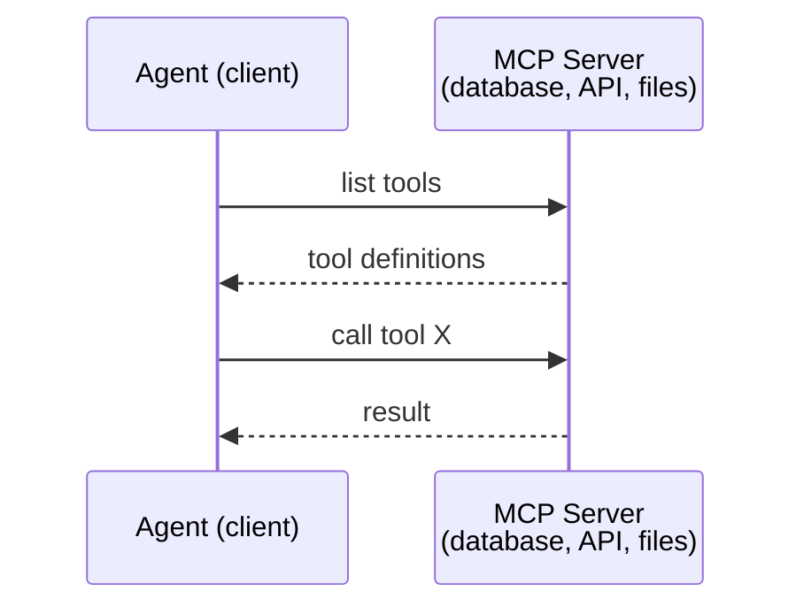
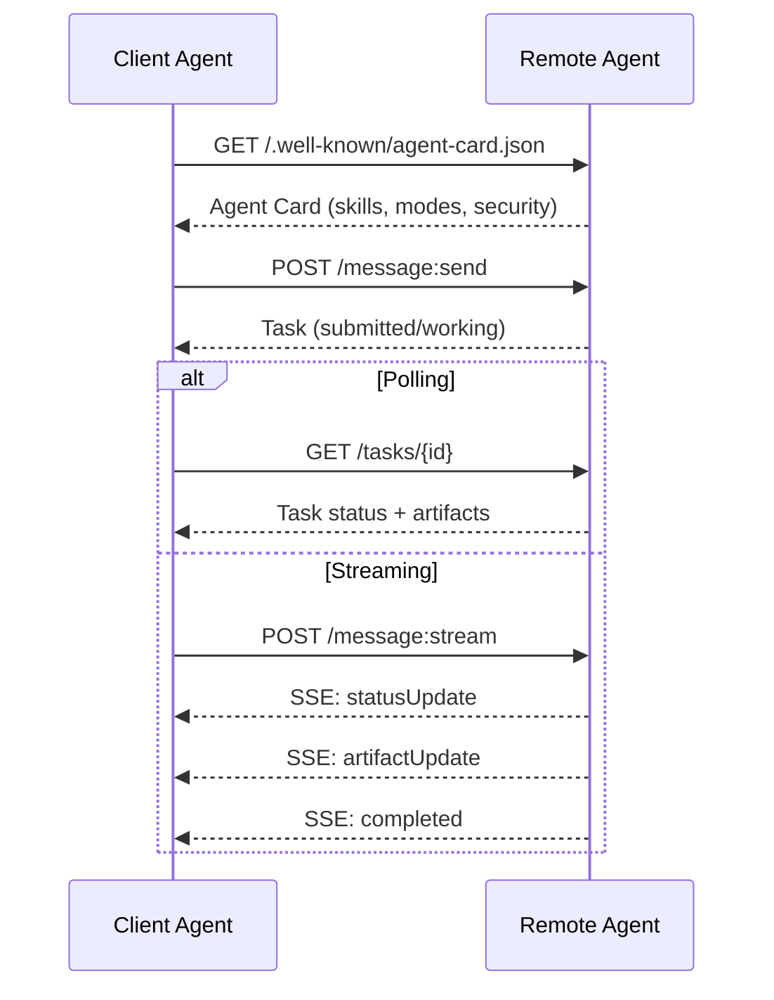
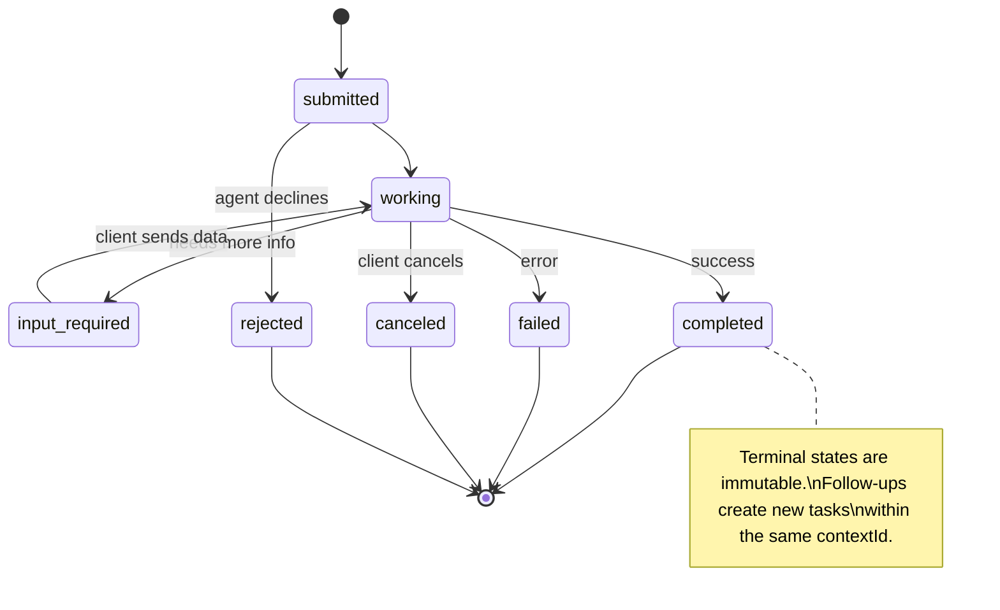
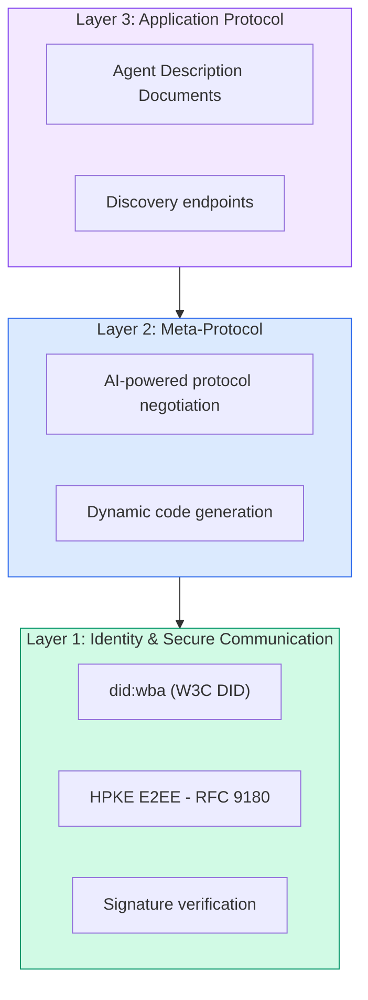
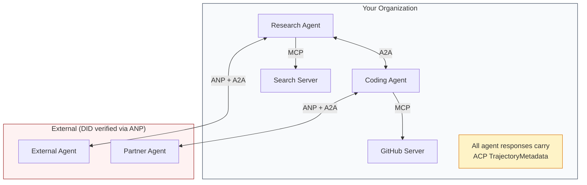
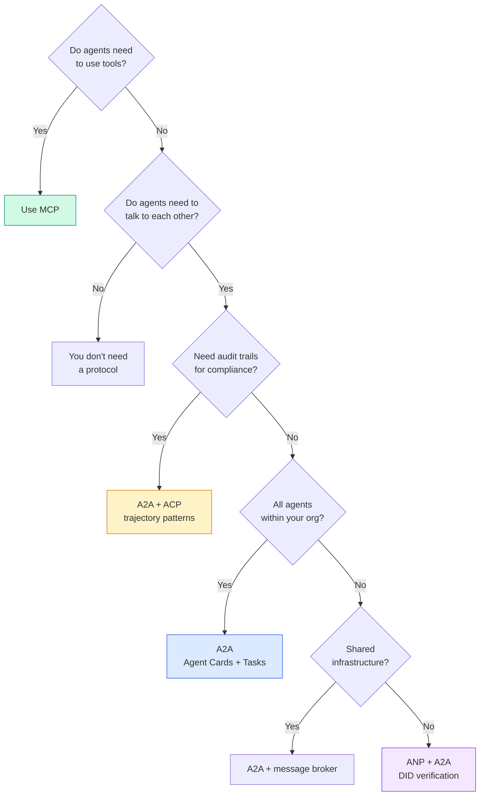

# 通信协议

> 无法说同一种语言的智能体不是团队。它们是陌生人在向虚空呐喊。

**类型：** 构建
**编程语言：** TypeScript
**前置知识：** Phase 14（智能体工程）、第 16.01 课（为什么需要多智能体）
**预计时间：** 约 120 分钟

## 学习目标

- 实现 MCP 工具发现和调用，使智能体可以使用外部服务器暴露的工具
- 构建 A2A 智能体卡片和任务端点，允许一个智能体通过 HTTP 将工作委托给另一个
- 比较 MCP（工具访问）、A2A（智能体对智能体）、ACP（企业审计）和 ANP（去中心化信任）并解释哪个协议解决哪个问题
- 在单个系统中将多个协议连接在一起，智能体通过 MCP 发现工具，通过 A2A 委托任务

## 问题背景

你将系统分成了多个智能体：研究者、编码者、审查者。它们各自都擅长自己的工作。但现在你需要让它们实际互相通信。

你的第一次尝试很明显：传递字符串。研究者返回一段文本，编码者尽可能解析它。这有效，直到编码者误解了研究摘要，或两个智能体陷入死锁相互等待，或你需要由不同团队构建的智能体进行协作。突然间"只是传递字符串"就崩溃了。

这就是通信协议问题。如果没有关于智能体如何交换信息的共享合约，多智能体系统是脆弱的、不可审计的，并且无法扩展到你亲自编写的几个智能体之外。

AI 生态系统用四个协议做出回应，每个解决问题的不同部分：

- **MCP** 用于工具访问
- **A2A** 用于智能体对智能体协作
- **ACP** 用于企业可审计性
- **ANP** 用于去中心化身份和信任

本课深入讲解。你将阅读每个规范的真实线路格式，构建工作实现，并将所有四个连接成一个统一系统。

## 核心概念

### 协议格局

将这四个协议视为层，每个解决不同的问题：

```mermaid
block-beta
  columns 1
  block:ANP["ANP — 智能体如何信任陌生人？\n去中心化身份（DID）、E2EE、元协议"]
  end
  block:A2A["A2A — 智能体如何在目标上协作？\n智能体卡片、任务生命周期、流式传输、谈判"]
  end
  block:ACP["ACP — 智能体如何在可审计系统中通信？\n运行、轨迹元数据、会话连续性"]
  end
  block:MCP["MCP — 智能体如何使用工具？\n工具发现、执行、上下文共享"]
  end

  style ANP fill:#f3e8ff,stroke:#7c3aed
  style A2A fill:#dbeafe,stroke:#2563eb
  style ACP fill:#fef3c7,stroke:#d97706
  style MCP fill:#d1fae5,stroke:#059669
```

它们不是竞争者。它们在不同层面解决不同问题。

### MCP（回顾）

MCP 在 Phase 13 中深入讲解。快速回顾：MCP 标准化了 LLM 如何连接到外部工具和数据源。这是一个**客户端-服务器**协议，智能体（客户端）发现并调用服务器暴露的工具。



MCP 是**智能体到工具**的通信。它不帮助智能体互相通信。

### A2A（Agent2Agent 协议）

**创建者：** Google（现在在 Linux 基金会下作为 `lf.a2a.v1`）
**规范版本：** 1.0.0
**问题：** 自主智能体如何互相协作、谈判和委托任务？

A2A 是**点对点智能体协作**的协议。MCP 将智能体连接到工具，A2A 将智能体连接到其他智能体。每个智能体在已知 URL 发布**智能体卡片**，其他智能体发现、协商并委托任务给它。

#### A2A 工作原理



#### 真实的智能体卡片

这是 A2A 智能体卡片在实际中的样子。在 `GET /.well-known/agent-card.json` 提供服务：

```json
{
  "name": "Research Agent",
  "description": "Searches documentation and summarizes findings",
  "version": "1.0.0",
  "supportedInterfaces": [
    {
      "url": "https://research-agent.example.com/a2a/v1",
      "protocolBinding": "JSONRPC",
      "protocolVersion": "1.0"
    }
  ],
  "provider": {
    "organization": "Your Company",
    "url": "https://example.com"
  },
  "capabilities": {
    "streaming": true,
    "pushNotifications": false
  },
  "defaultInputModes": ["text/plain", "application/json"],
  "defaultOutputModes": ["text/plain", "application/json"],
  "skills": [
    {
      "id": "web-research",
      "name": "Web Research",
      "description": "Searches the web and synthesizes findings",
      "tags": ["research", "search", "summarization"],
      "examples": ["Research the latest changes in React 19"]
    }
  ],
  "securitySchemes": {
    "bearer": {
      "httpAuthSecurityScheme": {
        "scheme": "Bearer",
        "bearerFormat": "JWT"
      }
    }
  },
  "security": [{ "bearer": [] }]
}
```

需要注意的关键点：
- **技能（Skills）** 是智能体能做什么。每个都有 ID、标签和支持的输入/输出 MIME 类型。这是客户端智能体决定此远程智能体是否能处理其请求的方式。
- **supportedInterfaces** 列出多个协议绑定。单个智能体可以同时支持 JSON-RPC、REST 和 gRPC。
- **安全**内置于卡片中。客户端在发出任何请求之前知道它需要什么认证。

#### 任务生命周期

任务是 A2A 中工作的核心单位。它们经历定义的状态：



所有 8 个状态：

| 状态 | 终止？ | 含义 |
|------|--------|------|
| `TASK_STATE_SUBMITTED` | 否 | 已确认，尚未处理 |
| `TASK_STATE_WORKING` | 否 | 正在积极处理 |
| `TASK_STATE_INPUT_REQUIRED` | 否 | 智能体需要客户端提供更多信息 |
| `TASK_STATE_AUTH_REQUIRED` | 否 | 需要身份验证 |
| `TASK_STATE_COMPLETED` | 是 | 成功完成 |
| `TASK_STATE_FAILED` | 是 | 出错完成 |
| `TASK_STATE_CANCELED` | 是 | 完成前取消 |
| `TASK_STATE_REJECTED` | 是 | 智能体拒绝任务 |

一旦任务达到终止状态，它就是不可变的。没有进一步的消息。后续操作在同一 `contextId` 中创建新任务。

### ACP（智能体通信协议）

**创建者：** IBM / BeeAI
**规范版本：** 0.2.0（OpenAPI 3.1.1）
**状态：** 合并到 Linux 基金会下的 A2A 中
**问题：** 智能体如何以完整可审计性、会话连续性和轨迹追踪进行通信？

ACP 是**企业协议**。ACP 的关键差异是 **TrajectoryMetadata**：每个智能体响应都可以携带产生它的推理步骤和工具调用的详细日志。

ACP 使用"运行"而不是"任务"。运行有三种模式：

| 模式 | 行为 |
|------|------|
| `sync` | 阻塞。响应包含完整结果。 |
| `async` | 立即返回 202。轮询 `GET /runs/{id}` 获取状态。 |
| `stream` | SSE 流。随着智能体工作，事件触发。 |

每个消息部分都可以包含显示智能体确切操作的元数据：

```json
{
  "role": "agent/researcher",
  "parts": [
    {
      "content_type": "text/plain",
      "content": "The weather in San Francisco is 72F and sunny.",
      "metadata": {
        "kind": "trajectory",
        "message": "I need to check the weather for this location",
        "tool_name": "weather_api",
        "tool_input": { "location": "San Francisco, CA" },
        "tool_output": { "temperature": 72, "condition": "sunny" }
      }
    }
  ]
}
```

对于受监管行业，这是黄金。每个答案都带有可证明的推理链：调用了哪些工具，使用了什么输入，收到了什么输出。没有黑盒。

### ANP（智能体网络协议）

**创建者：** 开源社区（GaoWei Chang 创立）
**问题：** 来自不同组织的智能体如何在没有中央权威的情况下相互信任？

ANP 是**去中心化身份协议**。它使用 W3C 去中心化标识符（DID）和端到端加密来建立信任。与 A2A 不同，ANP 让智能体通过密码学证明其身份。

ANP 有三层：



ANP 最新颖的特性是**元协议谈判**：当来自不同生态系统的两个智能体相遇时，它们不需要预先商定数据格式。它们用自然语言谈判，最多 10 轮，然后动态生成代码来处理商定的格式。

### 对比（已更正）

| | MCP | A2A | ACP | ANP |
|---|---|---|---|---|
| **创建者** | Anthropic | Google/Linux 基金会 | IBM/BeeAI | 社区 |
| **规范格式** | JSON-RPC | JSON-RPC/REST/gRPC | OpenAPI 3.1（REST） | JSON-RPC |
| **主要用途** | 智能体到工具 | 智能体到智能体 | 智能体到智能体 | 智能体到智能体 |
| **发现** | 工具列表 | `/.well-known/agent-card.json` | `GET /agents`、`/.well-known/agent.yml` | `/.well-known/agent-descriptions`、DID 服务端点 |
| **身份** | 隐式（本地） | 安全方案（OAuth、mTLS） | 服务器级别 | W3C DID（`did:wba`）加 E2EE |
| **审计追踪** | 无 | 基本（任务历史） | TrajectoryMetadata（工具调用、推理） | 未正式规定 |
| **状态机** | 无 | 9 个任务状态 | 7 个运行状态 | 无 |
| **流式传输** | 无 | SSE | SSE | 传输无关 |
| **独特功能** | 工具架构 | 智能体卡片 + 技能 | 轨迹审计追踪 | 元协议谈判 |
| **最适合** | 工具和数据 | 动态协作 | 受监管行业 | 跨组织信任 |
| **状态** | 稳定 | 稳定（v1.0） | 合并到 A2A | 积极开发 |

### 它们如何协同工作

这些协议不是互斥的。现实的企业系统使用多个：



- **MCP** 将每个智能体连接到其工具
- **A2A** 处理智能体之间的协作（内部和外部）
- **ACP** 将响应包装在轨迹元数据中以实现可审计性
- **ANP** 为你不控制的智能体提供身份验证

## 动手实践

### 第 1 步：核心消息类型

每个多智能体系统都从消息格式开始：

```typescript
import crypto from "node:crypto";

type MessageRole = "user" | "agent";

type MessagePart =
  | { kind: "text"; text: string }
  | { kind: "data"; data: unknown; mediaType: string }
  | { kind: "file"; name: string; url: string; mediaType: string };

type TrajectoryEntry = {
  reasoning: string;
  toolName?: string;
  toolInput?: unknown;
  toolOutput?: unknown;
  timestamp: number;
};

type AgentMessage = {
  id: string;
  role: MessageRole;
  parts: MessagePart[];
  trajectory?: TrajectoryEntry[];
  replyTo?: string;
  timestamp: number;
};
```

`MessagePart` 是多模态的（文本、结构化数据、文件），就像真实的 A2A 和 ACP 规范一样。`TrajectoryEntry` 捕获推理链，与 ACP 的 TrajectoryMetadata 匹配。

### 第 2 步：A2A 智能体卡片和注册表

构建与真实 A2A 规范匹配的智能体发现：

```typescript
type Skill = {
  id: string;
  name: string;
  description: string;
  tags: string[];
  inputModes: string[];
  outputModes: string[];
};

type AgentCard = {
  name: string;
  description: string;
  version: string;
  url: string;
  capabilities: {
    streaming: boolean;
    pushNotifications: boolean;
  };
  defaultInputModes: string[];
  defaultOutputModes: string[];
  skills: Skill[];
};

class AgentRegistry {
  private cards: Map<string, AgentCard> = new Map();

  register(card: AgentCard) {
    this.cards.set(card.name, card);
  }

  discoverBySkillTag(tag: string): AgentCard[] {
    return [...this.cards.values()].filter((card) =>
      card.skills.some((skill) => skill.tags.includes(tag))
    );
  }
}
```

你可以按技能标签、按输入 MIME 类型或按名称发现智能体，就像真实的 A2A 规范支持的那样。

### 第 3 步：A2A 任务生命周期

构建完整的任务状态机（完整代码见 `code/main.ts`）。

处理程序是产生事件（状态更新和工件块）的异步生成器，与 SSE 流式传输模型匹配。

### 第 4 步：ACP 风格的审计追踪

用轨迹追踪包装通信。每次智能体执行都产生完整的审计条目：输入什么、输出什么，以及中间工具调用和推理步骤的完整轨迹。

### 第 5 步：ANP 风格的身份验证

构建基于 DID 的身份和验证。这反映了真实的 ANP 身份模型：智能体有带独立认证、密钥协议和人类授权密钥的 DID 文档。

### 第 6 步：协议网关

将所有四个协议连接成一个统一系统。网关在一次调用中做四件事：
1. **ANP**：通过 DID 签名验证调用者身份
2. **A2A**：发现目标智能体并检查能力
3. **ACP**：将执行包装在带轨迹的审计追踪中
4. **A2A**：创建带完整生命周期追踪的任务

## 常见问题

协议解决了快乐路径。以下是生产中会出问题的地方：

**模式漂移。** 智能体 A 发布宣传 `application/json` 输出的智能体卡片。但 JSON 模式在版本之间发生变化。智能体 B 解析旧格式并得到垃圾。修复：对你的技能和输出模式进行版本控制。

**状态机违规。** 智能体处理程序产生 `completed` 事件，然后尝试产生更多工件。任务是不可变的。你的代码静默丢弃更新或抛出异常。修复：在产生之前检查终止状态。

**信任解析失败。** 智能体 A 尝试验证智能体 B 的 DID，但智能体 B 的域名挂了。DID 文档无法获取。ANP 建议以最小信任原则关闭失败。

**轨迹膨胀。** ACP 轨迹日志功能强大但开销大。对于不受监管的工作负载，记录工具名称和 IO，跳过推理步骤。

## 选择正确的协议



## 练习

1. **多跳任务委托。** 扩展 `TaskManager`，使智能体处理程序可以将子任务委托给其他智能体。研究者接收任务，将"搜索"和"摘要"子任务委托给两个专家智能体，等待两个完成，然后将结果合并到自己的工件中。

2. **流式审计追踪。** 修改 `AuditableRunner` 以支持流式模式。不等待完整结果，在添加轨迹条目时实时产生 `AuditEntry` 更新。

3. **DID 轮换。** 向 `IdentityRegistry` 添加密钥轮换。智能体应该能够发布带更新密钥的新 DID 文档，同时维护 `previousDid` 引用。在宽限期内验证者应接受当前和之前密钥的签名。

4. **协议谈判。** 实现 ANP 的元协议概念。两个智能体交换带候选格式的 `protocolNegotiation` 消息。最多 3 轮后，它们同意格式或超时。

5. **限速发现。** 添加带可配置 TTL 的 `RateLimitedRegistry` 包装器，限制每个智能体每秒的发现查询。模拟 100 个智能体在启动时互相发现的雷鸣群体并测量差异。

## 关键术语

| 术语 | 常见说法 | 实际含义 |
|------|---------|---------|
| MCP | "AI 工具协议" | 智能体发现和使用工具的客户端-服务器协议。智能体到工具，不是智能体到智能体。 |
| A2A | "Google 的智能体协议" | Linux 基金会下的点对点智能体协作协议。通过智能体卡片发现，9 状态任务生命周期，通过 SSE 流式传输。 |
| ACP | "企业智能体消息传递" | IBM/BeeAI 用于带 TrajectoryMetadata 的智能体运行的 REST API：每个响应携带完整的推理链和工具调用。正在合并到 A2A。 |
| ANP | "去中心化智能体身份" | 使用 `did:wba`（DID）进行加密身份、HPKE 用于 E2EE、AI 驱动的元协议谈判的社区协议。 |
| 智能体卡片（Agent Card） | "智能体的名片" | `/.well-known/agent-card.json` 处的 JSON 文档，描述技能、支持的 MIME 类型、安全方案和协议绑定。 |
| DID | "去中心化 ID" | W3C 加密可验证身份标准，托管在智能体自己的域上。ANP 使用 `did:wba` 方法。 |
| TrajectoryMetadata | "审计收据" | ACP 用于将推理步骤、工具调用及其输入/输出附加到每个智能体响应的机制。 |
| 元协议（Meta-protocol） | "智能体协商如何通信" | ANP 的方法，智能体使用自然语言动态商定数据格式，然后生成代码来处理它们。 |
| 任务（Task） | "工作单位" | A2A 的有状态对象，追踪从提交到完成的工作。一旦终止则不可变。 |

## 延伸阅读

- [Google A2A 规范](https://github.com/google/A2A) — 官方规范和 SDK（v1.0.0，Linux 基金会）
- [IBM/BeeAI ACP 规范](https://github.com/i-am-bee/acp) — 用于智能体运行和轨迹元数据的 OpenAPI 3.1 规范
- [智能体网络协议](https://github.com/agent-network-protocol/AgentNetworkProtocol) — 基于 DID 的身份、E2EE、元协议谈判
- [Model Context Protocol 文档](https://modelcontextprotocol.io/) — Anthropic 的 MCP 规范（Phase 13 中涵盖）
- [W3C 去中心化标识符](https://www.w3.org/TR/did-core/) — ANP 基础的身份标准
- [RFC 9180（HPKE）](https://www.rfc-editor.org/rfc/rfc9180) — ANP 用于 E2EE 的加密方案
